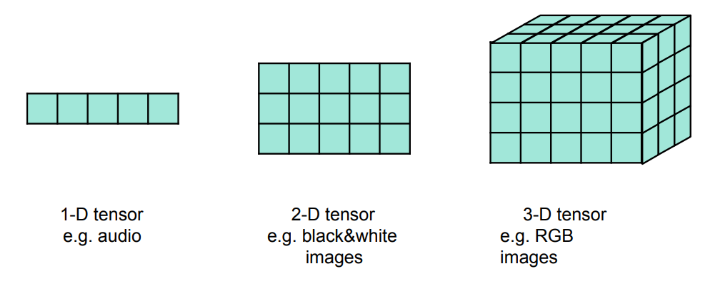
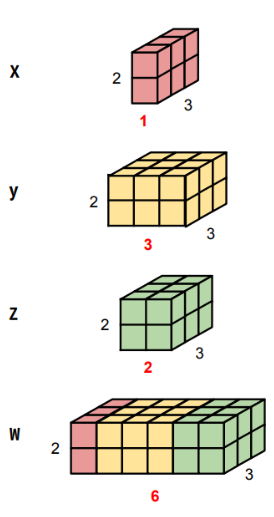
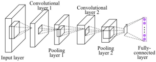
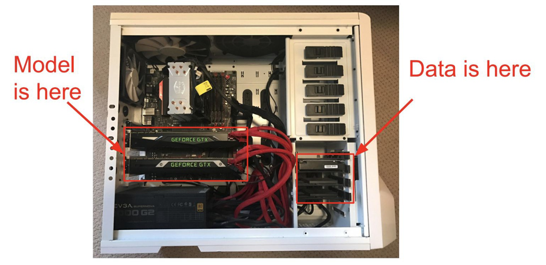

# PyTorch Tutorial

[toc]

## Why PyTorch?

- Keras is simple & easy to use but difficult to implement sophisticated algorithms
- PyTorch is flexible although complicated programs might be slow to run

## What is PyTorch?

- an open source machine learning framework based on python
- used for both GPU and CPU
- easy to learn and complete libraries
- strong community
- *data parallelism* - using this feature, PyTorch can distribute computational work among multiple CPU or GPU cores 
- GPU acceleration

## Getting Started

```python
import torch
torch.__version__
torch.cuda.is_available()
torch.cuda.get_device_name(0)
```

### Tensor

- **Tensors** are a fundamental and specialized data structure similar to NumPy arrays 
- however, they run on GPU (unlike NumPy arrays)



```python
vector = torch.tensor([7,7])
vector.shape
#torch.Size([2])

matrix = torch.tensor([[7,7],[7,7]])
matrix.shape
#torch.Size([2,2])
```

#### Common Operations

- addition, subtraction, division, multiplication
  - note that matrices must have matching inner dimensions to be multiplied
- `x.transpose(0,1)` will transpose the dimensions indexed at 0 and 1
- `x.squeeze(0)` will remove the dimension indexed at 0
- `x.unsqueeze(1)` will expend a new dimension indexed at 1
- `torch.cat([x,y,z], dim=1)` will concatenate the tensors `x`, `y`, and `z` on the dimension indexed at 1



### Module

This is an example of a CNN using PyTorch



```python
class Net(nn.Module):
    def __init__(self):
        super(Net, self).__init__()
        self.conv1 = nn.Conv2d(1, 10, kernel_size=5)
        self.conv2 = nn.Conv2d(10, 20, kernel_size=5)
        self.mp = nn.MaxPool2d(2)
        self.fc = nn.Linear(320, 10)
    def forward(self, x):
        in_size = x.size(0)
        x = F.relu(self.mp(self.conv1(x)))
        x = F.relu(self.mp(self.conv2(x)))
        x = x.view(in_size, -1)  # flatten the tensor
        x = self.fc(x)
        return F.log_softmax(x)
```

#### Train a Simple Network

1. **Forward** compute output of each layer
2. **Backward** compute gradient
3. **Update** update the parameters with computed gradient

```python
import torch
from torch.autograd import Variable

N, D_in, H, D_out = 64, 1000, 100, 10
x = Variable(torch.randn(N, D_in))
y = Variable(torch.randn(N, D_out), requires_grad=False)

# define our model as sequence of layers
model = torch.nn.Sequential(
	torch.nn.Linear(D_in, H),
	torch.nn.ReLU(),
	torch.nn.Linear(H, D_out))
## nn also defines common los functions
loss_fn = torch.nn.MSELoss(size_average=False)

learning_rate = 1e-4
for t in range(500):
    # forward pass: feed data to model; and prediction to loss function
    y_pred = model(x)
    loss = loss_fn(y_pred, y)
    # backward pass: compute all gradients
    model.zero_grad()
    loss.backward()
    # update: make gradient step on each model parameter
    for param in model.parameters():
        param.data -= learning_rate * param.grad.data
```

We can also use an **optimizer** for different update rules

```python
learning_rate = 1e-4
optimizer = torch.optim.Adam(model.parameters(), lr=learning_rate)
for t in range(500):
    y_pred = model(x)
    loss = loss_fn(y_pred, y)
    
    optimizer.zero_grad()
    loss.backward()
    # update all parameters after computing gradient
    optimizer.step()
```

#### Data Loading

##### Batch Size

- one **epoch** is one forward pass and one backward pass of *all* training examples
- **batch size** is the number of training examples in one forward / backward pass. The higher the batch size, the more memory space you'll need
- the number of **iterations** is the number of *passes*, each pass using *batch size* number of examples
  - to be clear, **one pass** includes both a forward and backward pass (they are **not** considered as two different passes)

> if you have $1000$ training examples and your batch size is $500$, then it will take $2$ iterations to complete $1$ epoch

##### CPU / GPU Communication



- if you aren't careful, training can bottleneck on reading data and transferring to GPU
- solutions:
  - read all data into RAM
  - use SSD instead of HDD
  - use multiple CPU threads to prefetch data

## TensorBoard

[TensorBoard](https://www.tensorflow.org/tensorboard) is a tool to show the progress of multiple projects


