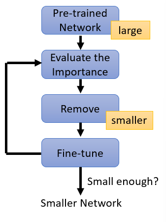
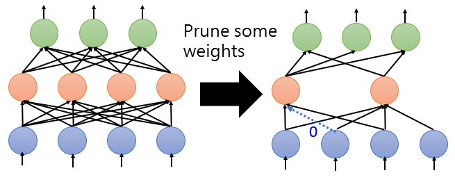
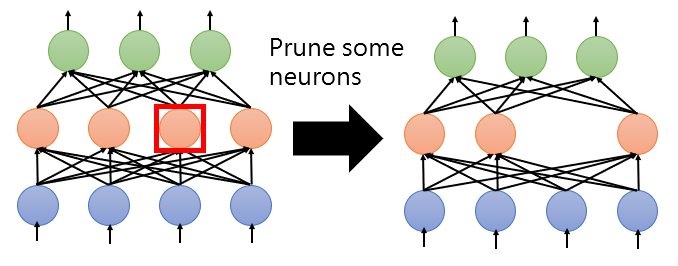
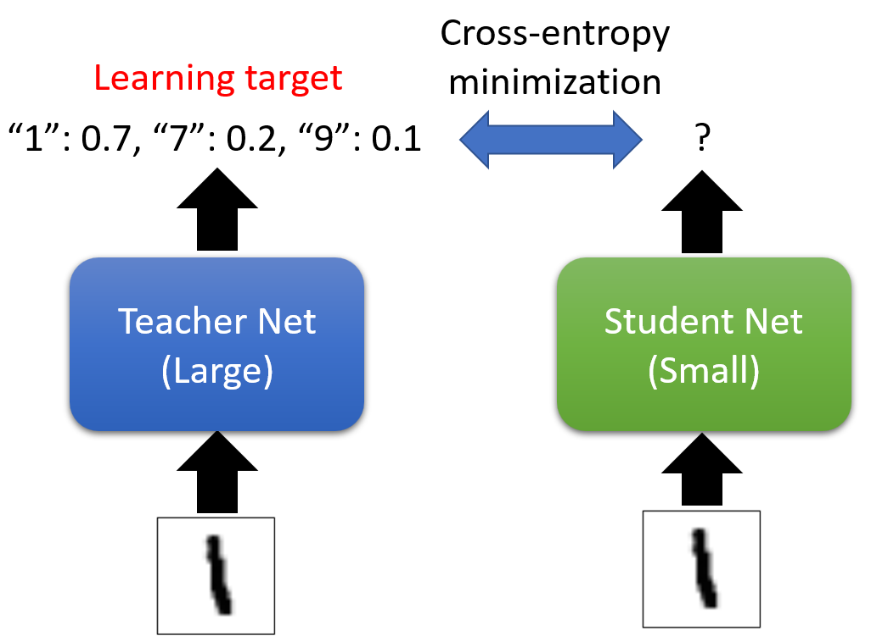
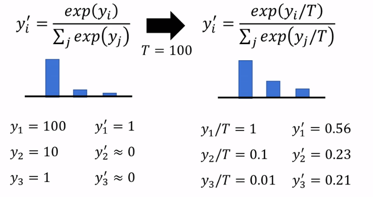
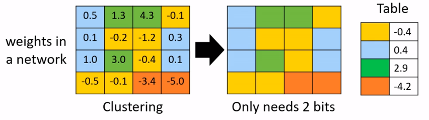
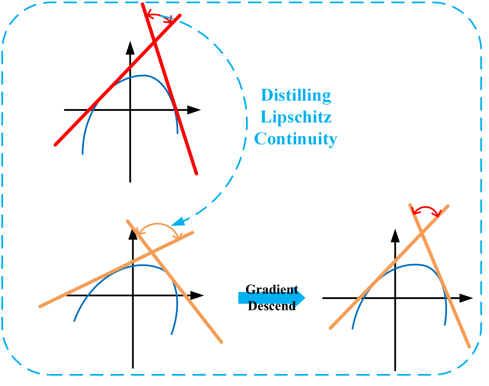

# Network Compression

- smaller models are desirable as a result of limited memory and computing power
- ChatGPT 3 has about 175 billion parameters and it costs about $0.10 for every query given to it
- smaller models can be be deployed in resource-constrained environments (like an iPhone) 

[toc]

## Network Pruning

- networks are typically over-parameterized 
  - there is significant redundant weights or neurons
- the solution is to prune them

- to evaluate the importance of 
  - a weight: absolute values, life long, etc
  - a neuron: the number of times it wasn't 0 on a given dataset
- after pruning, the accuracy will drop (hopefully not too much)
- then we fine-tune on training data for recovering accuracy
- the repeat from the evaluation
  - don't prune too much at once or the network won't recover!

### Network Pruning Practical Issues

- after pruning weights, we also prune neurons such that the network architecture becomes irregular and *harder* to implement and speed up 
  - representing the calculations as matrix multiplications is hard / no longer possible 
  - this makes it difficult for GPUs to speedup the calculations 

- however, when we prune neurons, our network architecture is still regular
  - easy to implement & speed up

### Why Prune?

- how about just train smaller network?
- it is widely known that smaller network is more difficult to learn
- ==lottery ticket hypothesis== is about finding a small, essential subset of connections in a neural network that, when properly trained, can achieve high performance

---

## Knowledge Distillation

- we have 2 networks, a larger *teacher net* and a *student net*

- the student can be trained by minimizing its loss with respect to the teacher's predictions
  - this way if the teacher predicts a higher probability between "1" and "7" on a target image, the student is provided information that "1" and "7" are similar in shape
- we can also use an ensemble of $N$ networks as the teachers for the smaller student network 

### Temperature for SoftMax

- we can also introduce a hyperparameter for temperature in SoftMax activation functions 

- when temperature is high, the SoftMax function becomes "soft" 
  - the probability distribution over classes is more uniform
  - all classes have nearly equal probabilities, and it's less certain about the predictions
- when the temperature is low, the SoftMax function becomes "hard"
  - the probability distribution is more peaked, with one or a few classes having high probabilities
  - low temperature makes the model more certain about its predictions, and it's less likely to explore alternatives

---

## Parameter Quantization

- use less bits to represent a value

### Weight Clustering

- represent frequent clusters by less bits
- represent rare clusters by more bits

---

# Network Compression and its Application

## Lipschitz Continuity Guided Knowledge Distillation

### Motivations

- ==Lipschitz constant== of a function $||f||_\text{Lip}$ is the maximum norm of its gradient in the domain set which reflects Lipschitz continuity of the function 

$$
\forall{x,y\in \mathbb R^n}, ||f(x)-f(y)||_2 \le ||f||_\text{Lip} \cdot ||x-y||_2
$$

- the Lipschitz constant of a function is like a measure of how fast the function can change
  - if the Lipschitz constant is small, it means the function changes slowly and is "smooth" 
  - if it's large, the function can change quickly and is less smooth

- *Lipschitz Continuity Guided Knowledge Distillation* is about using *Lipschitz constant* to help transfer knowledge from one neural network to another
  - its like transferring the knowledge of how fast the function changes from one network to another

- many studies underline the significance of Lipschitz constant in neural networks' **expressiveness and robustness**