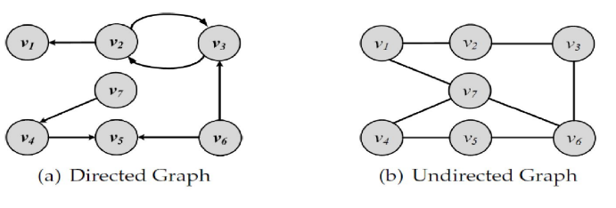

# Graph Essentials

[toc]

- a network is a graph (collection of points connected by lines)
- points are called **nodes, actors, or vertices**
  $\bf{V}=\{v_1, v_2, ..., v_n\}$
- connections are called **edges or ties**
  $\bf{E}=\{e_1, e_2, ..., e_m\}$
  where edges can be written as $e(v_i, v_j)$
- directed vs undirected graphs
  - directed: $e(v_i, v_j) \neq e(v_j, v_i)$
  - undirected: $e(v_i, v_j) = e(v_j, v_i)$



* neighborhood $N(v)$ is the set of nodes that node $v$ is connected to

  - the number of edges connected to a node is the degree of the node or the size of its neighborhood

  - in-degree $d_{in}$ is number of edges pointing towards a node

  - out-degree $d_{out}$ is number of edges pointing away from a node

### Degree and Degree Distribution

- Theorem 1: the summation of degrees in an undirected graph is twice the number of edges 
  $\sum_i d_i = 2|\bf{E}|$
- Lemma 1: the number of nodes with odd degree is even
- Lemma 2: in any directed graph, the sum of in-degrees is equal to the sum of of out-degrees
  $\sum_i d_i^{out} = \sum_j d_j^{out}$

### Subgraphs

.png)

### Graph Representation

- Adjacency Matrix

  - can be implemented with 2D array

  .png)

- Adjacency List

  - can be implemented with dictionary where keys are nodes and values are arrays

  .png)

- Edge List

  - can be implemented with a list of tuples

  .png)

### Types of Graphs

- **null graph** is where node set (and edge set) is empty
- **empty graph** or **edgeless graph** is one where the edge set is empty
- **directed, undirected, mixed graphs**
  - the agency matrix for directed graph may not be symmetrical
- **simple graph** vs **multigraph**
  - single graphs only allow a single edge between nodes
  - multigraph allow multiple edges between nodes
- **weighted graphs** associate edges with weights

#### Walk, Trail, Tour, Path, Cycle

- **Walk**: an alternating series of node and edges that begins and ends at a node
- **Trail**: a walk where no edge is visited more than once and all edges are distinct
  - **Tour / Circuit**: a closed trail (one that ends where it starts)
- **Path**: a walk where nodes and edges are distinct
  - **Cycle**: a closed path
  - Length of Path: number of edges visited on a path (or cycle)

##### Examples

- **Eulerian Tour**
  - All edges are traversed only once
  - Konigsberg edges
- **Hamiltonian Cycle**
  - A cycle that visits all nodes

##### Random Walk

- a walk that the next node is selected randomly among the neighbors

- the weight of an edge can be used to define the probability of visiting it

### Connectivity

- A node $v_i$ is **connected** to another node $v_j$ if it is adjacent to to it or there exists a path from $v_i$to $v_j$
- A graph is **connected** if there exists a path between any pair of nodes in it
  - to tell if an undirected graph of $x$ nodes  is connected, we must consider $x \choose 2$
  - to tell if a directed graph of x nodes  is strongly connected, we must consider $2 * {x \choose 2}$
  - in a directed graph, a graph is **strongly connected** if there exists a directed path between any pair of nodes
  - in a directed graph, a graph is **weakly connected** if there exists a path between any pair of nodes without following edge directions
- A graph is **disconnected** otherwise

#### Components

- a component in an undirected graph is a connected subgraph
- a component in a directed graph can either be a strongly connected *or* weakly connected component

#### Shortest Path

the shortest path is the path between two nodes that has the shortest length

* the length of the shortest path between nodes $v_i$ and $v_j$ as $l_{i,j}$

an **n-hop neighborhood** of a node is the set of nodes that are within n hops distance from the node

#### Diameter

of a graph is the length of the shortest path between the most distanced nodes

## Special Graphs

- **Trees**: connected acyclic undirected graph
- **Spanning Tree**: for any connected graph, the spanning tree is a subgraph and a tree that includes all the nodes of the graph
  - **MST Minimum Spanning Tree**: out of the many spanning trees of a weighted graph, MST is the one that has the minimum weight
- **Steiner Trees**: given a weighted graph $G: (V, E, W)$ and a subset $V’ \subseteq V$ the steiner tree is the one that spans the subset (MST)
- **Complete Graph**: a graph for a set of nodes V that has all possible existing edges (all nodes are directly connected)
- **Planer Graph**: a graph that can be drawn such that no two edges cross
- **Bipartite Graphs**: a graph where the node set can be partition into two nonempty disjoint sets $V_R, V_L$ such that every edge in the graph only connects one vertex in $V_R$ to one vertex in $V_L$
- **Regular Graphs**: a graph where all nodes have same degree
  - **$k$-Regular Graph**: all nodes have degree $k$
  - a complete graph *is* a regular graph (*not always* other way around)

#### Bridges

are edges whose removal will increase the number of *connected* components

### Graph / Network Traversal Algorithms

these algorithms visits nodes on a graph and return the order of the nodes visited

- **DFS Depth-First Search**
  - uses stack for frontier
- **BFS Breadth-Firth Search**
  - uses queue for frontier 
- **Dijkstra's Algorithm**
  - used to find shortest paths (and their lengths) to all other nodes from a starting node
  - used for weighted graphs with *non-negative* edges

```python
def dijkstra(G, start_node):
    table = {n : {'distance': float('inf'), 'prev_node': None} for n in G.nodes}
    table[start_node]['distance'] = 0
    visited = {n : False for n in G.nodes}
    queue = PriorityQueue()
    queue.put((table[start_node]['distance'], start_node))
    while not queue.empty():
        current = queue.get()[1]
        visited[current] = True
        for neighbor in G.neighbors(current):
            tentative_distance = table[current]['distance'] + G[current][neighbor]["weight"] 
            if not visited[neighbor] and tentative_distance < table[neighbor]['distance']:
                table[neighbor]['distance'] = tentative_distance
                table[neighbor]['prev_node'] = current
                queue.put((table[neighbor]['distance'], neighbor))
    return table
```

- **Prim’s Algorithm**
  - used to find MST