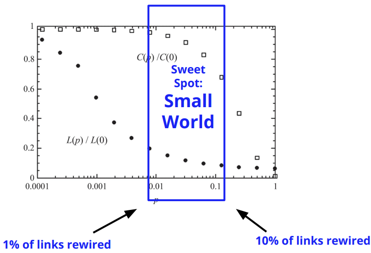

# Network Models

## Properties of Real-World Networks

#### Degree Distribution

- We can use a histogram to plot how many neighbors for each node in a graph
- The **Pareto principle** says that 80% of the effects come from 20% of the causes
  - Wealth distribution: top 0.001% owns most of wealth
  - City population: few cities have dense population
  - Social media: few users are very popular

### Power Law Distribution

> The rich get richer

When the frequency of an event changes a power of an attribute
$$
P_d = ad^{-b} \\
\ln{P_d} = -b \ln d + \ln a
$$

- where $a$ is Power-law intercept, $d$ is node degree, $b$ is Power-law exponent (value typically in range of $[2, 3]$), $P_d$ is fraction of users with degree $d$

- Many real world networks exhibit power law distribution
- **Small occurrences** are common while **Large instances** are very rare
  - *Not sure what this means*
- Networks with power-law degree distribution are often called **scale-free** networks
  - *Not sure what this means exactly* - on different scales the same trend will be observed

###### Examples of Power Law Distribution

- Call networks: fraction of telephone numbers that receive $k$ calls per day is proportional to $1 / k^2$ (where $k$ is $d$ and $2$ is $b$)

#### The Long Tail

Displays in a company if most sales are made from a small set of popular items or a much larger population of items are each are less popular

* 57% of Amazon sales is from the *long tail*

### Clustering Coefficient

- in real world networks, friendships are highly transitive (refer to **Friendship Patterns/Transitivity** in **Network Measures**)

### Average Path Length

* How long (maximum or average time) does it take for a rumor to reach all nodes in the network
* Average shortest path: any two members in the network are usually connect via short paths. On average, what is the length of the shortest path between users?
  * Usually is pretty small: One Facebook it is 4.7

## Random Graphs

We start with the basic assumption on how friendships are formed

- Edges (friendships) between nodes (individuals) are formed randomly
- We will discuss 2 random graph models: $G(n, p)$ and $G(n, m)$

### $G(n, p)$

* Consider a graph with fixed $n$ nodes
* Any of the $n \choose 2$ edges can be formed with probability $p$

### $G(n, m)$

* Assume both number nodes $n$ and edges $m$ are fixed
* Select $m$ edges randomly from the set of possible edges

$$
|\Omega| = {{n \choose 2} \choose m}
$$

is the number of possible graphs with $n$ nodes, $m$ edges

### Comparing the 2 Random Graphs

**Similarities**

- when $n$ is very large (i.e. in the limit), both $G(n,p)$ and $G(n,m)$ act very similarly
  - the expected number of edges in $G(n,p)$ is ${n \choose 2}p$
  - we can set $m = {n \choose 2}p$ and, in the limit, we get similar results

**Differences**

- $G(n,m)$ has fixed number of edges (i.e. always $m$)
- $G(n,p)$ can have none or all possible edges

### Expected Degree

The expected degree of $G(n,p)$ is $c = (n-1)p$

We can also say $p = c/(n-1)$

> Proof:
>
> - a node can have at most $n-1$ edges
> - all edges are selected independently with probability $p$
> - therefore, on average, $(n-1)p$ edges are selected

 Given $G(n,p)$, the probability of observing $m$ edges is the binomial distribution
$$
P(|E|=m) = {{n \choose 2} \choose m}p^m(1-p)^{{n \choose 2} - m}
$$

## Evolution of Random Graphs

### Giant Component

- as $p$ increases in random graphs, we have more nodes are connected
- the *largest* connected component is known as the **giant component**
  - when $p = 0$, the giant component will be $0$
  - when $p = 1$, the giant component will be $n$

- notice that as $p$ increases, it does not necessarily mean that that diameter and average path length will increase

## Properties of Random Graphs

### Degree Distribution

$$
P(d_v=d) = {n-1 \choose d} p^d(1-p)^{n-1-d}
$$

- where we have $n-1$ possible values of $d$ for node $v$ to have a degree $d_v=d$
- this is a binomial degree distribution
- in the limit, it becomes Poisson degree distribution (unlike real world networks that have the power law distribution)

### Expected Local Clustering Coefficient

for a node $v$ of a random graph generated by $G(n,p)$ is $p$

### Global Clustering Coefficient

for a node $v$ of a random graph generated by $G(n,p)$ is also $p$

> Both local and global are the same for a random graph

### How representative is the Generated Graph?

- [ ] **Degree Distribution**: random graphs do not have power law distribution
- [x] **Average Path Length**: random graphs perform well in modeling average path lengths
- [ ] **Clustering Coefficient**: random graphs drastically underestimate the clustering coefficient

## Small-World Model

is a special type of random graph that exhibits small-world properties:

- has small average path length
- has high clustering coefficient

### Regular Lattice

- in the real world, many individuals have a limited number of connections
- this assumption can be exercised using a **regular network** (all nodes have same number of connections)
- a **regular lattice** is a special regular network where there exists a pattern on how nodes connect
  - in a regular lattice of degree $c$, nodes are connected to their previous $c/2$ neighbors and following $c/2$ neighbors
  - formally, an exists between nodes $i,j$ if and only if

$$
0 \le min(n-|i-j|, |i-j|) \le c/2
$$

- the lattice has a *high* but *fixed* clustering coefficient
- the lattice has a *high* average path length

### Rewiring Edges

- in the small-world model, a parameter $\beta \in [0,1]$ controls the randomness in the model
  - when $\beta = 0$ it is a regular lattice
  - when $\beta=1$ is is a random graph
- rewiring operation is when an edge is selected and one of its endpoints is changed randomly, usually
  - disallowing self-edges
  - disallowing multiple edges

### Comparing Random Graph to Regular Lattice

**Regular Lattice**

- high clustering coefficient
- high average path length

**Random Graph**

- low clustering coefficient 
- *ok* average path length

#### What happens in Between?

as we increase $p$ (i.e. $\beta$) from $0$ to $1$ (regular lattice to random graph)

- *fast* decrease in average path length
- *slow* decrease in clustering coefficient 

### Degree Distribution of Small-World

- still it is not power law distribution
- the formula is too long for me to care about

### Clustering Coefficient of Small-World

$$
C(p) \approx (1-p)^3C(0)
$$

### How representative is the Small-World?

- [ ] **Degree Distribution**: small world also does not preserve the power law distribution
- [x] **Average Path Length**: small world is similar to original network
- [x] **Clustering Coefficient**: small world is also similar

## Preferential Attachment Model

when a new user joins a network, the probability of connecting to existing nodes is proportional to existing node's degrees

> The rich get richer

###### Example

say a new node $v$ arrives to this graph

the probability of $v$ connecting to another node $v_i$ is
$$
P(v_i) = \frac{d_i}{\sum_j d_j}
$$
so the probabilities $v$ connects to each node is

- $P(1) = 1/7$
- $P(2) = 1/7$
- $P(3) = 2/7$
- $P(4) = 0/7$
- $P(5) = 3/7$

### How representative is the Preferential Attachment Model?

- [x] **Degree Distribution**: well preserves power law properties (*rich get richer*)
- [x] **Average Path Length**: reversed by preferential attachment model 
- [ ] **Clustering Coefficient**: underestimated

Still none of the proposed models fully preserve all these 3 properties :cry:

