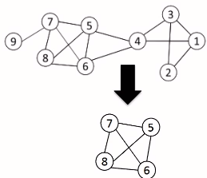
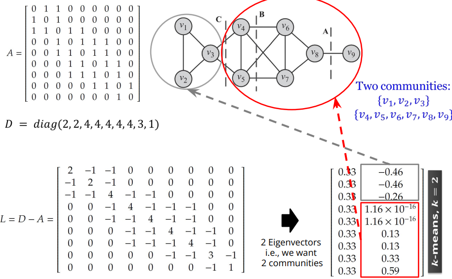
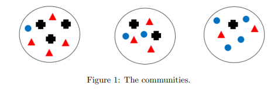

# Community Analysis

[toc]

**Why analyze communities?**

- helps better understand users - users form groups based on their interests
- provide a clear global view of user interactions - polarization
- some behaviors are only observable in a group setting and not on an individual level - some republicans can agree with democrats though their parties are opposing

## Social Media Communities

- **Explicit**: formed by user subscription
- **Implicit**: formed by social interaction

### Overlapping vs. Disjoint Communities


### What is Community Analysis?

1. **Community detection**: discovering implicit communities
2. **Community evolution**: studying temporal evolution of communities
3. **Community evaluation**: evaluating detected communities

## Community Detection

the process of finding clusters of nodes (*communities*)

- with **strong** <u>internal</u> connections, and
- **weak** connection between <u>different communities</u>

<hr>

### Community Detection vs. Clustering

**Clustering**

- data is often non-linked (matrix rows)
- clustering works on distance or similarity (k-means)
- if you use k-means with adjacency matrix rows, you are only considering the ego-centric network

**Community Detection**

- data is linked (graph)
- network data tends to be discrete leading to algorithms using the graph property directly
  - k-clique, quasi-clique, edge-betweenness

<hr>

### Member-Based Community Detection

> Identify *nodes* with similar characteristics and consider them a community

#### Node Characteristics

##### A. Node Degree

- the most common subgraph searched for is a **clique**
- a clique is a complete subgraph of the original graph
- recall that a complete graph is a graph where all possible edges are present

Find communities by searching for:

1. **the maximum clique**: the one with the largest number of vertices
2. **all maximal cliques**: cliques that are not subgraphs of a larger clique; i.e. cannot be further expanded

* both of these are NP-hard; to overcome we can use
  1. brute force - impractical for large networks
  2. relax cliques
  3. use cliques as the core for larger communities 

###### 1. Enhancing the Brute-Force Performance

**Pruning** can help the performance of an exhaustive search

- when searching for cliques of size $k$ or larger
- if the clique if found, each node should have a degree $\ge k-1$
- we can first prune all nodes with degree $< k-1$
  - prune recursively 
- for large $k$ many nodes are pruned as social media networks follow the power law distribution

**Example**



To find a clique $\ge 4$ remove all nodes with degree $\le (4-1)-1=2$

- remove nodes 2 and 9
- remove nodes 1 and 3
- remove node 4

Even with pruning, cliques are not that desirable as they are *rare*

###### 2. Relaxing Cliques

**k-plex**: a set of vertices $V$ in which we have 
$$
d_v \ge |V| - k, \forall_v \in V
$$

- a subset of vertices $V$ where each vertex is connected to at least $|V|-k$
- in other words, a graph is a k-plex if it is missing at most $k$ of its possible edges

**Example**


###### 3. Using Cliques as a Seed of a Community

**Clique Percolation Method CPM**

- uses cliques as seeds to find larger communities
- CPM finds overlapping communities

**Input** is a parameter $k$ and a network


1. find all the cliques of size 3
2. make a CPM clique graph by treating the cliques as nodes
3. each piece of the CPM clique graph is a community

##### B. Node Reachability

> If nodes can easily reach each other, then they should be put into the same community

**Special Subgraphs**

1. **k-clique**: a <u>maximal</u> subgraph in which the largest shortest path distance between any 2 nodes is $\le k$
   - if your looking at $n$ nodes, you'll need to check $n \choose 2$ nodes for the k-clique property
   - nodes on the shortest paths do *not* need to part of the subgraph
2. **k-club**: follows the same definition as *k-clique* but with this addition constraint:
   - nodes on the shortest paths *must* be part of the subgraph
3. **k-clan**: a *k-clique* where all shortest paths within the subgraph: the distance is $\le k$
   - all *k-clans* are *k-cliques* but not vice versa


##### C. Node Similarity

can be defined

- using the similarity of node neighborhoods (**structural equivalence**)
- by similarity of social circles (**regular equivalence**)

**Structural Equivalence**

two nodes are structurally equivalent if they are connecting to the same set of actors 


- nodes 1 and 3 are structurally equivalent
- so are 5 and 6
- note that the nodes themselves do not need to be connected

Jaccard similarity
$$
\sigma_\text{Jaccard}(v_I,v_j) 
= \frac{|N(v_i) \cap N(v_j) |}{|N(v_i) \cup N(v_j) |}
$$
Cosine similarity
$$
\sigma_\text{Cosine}(v_I,v_j) 
= \frac{|N(v_i) \cap N(v_j) |}{\sqrt{|N(v_i)|| N(v_j) |}}
$$


<hr>

### Group-Based Community Detection

> Finding communities that have certain **group properties** 

#### Group Properties

1. Balance
2. Robust
3. Modular
4. Dense
5. Hierarchical

##### Balanced Communities

Community detect can be through of as *graph clustering*

- **Graph Clustering**: we cut the graph into several partitions and assume these partitions represent communities
- **Cut**: partitioning of the graph into 2 or more sets (*cutsets*)
  - the *size* of the cut is the number of edges that are being cut
- **Minimum Cut** (*min-cut*) **Problem**: find a graph partition such that the number of edges between two sets is minimized


- min-cut often returns an imbalanced partition with one set being a singleton

###### Ratio Cut and Normalized Cut

To mitigate the min-cut problem, we can change the object function to consider *community size*
$$
\text{Ratio Cut}(P) = \frac{1}{k}\sum_{i=1}^k \frac{\text{cut}(P_i,\bar P_i)}{|P_i|} \\
\text{Normalized Cut}(P) = \frac{1}{k}\sum_{i=1}^k \frac{\text{cut}(P_i,\bar P_i)}{\text{vol}(P_i)}
$$

- where $\bar P_i = V-P_i$ is the complement cut set
- $\text{cut}(P_i,\bar P_i)$ is the size of the cut
  - the number of edges that need to removed to disconnect $P_i, \bar P_i$
- $\text{vol}(P_i) = \sum_{V\in P_i}d_v$ the sum of degrees in the cutset $P_i$
  - remember to include the edges that you "cut"

 

**Example**


For Cut A:
$$
\text{Ratio Cut}(\{1,2,3,4,5,6,7,8\},\{9\}) = \frac{1}{2}(\frac{1}{1}+\frac{1}{8})=0.56\\
\text{Normalized Cut}(\{1,2,3,4,5,6,7,8\},\{9\}) = \frac{1}{2}(\frac{1}{1}+\frac{1}{27})=0.52\\
$$
For Cut B:
$$
\text{Ratio Cut}(\{1,2,3,4\},\{5,6,7,8,9\}) = \frac{1}{2}(\frac{2}{4}+\frac{2}{5})=0.45\\
\text{Normalized Cut}(\{1,2,3,4\},\{5,6,7,8,9\}) = \frac{1}{2}(\frac{2}{12}+\frac{2}{16})=0.15\\
$$

- we should choose Cut B as it minimizes the ratios

###### Spectral Clustering

1.  Take adjacency matrix $A$ and diagonal matrix $D$ (where $D$ is a matrix with only values in the diagonal equal to the sum of elements in $A$'s columns)
2. $L=D-A$
3. Find $n$ eigenvectors from $L$ (i.e. we're looking for $n$ communities) 
4. Append the eigenvectors into one matrix and treat them as features with k-means clustering

**Example**



###### Robust Communities

The goal is to find subgraphs robust enough such that *removing some edges* or vertices *does not disconnect* the subgraph

- **k-vertex connected (k-connected)**: $k$ is the minimum number of nodes that must be removed to disconnect the graph
- **k-edge connected**: at least $k$ edges must be removed to disconnect the graph

###### Modularity Communities

- Consider a graph $G(V,E)$ where the degrees are known beforehand but the edge are not
- Consider the 2 vertices $v_i,v_j$ of degrees $d_i,d_j$
- What is the expected number of edges between $v_i,v_j$?
  - for any edge going out of $v_i$ randomly, the probability of this edge connecting to $v_j$ is

$$
\frac{d_j}{\sum_i d_i} = \frac{d_j}{2m}
$$


 <span style="color:red">finish going over "Ch 6 - Community Analysis I" and "Ch 6 - Community Analysis II"</span>


As an example, this is python code to calculate NMI from [Homework 3](assignments/CS 579 Homework 3.pdf)

- assume circle = 1, cross = 2, triangle = 3
- the communities are labeled 1, 2, 3 from left to right



```python
import math
n = 22
h = [1 for _ in range(8)] + [2 for _ in range(7)] + [3 for _ in range(7)]
l = [1, 2, 2, 2, 3, 3, 3, 3] + [1, 1, 2, 2, 3, 3, 3] + [1, 1, 1, 1, 2, 3, 3]
def nh(x):
    return h.count(x)
def nl(x):
    return l.count(x)
def nhl(x,y):
    c = 0
    for i in range(len(h)):
        if h[i] == x and l[i] == y:
            c = c + 1
    return c
term1 = sum(nhl(x,y) * math.log2((n * nhl(x,y)) / (nh(x)*nl(y))) for x in h for y in l)
term2 = sum(nh(x)*math.log2(nh(x)/n) for x in h)
term3 = sum(nl(y)*math.log2(nl(y)/n) for y in l)
NMI = term1 / math.sqrt(term2*term3)
```

