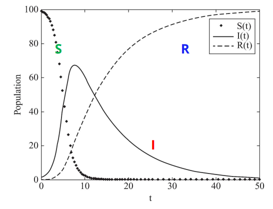

# Information Diffusion in Social Media

**Information Diffusion**: process by which a piece of information (knowledge) is spread and reaches individuals through interactions

- **Senders**: initiation the diffusion process
- **Receivers**: receive diffusion information. Commonly the set of receivers are much larger than senders
- **Medium**: the medium where diffusion takes place


## Herd Behavior

- Network is observable
- Only public information is available

In general, **herd behavior**'s network is close to a **complete graph** where nodes can observe most other nodes and they can observe public information (i.e. they can see the crowd)

### Examples of Herd Behavior

**Milgram's Experiment**

>  Stanley Milgram asking one person to stand on a busy street in NY and look up to the sky - about 4% of passerby stopped and also looked up

**Popular Restaurant**

> - you're on a trip and decide to go to a restaurant **A** based on many positive online reviews
> - you get to **A** and find it empty but with many people at **B** which saves the same cuisine
> - you decide to go to **B** based on the belief that other diners have also had the chance of going to **A**

**Solomon Asch's Experiment**

**Asch Elevator Experiment**

### Main Components of Herd Behavior

1. a method to transfer behavior among individuals or to observe their behavior 
2. a connection between individuals

### Designing a Herd Behavior Experiment

1. There needs to be a decision made
   - For example, *going* to a restaurant
2. Decisions need to be in a sequential order
3. Decisions are not mindless and people have private information that helps them decide; and
4. No message passing is possible. Individuals don't know the private information of others, but can infer what others know from what is observed from their behavior.

#### Example: Urn Experiment

- there is an urn with 3 marbles where each marble is either <span style="color:red">red</span> or <span style="color:blue">blue</span>
- in a large class, each student comes to the urn, picks a marble, checks its color in private, then writes on a public board what if they think the urn has majority <span style="color:red">red</span> or <span style="color:blue">blue</span> marbles
- students can see the public guesses made by other students but not what they privately observed


- regardless of what marbles there are, herding always happens at the 4th level

### Herding Intervention

- herding can be intervened by releasing private information
- an example of intervention is in the folktale, [The Emperor's New Clothes](https://en.wikipedia.org/wiki/The_Emperor%27s_New_Clothes#Plot)

<hr>

## Information Cascade

Users often repost content posted by others in the network

- In the presence of a network
- Only local information is available

In **information cascade**, a piece of information/decision cascaded among some users, where

- individuals are connected by a network and
- individuals are only observing decisions of their immediate neighbors 

> Note that *cascade users* have less information available while *herding users* have almost all information about decisions

### Hotmail Example of Information Cascade

> Hotmail was one of the first internet business's to become extremely successful utilizing viral marketing by inserting the tagline "Get your free e-mail at Hotmail" at the bottom of every e-mail sent out by its users. 

### Assumptions for Cascade Models

- Network is a **directed graph** where edges depict communication channels between nodes
- A node can only influence nodes that it is connected to
- Decisions are binary where nodes are either
  - **Active**: the node adopted the behavior or decision and can activate its neighbors
  - **Inactive**
  - nodes change from inactive to active but not vice versa (*progress process*)

### Independent Cascade Model ICM

- A **sender-centric** model of cascade
- Each nodes has *one chance* to activate its neighbors

```pseudocode
/* ICM Algorithm */
/* A[0] is set of inital activated nodes  */
/* p(v,w) is activation probabilities */
i = 0
while A[i] != {}: /* for all */
	i++
	A[i] = {};
	for all v in A[i-1]:
		for all neighbor w of v where w not in any A:
			if random.number < p(v,w):
				activate w
				A[i] = A[i] union {w}
return the union of all A
```


- in this example, every edge has a weight $w$ and a *randomly* generated threshold $r$
- if $w > r$ then activate the neighbor  

### Maximizing the Spread of Cascades

#### Problem Statement

**Given** limited budget $k$, find an initial $k$-node set $S$ to maximize $f(S)$

- a constrained optimization problem with $f(S)$ as the objective function
- it is NP-hard

$f(S)$ is the expected spread of node set $S$

- the expected number of activated nodes at the end of a cascade

1. it is non-negative
2. it is monotone such that $f(S+v) \ge f(S)$
3. it is submodular

#### Cascade Maximization: Greedy Algorithm

Because this problem is NP-hard, we can relax it and look for a non-global solution with a greedy algorithm

```pseudocode
1. start with B = {} /* start with empty sety */
2. evaluate f(v) for each node v then pick the node v1 with max to form B = {v1}
3. select a node which will increase f(B) most if the node is included
```

The resulting set $S$ activates at least $1-1/e \approx 63\%$ from the optimal solution

> To use $f(S)$, we need an activation rule
>
> For example, an activation rule can be `abs(i - j) mod 3 ** 2` where
> `i` is the index of the sender and `j` is the index of the receiver
> if their difference mod 3 equals 2 then the receiver gets activated
>
> We apply this rule iteratively across activated nodes

<hr>

## Diffusion of Innovation

- The network is totally *not observable* (we don't know how people are connected)
- Only public information is observable
- Because we can't really access the information, the models are very qualitative and descriptive

### Innovation Characteristics

- **Observable**: the degree to which the results of an innovation are visible to potential adopters
- **Have Relative Advantage**: the degree to which the innovation is perceived as better than current practice
- **Compatible**: the degree to which the innovation is perceived to be consistent with socio-cultural values
- **Trailable**: the degree to which the innovation can be expereinced on a limited basis
- **Not to Complex**: the degree to which the innovation is difficult to use / understand

### I. The Iowa Study of Hybrid Cord Seed (Adoption Types)

Because we don't know much about the network, the best we can do is divide the population into 5 categories:


### II. Katz Two-Step Flow Model

- most information comes from mass media which is then directed to influential figures or *opinion leaders*
- these leaders convey information and act as hubs for other members

### III. EM Roger's Process of Diffusion of Innovation

Gives a set of 6 steps for adoption process

<hr>

## Epidemics

describes the process by which disease spread

- **Pathogen**: the disease being spread or the tween being retweeted
- **Population of Hosts**
- **Spreading Mechanism**

Epidemic models assume an *implicit network* and unknown connection between users

- unlike herding and information cascades
- similar to diffusion of innovation

Epidemic models are more suitable when we are interested in global patterns

- trends
- ratios of people getting infected
- **not suitable for knowing who infects whom**

### How to Analyze Epidemics?

- Using **contact networks**
  - a graph where nodes represent hosts and edges represent their interactions
  - e.g. in an influenza contact network, hosts that breath the same air are connected
- Using **fully-mixed** method 
  - analyze only the rates at which hosts get infected, recover, and avoids considering network information

> These models assume no contact network information is available and
> the process by which hosts gets infected is unknown 

### Basic Epidemic Models

#### SI Model

Individuals are either

- **S**usceptible state
- **I**nfected state

$N = S(t) + I(t)$ 	(size of crowd)

$S(t)$ 	(number of susceptible individuals at $t$)
$I(t)$ 	(number of infected)

$\Beta$ contact probability where if $\Beta=1$ everyone comes in contact with everyone else

1. At each time stamp an *infected* induvial will meet $\Beta N$ people and infect $\Beta S$ of them
2. Since $I$ are infected, $\Beta IS$ will be infected in the next time stamp

$$
\frac{dS}{dt} = -\Beta IS \\
\frac{dI}{dt} = \Beta IS \\
(S + I = N) \rightarrow \frac{dI}{dt} =\Beta I(N-I) \rightarrow I(t) = \frac{NI_0e^{\Beta IN}}{N+I_0(e^{\Beta tN}-1)}
$$


- SI model has a **logistic growth function** compared to the HIV/AIDS growth in the United States

#### SIR Model

- Individuals are either S, I, or in a **R**ecovery state
- Individuals get infected and some recovery


$N = I + S + B$	(size of crowd)

$\frac{dS}{dt} = -BIS$
$\frac{dI}{dt} = BIS - \gamma I$
$\frac{dR}{dt}=\gamma I$

Where $\gamma$ defines the recovering probability of an individual at a time stamp



SIR model simulated with $S_0 = 99, I_0 = 1, R_0 = 0, B = 0.01,\gamma = 0.1$

#### SIS Model

the same as [SI](#SI Model) model with the addition of infected nodes recovering and becoming susceptible again

$\frac{dS}{dt} = \gamma I - BIS$
$\frac{dI}{dt} = BIS - \gamma I$

$\rightarrow \frac{dI}{dt}=BI(N-I)-\gamma I=I(BN-\gamma)-BI^2$

1. When $BN \le \gamma$

   - the first term will be at most zero

   - the whole term becomes negative

   - in the limit, $I(t)$ will decrease exponentially to zero

2. When $BN ? \gamma$

   - we will have a logistic growth function like SI model


SIS model simulated with $S_0 = 99, I_0 = 1, B = 0.01, \gamma = 0.1$

#### SIRS Model

individuals who have recovered will lose immunity after a certain period of time then become susceptible again


$\frac{dS}{dt}=\lambda R - BIS$
$\frac{dI}{dt}=BIS-\gamma I$
$\frac{dR}{dt}=\gamma I - \lambda R$


SIS model simulated with $S_0 = 99, I_0 = 1, B = 0.01, \lambda=0.2, \gamma = 0.1$

### Epidemic Intervention

Randomly pick some nodes and ask them who is the most popular from their point of view, then vaccinate those individuals!

