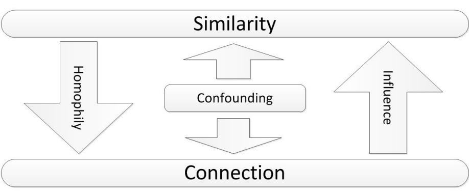
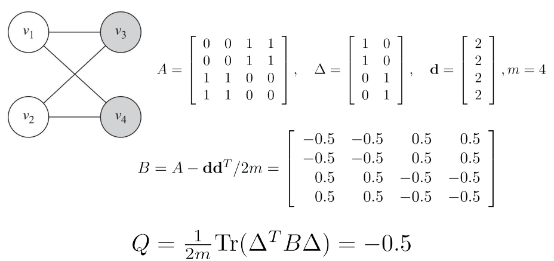
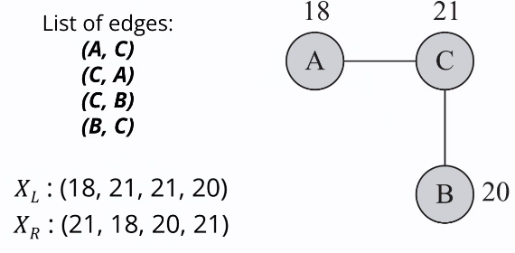
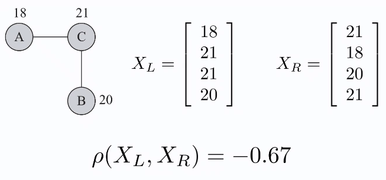
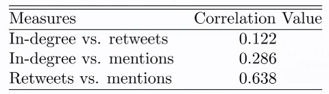
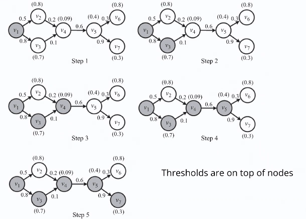
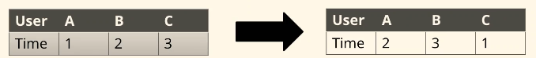
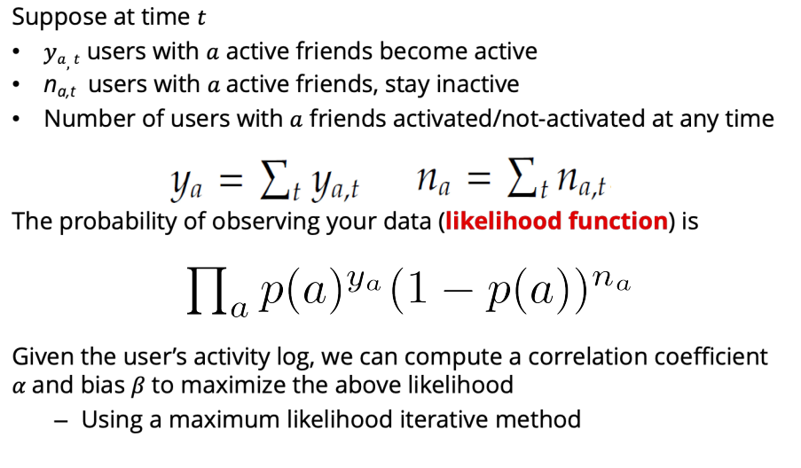
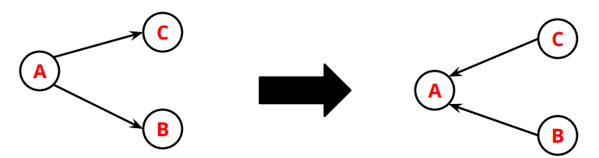

# Influence and Homophily

- *Special forces* connect individuals in different ways
- When individuals get connected we observe ==assortativity== or *social similarity*
- Social networks are assortative (high similarity between friends)

==Influence== 

- the process by which a user affects another user
- the influenced user becomes more similar to the influential figure

> Smoker friends influence their non-smoker friends

==Homophily== 

similar individuals become friends due to their high similarity

> Smokers become friends with smokers

==Cofounding==

the environments effect on making individuals similar

> There are lots of places people can smoke

> Both influence and homophily generate similarity in social networks
>
> - influence makes connected nodes similar to each other
> - homophily selects similar nodes and links them together

## Measuring Assortativity

### Measuring Assortativity for ==Nominal== Attributes

- Nodes have a [nominal](Ch-5-Data-Mining-Essentials.md#Data-Types) attribute such as race or sex
- $t(v)$ denotes the type of node $v$

$$
\frac{1}{m}\sum_{(v_i,v_j)\in E}\delta(t(v_i),t(v_j)) = \frac{1}{2m}\sum_{ij}A_{ij}\delta(t(v_i),t(v_j)) \\
\text{Kroncker delta function }\delta(x,y)=1 \text{ if }x=y \text{, else }0
$$

- $m$ is the total number of edges
- $d$ is the degree vector (the degrees of each node in a vector) 

### Assortativity Significance

the difference between [measured assortativity](#Measuring-Assortativity-for-Nominal-Attributes) and *expected assortativity*
$$
Q = \frac{1}{2m}\sum_{ij}A_{ij}\delta(t(v_i),t(v_j)) - \frac{1}{2m}\sum_{ij}\frac{d_id_j}{2m}\delta(t(v_i), t(v_j)) \\
= \frac{1}{2m}\sum_{ij}(A_{ij}-\frac{d_id_j}{2m})\delta(t(v_i),t(v_j))
$$
this is ==modularity==

#### Normalized Modularity Matrix Form

$$
Q=\frac{1}{2m}\text{Tr}(\Delta^TB\Delta)
$$

- where $\Delta$ is the matrix that indicates which attributes a node has
- and $B=A-dd^t/2m$ and $d$ is the degree vector

##### Example

The $\Delta$ matrix's left column indicates a node is light while the right indicates dark

This value shows that the edges between nodes of the same color is less than the expected number of edges between them

### Measuring Assortativity for ==Ordinal== Attributes

- A common measure for analyzing relationship between [ordinal](Ch-5-Data-Mining-Essentials.md#Data-Types) values is ==covariance==
- Covariance describes how two variables change together
- In our case, we have a network; we're interested in how values of nodes that are connected are related 

#### Covariance Variables

- the value assigned to node $v_i$ is $x_i$
- we construct two variables $X_L, X_R$ 
- then calculate covariance

##### Example

- Given the graph, construct a list of edges (where edges are specified in **both** directions)
- Define vector variables $X_L,X_R$ where $X_L$ has the attributes on the left nodes of edges and $X_R$ has the right ones (in the same orders)
- Notice that the expectation (mean) of both are the same $E(X_L)=E(X_R)$
- and the variance are the same $\sigma(X_L)=\sigma(X_R)$
- Calculating covariance:

$$
\sigma(X_L,X_R) = E[X_LX_R] - E[X_L]E_[X_R]\\
E(X_L)=E(X_R)=\frac{\sum_i(X_L)_i}{2m}=\frac{\sum_id_ix_i}{2m}\\
E(X_LX_R) = \frac{1}{2m}\sum_i(X_L)_i(X_R)_i=\frac{\sum_{ij}A_{ij}x_ix_j}{2m}\\
\sigma(X_L,X_R) = \frac{1}{2m}\sum_{ij}(A_{ij}-\frac{d_id_j}{2m})x_ix_j
$$

###### Pearson Correlation

- ==Normalized Covariance== can be done through *Pearson correlation* $[-1,1]$:

$$
p(X_L,X_R) = \frac{\sigma(X_L,X_R)}{\sigma(X_L)\sigma(X_R)}\\\\
\sigma(X_L)\sigma(X_R) = \frac{1}{2m}\sum_{ij}A_{ij}x_i^2-\frac1{2m}\sum_{ij}\frac{d_id_j}{2m}x_ix_j
$$

- where $d_i$ is the degree of node $i$ 
  $x_i$ is the nominal value of node $i$
  $m$ is the total number of edges in the graph
  $A$ is the adjacency matrix

## Measuring Influence

measured based on

1. Prediction
2. Observation

### Prediction-based Measurement

individual's attribute can predict how influential the user will be

> The number of friends of an individual is correlated with how influential they are (i.e. [centrality measures](Ch-3-Network-Measures.md#Centrality); how strong are these friendships)

### Observation-based Measurement

measuring the amount of influence **attributed** to the individual

1. Individual is the role mode: size of the audience that has been influenced
2. Individual spreads information: size of the cascade (population affected and rate they are influenced)
3. Individual increases values: rate of increase in the value of an item (second person to ever buy a fax machine increased it's value a lot)

### Case Studies for Measuring Influence in Twitter

- **In-degree**: number of followers; audience size
- **Number of mentions**:  individual’s ability in generating content that is worth being passed on
- **Number of retweets**:  individual’s ability in generating content that is worth being passed on

> - Observation: number of followers is considered an inaccurate measure compared to the other 2
> - We can rank individuals on Twitter independently based on these 3 measures
> - To see if they are correlated or redundant, we can compare ranks (in influence) of individuals across 3 measures using [rank correlation](#Comparing-Ranks-across-3-Measures) measures

#### Comparing Ranks across 3 Measures

to compare ranks across more than one measure (i.e. *in-degree* vs *mentions*) we can use ==Spearman's rank correlation== coefficient $[-1,1]$
$$
\rho = 1- \frac{6\sum_i(m_1^i-m_2^i)^2}{n^3-n}
$$

- where $m_1^i,m_2^i$ are the ranks of individual $i$ based on measures $m_1,m_2$
- $n$ is total number of usernames

- users with high in-degree do not necessarily have high ranks in terms of number of retweets or mentions

## Influence Modeling

- Each node is started as active or inactive
- A node, once activated, will activate its neighbors
- An activated node cannot be deactivated

### Influence Modeling: Assumptions

- The influence process takes place in a network
- Sometimes this network is observable (==explicit network==) and sometimes not (==implicit network==)
- Explicit (observable) network: we can use threshold models
  - linear threshold model (LTM)
- Implicit Network: we can use methods that take the number of individuals who get influenced at different times as input
  - linear influence model (LIM)

### Threshold Models

- simple yet effective methods for modeling influence in **explicit networks**
- nodes make decision based on the influence coming from their **already activated neighborhood**

#### Linear Threshold Model LTM

- receiver centric unlike [Independent Cascade Model](Ch-7-Information-Diffusion-in-Social-Media.md#Independent-Cascade-Model-ICM)
- a node $i$ becomes active if incoming influence $w_{j,i}$ from friends exceeds a certain threshold
- nodes satisfying the following will be activated

I  don't understand this equation, but the example makes sense
$$
\sum_{v_j\in N_{in}(v_i),v_j\in A_{t-1}}w_{j,i} \ge \theta_i
$$

- the summation is over $v_j\in N_{in}(v_i),v_j\in A_{t-1}$
- the threshold $\theta\in[0,1]$ is chosen randomly
- at time $t$, all nodes that were active in the previous steps $[0,...,t-1]$ remain active, but only nodes activated at $t-1$ get a chance to activate other nodes (nodes in the `frontier`)

##### LTM Example

1. $v_1$ is active; `frontier = [1]`
2. $v_3$ is activated as $0.8 > 0.7$ but not $v_2$ as $0.5 \cancel > 0.8$; `frontier = [3]`
3. $v_4$ is activated as $0.1 > 0.09$; `frontier = [4]`
   - note that we do not consider $v_2$ again in this step as the only node that is activating other nodes is $v_3$ (`frontier`) and $v_3$ is not connected to $v_2$
   - this doesn't mean nodes can't be considered to be activated twice, but it just depends on which node is in the `frontier`

## Measuring Homophily

- we can measure how the assortativity of the network changes over time
- consider 2 snapshots of a network $G_t(V,E)$ and $G_{t'}(V,E')$ at times $t, t'$ respectively 
- $V$ is fixed, $E$ are added and removed 
- for **nominal attributes**, ==homophily index== is defined as

$$
H = \mathcal Q^{t'}_\text{normalized} - Q^t_\text{normalized}
$$

> $\mathcal Q$ represents the observed fraction of edges in the network that connect nodes with the same attribute value
> $$
> \mathcal Q = \frac1m\sum_{ij}A_{ij}[X_i=X_j]
> $$
> (i.e., $A_{i,j} = 1$ if nodes $i$ and $j$ are connected by an edge, and $A_{i,j} = 0$ otherwise)

- for **ordinal attributes**, ==homophily index== is defined as the change in [Pearson correlation](#Pearson-Correlation)

$$
H = \rho^{t'} - \rho^t
$$

### Modeling Homophily

Homophily can be modeled using a variation of [ICM](Ch-7-Information-Diffusion-in-Social-Media.md#Independent-Cascade-Model-ICM)

- at each step, a single node gets activated (once a node is activated, it remains activated)
- $p_{v,w}$ or `p(v,w)` in the ICM model is replaced with **similarity** $\text{sim}(v,w)$ between nodes $v,w$
- when a node $v$ is activated, we generate a random tolerance $\theta_v$ for it $[0,1]$
  - this is the minimum similarity node $v$ requires for being connected to other nodes
- for any edge $(v,w)$ that is still not in the edge set, if $\text{sim}(v,w) > \theta_v$ then edge $(v,w)$ is added
- this continues until all vertices are visited

## Distinguishing Influence and Homophily

- Which social force (influence or homophily) resulted in an assortative network?
- To distinguish between an influence-based assortativity or homophily-based one, statistical tests can be used on snapshots of the network

### 1. Shuffle Test (Influence)

- influence is temporal 
- if $u$ influences $v$, then $u$ should have been activated before $v$
- based on a temporal assortative measure, if there is no influence, then a *shuffling of activation timestamps* should not effect the measurement

> After we shuffle the timestamps of user activities, if the new estimate of ==temporal assortativity== is significantly different from the original estimate based on the user’s activity log, **there is evidence of influence**

#### Measuring Temporal Assortativity

this is not that important; the idea is temporal assortativity can be measured in different ways for the shuffle test and this is just one of them...

- assume node activation probability $p(a)$ depends on $a$, the number of already-active friends of the node
- assume $p(a)$ can be estimated using a logistic function

$$
p(a) - \frac{e^{\alpha a + \beta}}{1 + e^{\alpha a + \beta}}\\
\ln\frac{p(a)}{1-p(a)}=\alpha a + \beta
$$

- where $a$ is number of active friends
- $\alpha$ (alpha) is the temporal assortativity (a variable)
- $\beta$ is a constant to explain the innate bias for activation 

### 2. The Edge-reversal Test (Influence)

If influence resulted in activation, then the direction of edges should be important (who influenced whom)

- reverse directions of all edges
- run the same logistic regression on the data using the new data
- if correlation is not due to influence, then $\alpha$ should not change 

### 3. Randomization Test (Influence / Homophily)

- capable of detecting both influence and homophily in networks
- influence changes attributes
- homophily changes connections

#### Notation and Preliminaries

- $X$ denotes node attributes
  - $X^i$ denotes the attribute of node $v_i$
  - $X_t$ denotes attributes of nodes at time $t$
- $A(G_t,X_t)$ denotes the assortativity of the network $G$ and attributes $X$ at time $t$
- the network becomes more assortative at $t+1$ if

$$
A(G_{t+1},X_{t+1}) - A(G_t,X_t)>0
$$

#### Influence Gain and Homophily Gain

- if the assortativity is due to influence, ==influence gain== is positive

$$
G_\text{Influence}(t) = A(G_t,X_{t+1}) - A(G_t,X_t) > 0
$$

- if it's due to homophily, ==homophily gain== is positive (notice the first $A$ term)

$$
G_\text{Homophily }(t) = A(G_{t+1},X_t) - A(G_t,X_t) > 0
$$

- in randomization test, we **check if the gains are significant**

##### Influence Significance Test

- compute influence gain $g_0$ at time $t$

- compute random attribute sets for time $t+1$

  - denote as $XR_{t+1}^i,1\le i\le n$ ($n$ randomized graphs with respect to their attributes)

    > ###### Example
    >
    > - $u$ has influence over $v$
    > - at time $t$, `movies` is in the hobbies of $u$ but not in hobbies of $v$
    > - at time $t+1$, `movies` is added to hobbies of $v$ (this is in reality, i.e. $v$ actually changed)
    > - to remove influence effect, we remove `movies` from $v$ at $t+1$ and replace with *random* hobby like `reading` (this is our test; was influence from $u$ on $v$ significant?)

- compute the (random) influence gain for all $XR_{t_1}^i$ sets and call them $\bf g_i$

- if $g_0$ is greater than $(1-\alpha/2)\%$ of all in $\bf g_i$ (or smaller than $(\alpha/2)\%$ of them), the influence gain is significant

##### Homophily Significance Test

- we construct random graphs with fixed attribute sets
- we remove the effect of homophily by generating $n$ random graphs $GR^i_{t+1}$ at time $t+1$
  - for any two (randomly selected) edges $e_{ij},e_{kl}$, we form new edges $e_{il},e_{kj}$
  - i.e. homophily effect remove while degrees stay the same
