# Recommendation in Social Media

When do we need recommender systems?

- too many choices 
- no obvious advantages among them
- we don't have enough resources / time to check all options
- we don't have enough knowledge to choose (information overload)
- too lazy

> Goal of Recommendation is to come up with a short list of items that fits the user's interests

## Main Idea

- use historical data such as the user's (or similar users) past preferences to predict future likes
- user's preferences are likely to remain stable and change smoothly over time
- formally, a recommender system takes a set of users $U$ and a set of items $I$ and learns a function $f$ such that $f:U\times I \rightarrow \mathbb R$

> The difference between *search* engines and *recommender* systems is that search engines’ results are not personalized 
> "best 2014 movie to watch" will be the same of a child and an adult

## Challenges

- **Cold Start Problem** we don't have enough data for a new user to recommend anything
- **Data Sparsity** we don't have enough historical information *for the system as a whole*
- Attacks like push attacks: push up ratings by creating fake users
- Privacy: employing user's private information to recommend things to others
- Explanation: recommenders often don't provide explanation of *why* it recommended something

## Classical Recommendation Algorithms

### Content-based Algorithms

- the more similar the item's description is to that user's interests, the more likely that user find the item's recommendation interesting
- thus, we need to find the similarity between the user and all of the existing items
- we first represent both the user profiles and items descriptions by vectorizing them using a set of $k$ keywords
- we can vectorize (e.g. use [TF-IDF](Ch-5-Data-Mining-Essentials.md#Term-Frequency-Inverse-Document-Frequency-TF-IDF)) the user and item $U_i, I_j$ and compute cosine similarity

$$
\cos(U_i,I_j) = \frac{U_i \cdot I_j}{|U_i||I_j|}
$$

- so if we have 100 users and 100 items, we need to calculate 100 by 100 similarities!
- also it may not always be possible to vectorize users / items

### Collaborative Filtering CF

- process of selecting information using techniques involving collaboration among multiple agents, data sources...
- the main advantage of this method is that the recommender *does not need to have additional information about the users or content of items*
- user's rating or purchase history is the only information that is needed

#### Rating Matrix

- **Explicit rating** entered by user directly (i.e. "1-5 stars")
- **Implicit rating** inferred by user behavior (i.e. watch time)

#### Types of CF

- [Memory-based](#Memory-based-CF): recommendation is directly based on previous ratings in the stored matrix that describe user-item relationships
- [Model-based](#Model-based-CF): one can assume that an underlying model (hypothesis) governs the way users rate items; this model can be approximated and learned
  (i.e. users rate low budget movies poorly)

#### Memory-based CF

- the assumptions are
  - [User-based CF](#User-based-CF): users with similar *previous* ratings for items are likely to rate future items similarly
    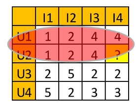
  - [Item-based CF](#Item-based-CF): items that have received similar ratings *previously* from users are likely to receive similar ratings from future users
    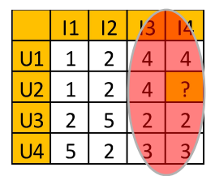

##### User-based CF

$$
r_{u,i} = \bar r_u + \frac{\sum_{v\in N(u)}\text{sim}(u,v)(r_{v,i}-\bar r_v)}{\sum_{v\in N(u)}\text{sim}(u,v)}
$$

- where $r_{u,i}$ is the predicted rating of user $u$ for item $i$
- $N(u)$ are the most similar neighbors of user $u$ (with a specified neighborhood size of $k$)
- $\bar r_u $ is the mean rating of user $u$
- $r_{v,i}$ is the observed rating of user $v$ for item $i$

###### User-based CF Example

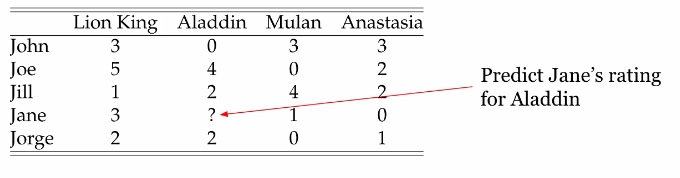

1. calculate average ratings
   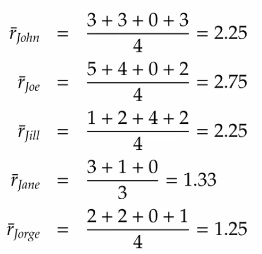

2. calculate user-user similarity (notice we do not use the Aladdin ratings as it is missing for Jane)
   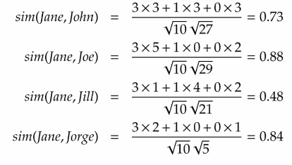

3. calculate Jane's rating for Aladdin; assume neighborhood size is 2 (i.e. use top 2 neighbors)
   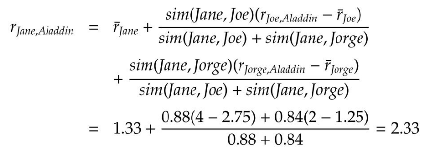

##### Item-based CF

$$
r_{u,i} = \bar r_i + \frac{\sum_{j\in N(i)}\text{sim}(i,j)(r_{u,j}-\bar r_j)}
{\sum_{j\in N(i)}\text{sim}(i,j)}
$$

- where $\bar r_i$ is the mean rating for item $i$
- $N(i)$ are the $k$ most similar neighbors of item $i$

###### Item-based CF Example

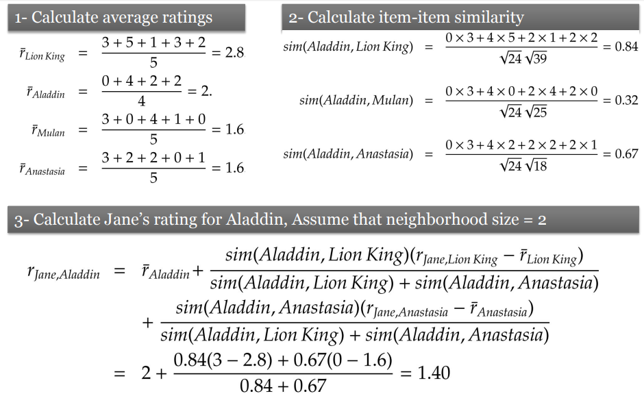

#### Model-based CF

- how do we find the underlying model?
- **Singular Value Decomposition (SVD)** linear algebra technique of a lossless matrix factorization to decompose matrix $X$ to 3 matrices $U\Sigma V^T$
- obtain a low-rank $k$ approximation $C$ of $X$
- recommend using $X_k$

> ###### SVD
>
> $$
> X = U\Sigma V^T
> $$
>
> - where $U\in \mathbb R^{m\times m}, V\in \mathbb R^{n\times n}$ are orthogonal matrices
> - $\Sigma\in\mathbb R^{m\times n}$ is a diagonal matrix (represents some correlation between $U,V$)
> - their product is equal to $X$, no information is lost
>
> "use MATLAB to calculate this crap" :poop:

> ###### Low-Rank Matrix Approximation with SVD
>
> - given a $k$, truncate
>   - $U\in \mathbb R^{m\times m} \rightarrow U_k\in \mathbb R^{m\times k}$ (keep only first $k$ columns)
>   - $\Sigma\in\mathbb R^{m\times n} \rightarrow \Sigma_k\in\mathbb R^{k\times k}$ (keep only first $k$ elements in diagonal)
>   - $V^T\in \mathbb R^{n\times n} \rightarrow V^T_k\in \mathbb R^{k\times n}$ (keep only first $k$ rows)
>
> $$
> X_k = U_k\Sigma_kV_k^T
> $$
>
> - where $X_k$ is the best low-rank approximation of matrix $X$

##### Model-based CF Example

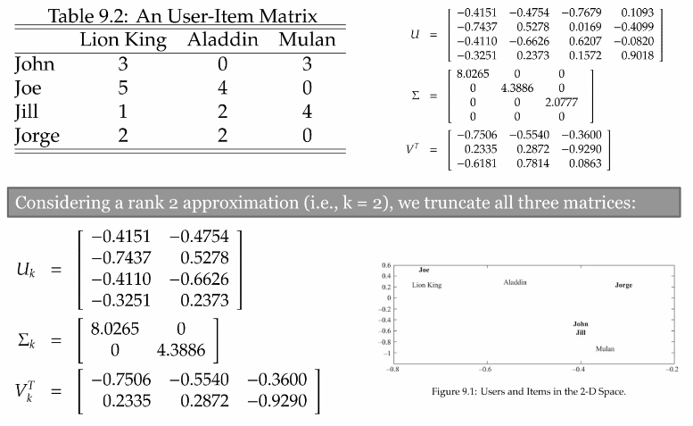

## Recommendation to Groups

Find content of interest to (ideally) all members of a group of socially acquainted individuals

### Aggregation Strategies

How to aggregate the individuals' ratings to a group rating

1. **Maximizing Average Satisfaction** average everyone's ratings and choose the max

$$
R_i = \frac1n\sum_{u\in G}r_{u,i}
$$

2. **Least Misery** max of all minimums (minimize dissatisfaction)

$$
R_i = \min_{u\in G}r_{u,i}
$$

3. **Most Pleasure** max of a individuals max ratings

$$
R_i = \max_{u\in G}r_{u,i}
$$

#### Aggregation Strategies Example

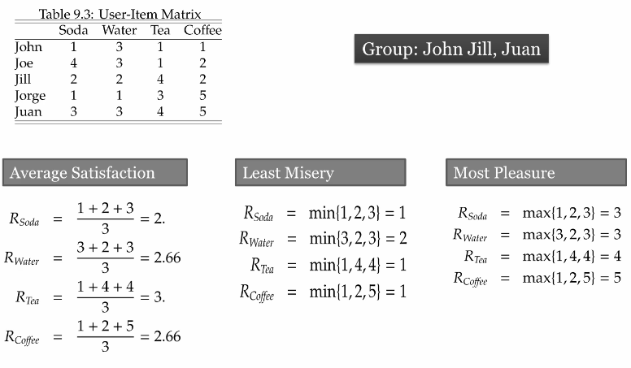

- each of this measures results in a different recommendation to the group
- for example, in least misery, we'd recommend water

## Recommendation Using Social Context

### Information Available in Social Context

- in social media, in addition to ratings of products, there is additional information available such as the friendship network
- this information can be used to improve recommendations
  - based on the assumption that an individual's friends have an impact on the ratings of that individual
- this impact can be due to homophily, influence, or confounding

> We can use additional social context by
>
> 1. using the social context alone (i.e. using the friendship network to recommend more friends; **friendship recommendation**)
> 2. using it in addition to ratings (**extending classical methods**)
> 3. using it to constrain recommendations (consider the ratings of users that are actually connected to me)

### Recommendation Constrained by Social Context

- in classical recommendation, to estimate ratings of an item, we determine similar users or items
- in other words, any user similar to the individual can contribute to the predicted rating
- we can limit the set of individuals that can contribute to the ratings of a user to the **set of friends** of the user

$$
r_{u,i} = \bar r_u + \frac{\sum_{v\in S(u)}\text{sim}(u,v)(r_{v,i}-\bar r_v)}{\sum_{v\in N(u)}\text{sim}(u,v)}
$$

- where instead of $N(u)$ in [user-based CF](#User-based-CF), we use $S(u)$ which is the set of $k$ most similar friends of $u$

#### Recommendation Constrained by Social Context Example

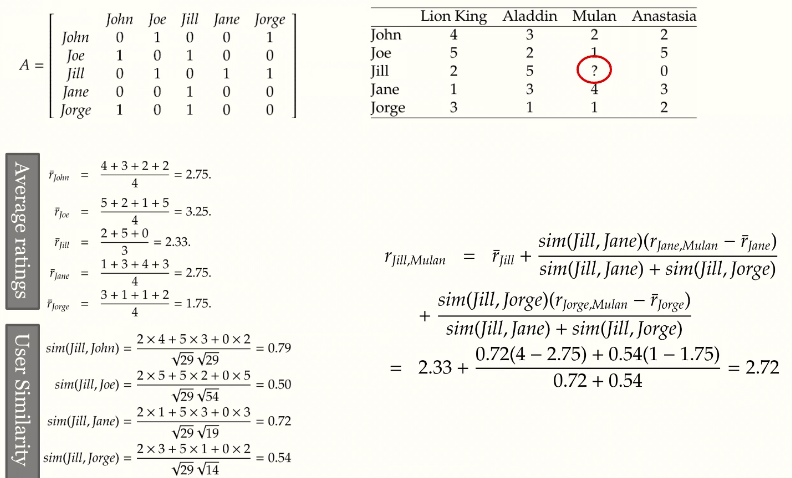

## Evaluation of Recommender Systems

- different algorithms work better or worse on different datasets
- the goals to perform evaluation may differ
- there is a significant challenge in deciding what combination of measures to use

### How Do We Evaluate Recommenders

- Application outcomes
  - add-on sales
  - click-through rates
  - number of products purchased (and not returned!)
- Research measures
  - user satisfaction
- Metrics
  - to anticipate the above beforehand (offline)

### Accuracy Metrics

- [Predictive accuracy](#Predictive-Accuracy) measure how close the recommender system’s predicted ratings are to the true user ratings 
- [Classification accuracy](#Relevance:-Precision-and-Recall) measure the ratio with which a recommender system makes correct vs. incorrect decisions about whether an item is good
  - Classification metrics are thus appropriate for tasks such as "Find Good Items" when users have binary preferences
- [Rank accuracy]()

#### Predictive Accuracy

- **Mean Absolute Error MAE** measures the average absolute deviation between a predicted rating $\hat r$ and the user’s true rating $r$

$$
\text{MAE} = \frac{\sum_{ij}|\hat r_{ij}-r_{ij}|}n\\
\text{Normalized: NMAE} = \frac{\text{MAE}}{r_\max-r_\min}
$$

- **Root Mean Square Error (RMSE)** similar to MAE, but places more emphasis on larger deviation

$$
\text{RMSE} = \sqrt{\frac1n\sum_{ij}(\hat r_{ij}-r_{ij})^2}
$$

##### Predictive Accuracy Example

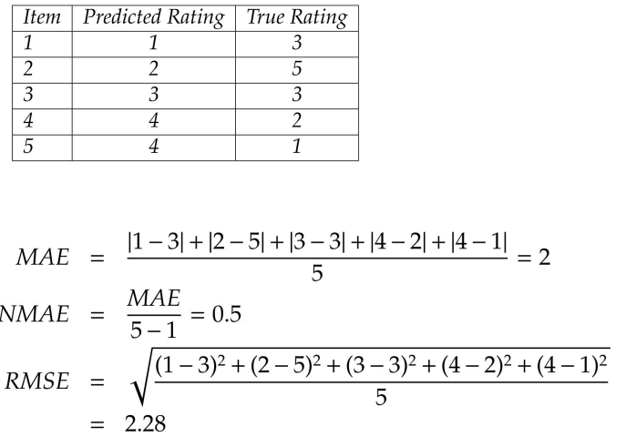

#### Relevance: Precision and Recall

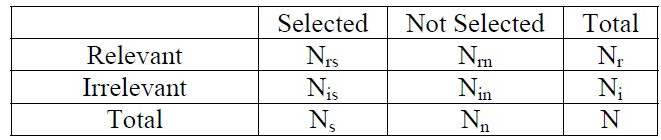

- **Precision** a measure of exactness, determines the fraction of relevant items retrieved out of all items retrieved

$$
P=\frac {N_{rs}} {N_s}
$$

- **Recall** a measure of completeness, determines the fraction of relevant items retrieved out of all relevant items

$$
R=\frac{N_{rs}}{N_r}
$$

- **F1**

$$
F = \frac{2\times P \times R}{P+R} \in [0,1]
$$

##### Relevance: Precision and Recall Example

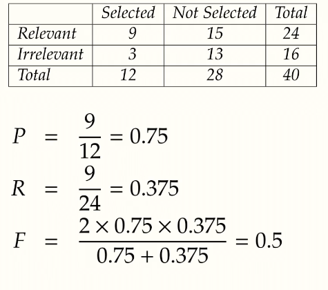

#### Evaluating Ranking of Recommendation

- Spearman's Rank Correlation (from [measuring influence](Ch-8-Influence-and-Homophily.md#Comparing-Ranks-across-3-Measures))

$$
\rho = 1 - \frac{6\sum_{i=1}^n(x_i-y_i)^2}{n^3-n}
$$

- **Kendall's Tau $\tau$** compares the order of the rankings from the recommender with the ground truth ranking list

$$
\tau = \frac{c-d}{n \choose 2}
$$

- where $c$ is the number of concordant(s) and $d$ discordant(s) 
-  concordant means the consistency between the two rankings order for each pair of items

##### Kendall's Tau Example

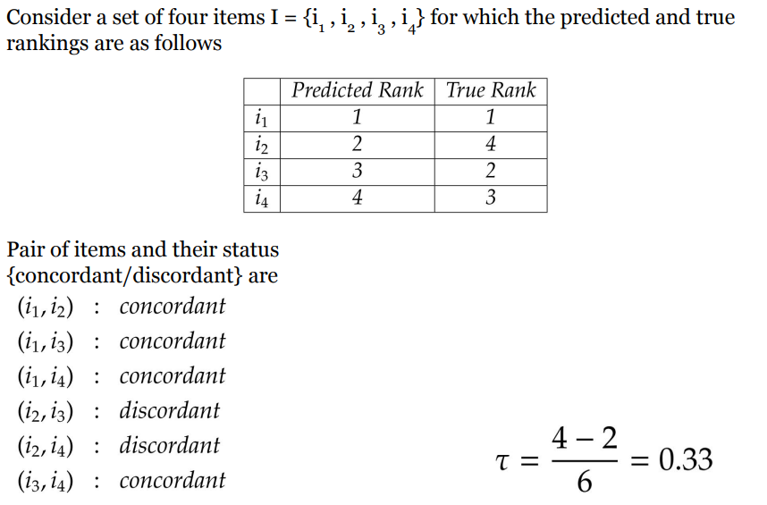

- for concordant(s), check each pair of items $(i_1,i_2)$
- if $i_1$ ranks higher than $i_2$ in both or lower in both, they are concordant
