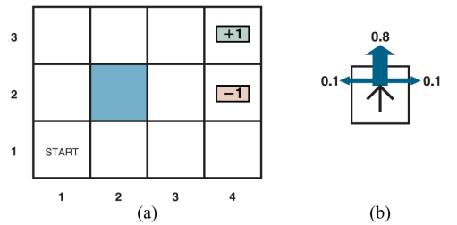
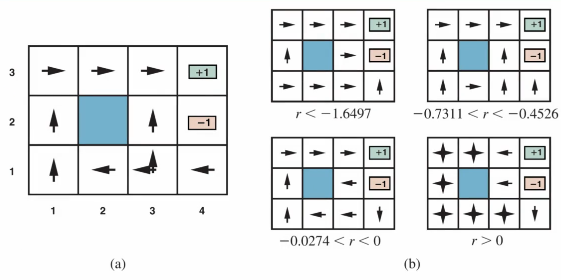
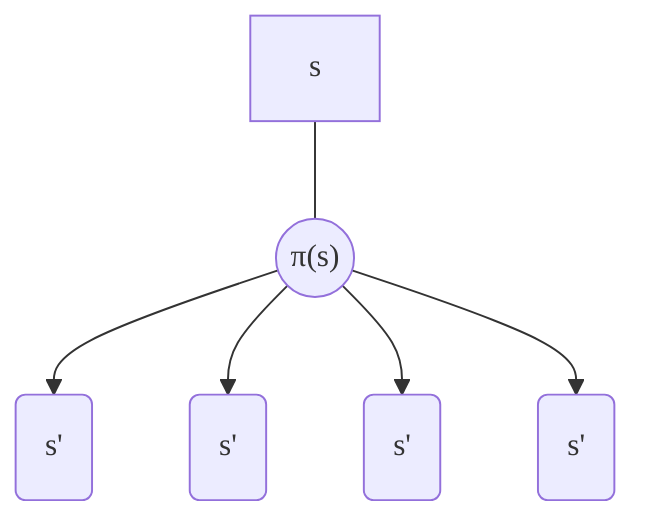
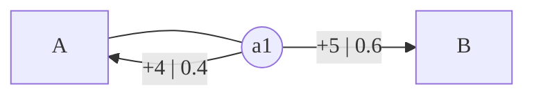
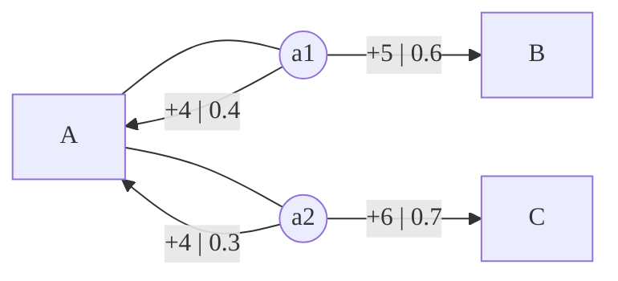

# Decision Making Under Uncertainty

[toc]

- The agent needs reason in an uncertain world which can be due to 
  - Noisy sensors
  - Imperfect data (low resolution image) 
  - Missing data (lab tests) 
  - Imperfect knowledge (medical diagnosis) 
  - Exceptions (all birds fly except ostriches, penguins, dead birds...) 
  - Changing data (flu seasons, traffic conditions)

- The agent still *must* act 

## Rational Agent

- given world states, utility function, actions, transitions, evidence, and probabilities
- a rational agent chooses the action that maximizes expected utility

## Utility Theory

- Lottery: $n$ possible outcomes with probabilities
  - $[p_1,S_1;p_2,S_2;...p_n,S_n]$
  - Each $S_i$ can be an atomic state or another lottery
- Expected utility of a lottery

$$
\text{EU}([p_1,S_1;p_2,S_2;...p_n,S_n]) = \sum_{i=1}^np_i\text{U}(S_i)
$$

- where $\text U$ is the utility function

### Spam Filtering Example

- Given an email where $s$ is space and $e$ is the evidence: 
  - $P(s|e) = 0.6$
  - $P(\neg s|e) = 0.4$
- Actions: 
  - deliver into spam folder $\text{dS}$ 
  - deliver into inbox folder $\text{dF}$
- Utility function: 
  - $U(\text{dS}, s) = 200$
  - $U(\text{dI}, \neg s) = 100$
  - $U(\text{dI}, s) = -100$
  - $U(\text{dS}, \neg s) = -500$
- Where should the email be delivered?

$$
\text{EU}(\text{dS}) = 0.6\times 200 + 0.4\times (-500) = 120 - 200 = -80\\
\text{EU}(\text{dI}) = 0.6\times 100 + 0.4\times (-100) = 120 - 200 = -20
$$

- We should do $\text{dI}$ as the expected utility is higher

> To find the threshold of the probability, make $\text{EU}(\text{dS})=\text{EU}(\text{dI})$ and plug in for $p$ and $1-p$ then solve for $p$

## Value of Information

- If I can "buy" more information to help with a decision, up to how much should I pay for?
-  Expected value of information $\text{EVOI}$ is:
  - Expected utility after information is acquired
    minus
    Expected utility before 
- The catch:
  - We don't know the content of the information before we get it
  - The solution is to take an expectation over possible outcomes

### Value of Information Example

- You are a treasure hunter with two actions:

  - dig the sight $d$

  - don't dig $\neg d$

- Possible resulting states:

  - you find treasure $t$
  - you don't $\neg t$
  - the possibility of finding treasure is generally $0.1$

- The utility of each possible outcome:

  - $U(d,t)=600$
  - $U(d,\neg t)=-100$
  - $U(\neg d,t)=-300$
  - $U(\neg d,\neg t)=10$

$$
\text{EU}(d) = 0.1\times 600+0.9\times-100=-30
\\\text{EU}(\neg d) = 0.1\times-300+0.9\times 10=-21
$$

- Thus we choose action $d$
- Let's say someone has a test before you dig with these (where $+$ indicates a positive test result):
  - $P(t|+)=0.3$
  - $P(t|-)=0.05$
  - $P(+)=0.4$ such that the test is positive 40% of the time
- How much should you pay the test?

$$
\text{if the test is +}\\
\text{EU}(d|+)=0.3\times600+0.7\times-100=110\\
\text{EU}(\neg d|+)=0.3\times-300+0.7\times10=-83\\\\
\text{if the test is -}\\
\text{EU}(d|-)=0.05\times600+0.95\times-100=-65\\
\text{EU}(\neg d|-)=0.05\times-300+0.95\times10=-5.5
$$

- First notice that the outcome of the test changed the outcome of our decision (the test is not *useless*)
  - $\text{EU}$ after the we use the test: $0.4\times110+0.6\times-5.5=40.7$
  - $\text{EU}$ before we use the test: $-21$
  - The $\text{EVOI}$ is $40.7-(-21)=61.7$

## Multi-armed Bandit

- $K$ slot machines
  - Each one is a one-armed bandit
- Unknown reward functions (the distribution of rewards are unknown for each machine)
- Limited resources (limited number of tries; or future rewards stop counting)
- Can gather information: each try gives a potentially zero / negative reward, but also is useful for information gathering
- Objective: maximize rewards
- Exploration vs Exploitation trade-off: how should you balance sticking with a machine vs trying a new one

### Notation

- $A_t, R_t$: action, reward at time $t$
- $A_1,R_1;A_2,R_2;...A_T,R_T$ is a sequence of action rewards
- $q_*(a)=E[R_t|A_t=a]$ is the expected reward of taking action $a$ which is **not given**
- $Q_t(a)$: average reward for action $a$ up to (excluding) time $t$ (running average)

> ###### Running Average Computation
>
> $$
> Q_{n+1}=\frac1n\sum_{i=1}^nR_i\\
> = Q_n + \frac1n[R_n-Q_n]
> $$
>
> - `new = old + size * (target - old)`
> - `size = 1 / totalSteps`
>
> ###### What if reward distribution changes over time (nonstationary)?
>
> - Instead use $Q_{n+1}=Q_n+\alpha[R_n-Q_n]$
> - where $\alpha$ is some constant
> - this effectively weights older averages lighter than the newer ones

#### Greedy Strategy (Exploit Only)

- $\underset{a}{\text{argmax }}Q_t(a)$: just select the machine that has given the most average reward so far
- Problems: the initial value of $Q_t(a)$ plays a big role (if th e machine returns \$0 the first try, it may never get played)

#### Random Strategy (Explore Only)

- Problem: never learns anything

#### Epsilon Greedy Strategy 

- Given an exploration parameter $\epsilon$
- at each step $t$
  - with probability $\epsilon$, choose random action
  - else choose the current best action $\underset{a}{\text{argmax }}Q_t(a)$
- $\epsilon=0$ is fully greedy, $\epsilon=1$ is fully random

#### Upper-Confidence Bound UCB Method

- calculates the upper bound on the mean for each slot and chooses the machine with max value

$$
Q_t(a)+c\sqrt{\frac{\ln(t)}{N_t(a)}}
$$

- where $N_t(a)$ is the number of times the action $a$ is tried and $c$ is the trade-off parameter
- this was also used in [Monte-Carlo Tree Search](3-Game-Playing.md#Exploration-vs-Exploitation-Trade-Off)

## Markov Decision Processes MDP

### Problem Settings

- The world is represented through states
- At each state, an agent is given 0 (terminal state) or more actions to choose from
- Each action moves the agent, probabilistically, to a state (could be the current state) and results, probabilistically, in a reward (could be zero, negative, positive)
- The agent needs to maximize the sum of the rewards it accumulates over time
- Greedy strategy with respect to immediate reward often don't work; the agents needs to consider long term consequences of actions

### MDP Diagram Example

### Notation

- $P(s'|s,a)$ is probability of arriving at state $s'$ given we are at state $s$ and take action $a$
- $R(s,a,s')$ is the reward the agent gets when it transitions from $s$ to $s'$ with $a$
- $\pi(s)$ is the action recommendation by policy $\pi$ at $s$
- $\pi^*$ is the ==optimal policy==
- $U^\pi(S)$ is the expected utility obtained via executing policy $\pi$ at state $s$
- $U^{\pi^*}(s)$ is often referred to as $U(s)$
- $Q(s,a)$ is the expected utility of taking $a$ at $s$
- $\gamma$ is the ==discount factor== $[0,1]$

#### Discount Factor

- Given these sequence of events: $s_0,a_0,R_0,s_1,a_1,R_1,...,s_{n-1},a_{n-1},R_{n-1},s_n$
- the reward is $\sum R = R_0+...+R_{n-1}$
- but the latter rewards are not as important as the initial such that the discounted factor is incorporated as

$$
\sum \gamma^i R_i = R_0+\gamma R_1+\gamma^2 R_2+...
$$

### MDP: Running Example

- At each room, the agent has 4 possible actions: `U,D,L,R`
- However, decisions do not have deterministic but rather stochastic behavior
  - 80% of going in that direction
  - 10% of going 90&#x00B0; of it
  - 10% of going -90&#x00B0; of it
- If you collide into a wall, you remain in the same room
- The rooms labeled `+1`, `-1` have those rewards for landing in them, all other rooms have reward $r$
- The solution can't be a sequence like `U,U,R,R,R` (as we can't tell deterministically the result of actions ) but rather a policy that says what to do when you are in a state

- where (a) is the optimal policy $\pi^*$ at $r=-0.04$ and $\gamma=1$

### Utility of States

- The agents gets a reward at each state
- ==Utility== of a state $s$ given a policy $\pi$ is the expected reward that the agent will get started from state $s$ and taking actions according to policy $\pi$
- Let $S_t$ denote the state the agent reaches at time $t$

> Note that utility (long-term cumulative) is different from short-term immediate reward $R(s,a,s')$

####   Bellman Equation

$$
U^\pi(S) = \sum_{s'}P(s'|s,\pi(s)) * [R(s,\pi(s),s')+\gamma U^\pi(s')]
$$

> Note that the utility of a terminal state is 0
>
> Also note that Q function
> $$
> Q^\pi(s, \pi(s)) = U^\pi(s)
> $$

where we do a summation $\sum_{s'}$ as we do not know which resulting state action $\pi(s)$ will take us to:

#### Bellman Optimality Equation

$$
U^{\pi^*}(s)=U(s) = \max_{a\in A(s)}\sum_{s'} P(s'|s,a)*[R(s,a,s') + \gamma U(s')]
$$

- where $A(s)$ is the set of actions at $s$
- we can also use Q function

$$
U(s) = \max_{a\in A(s)}Q^{\pi^*}(s,a)
$$

#### Bellman Optimality Equation for Q

$$
Q^{\pi^*} = \sum_{s'} P(s'|s,a) * [R(s,a,s') + \gamma \max_{a\in A(s)} Q^{\pi^*}(s',a')]\\
$$

- if you have $n$ states, you will have $n$ linear equations to solve for

### The Optimal Policy

- The optimal policy maximizes expected utility

$$
\pi^*_s=\underset{\pi}{\text{argmax }} U^\pi(S)
$$

- $\pi^*_s$, like any other policy, maps states to actions, however it is only optimal if the starting state is $s$
- We can also find the optimal policy at $s$ using the Q function

$$
\pi^* = \underset{a\in A(s)}{\text{argmax }}Q(s,a)
$$

#### How to Find $\pi^*$

$$
 \pi^*(s) = \underset{a\in A(s)}{\text{argmax }} \sum_{s'}P(s'|s,a)*[R(s,a,s')+\gamma U^{\pi^*}(s')]
$$

-  However, we are not given $U^{\pi^*}(s)$
- We have two algorithms to find optimal policies
  1. Value iteration (check the second [example](#Utility-MDP-Examples))
  2. Policy iteration

#### Policy Iteration

1. Start with an initial policy $\pi_0$ (can be random)
2. Alternate between
   - [**Policy evaluation**](#Policy-Evaluation): given policy $\pi_i$, calculate $U^{\pi_i}$
     This can be calculate with linear equations or iteration
   - **Policy improvement**: calculate a new MEU policy $\pi_{i+1}$ using the utilities calculate in the previous step
3. Stop when policy no longer changes

##### Policy Evaluation

- Given $\pi$, find $U^\pi$
- Use [Bellman Equation](#Bellman-Equation)

$$
U^\pi(S) = \sum_{s'}P(s'|s,\pi(s)) * [R(s,\pi(s),s')+\gamma U^\pi(s')]
$$

> ###### Iterative Approach
>
> 1. Initialize $U$
> 2. Loop until convergence; for each state s
>    - Update $U$ using the Bellman Equation

### Utility MDP Examples

$$
\text{Terminal state } U(B) = 0\\\\
U(A) = 0.4(4+\gamma U(A)) + 0.6(5+\gamma U(B)) \\
= 1.6 + 0.4 * \gamma * U(A) + 3 = 4.6 + 0.4*\gamma U(A)\\
= \frac{4.6}{1-0.4\gamma}\\\\
\text{if $\gamma=0.9$, } U(A)\approx7.19
$$

$$
U(B) = U(C) = 0\\
Q(A, a_1) = 0.4(4+\gamma U(A)) + 0.6(5+\gamma U(B)) \\
Q(A,s_2) = 0.4(4+\gamma U(A)) + 0.7(6+\gamma U(C)) \\
U^{\pi^*}(A) = \max_{a\in \{a_1,a_2\}}\sum P(s'|A,a)*[R(A,a,s') + \gamma U^{\pi^*}(s')]
$$

