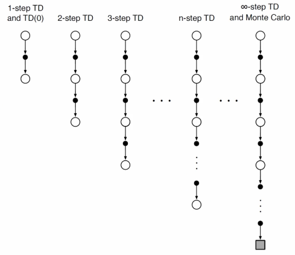

# Reinforced Learning RL

[toc]

## RL and MDPs

- [MDPs](10-Decision-Making.md#Markov-Decision-MDP) are building blocks for RL
- RL has the additional complexity that the agent doesn't have access to the full specification of the MDP
  - Transition probabilities are often unknown
  - Reward function is often unknown

## Prediction and Control

- **Prediction** given a policy, estimate a value function
- **Control** learn the optimal policy

## Monte Carlo MC Prediction

- Task: *prediction*
  -  policy is given; compute the value (utility) functions
- Unknown environment dynamics
  - transition probabilities are unknown
  - reward function is unknown
- Learn from *experience* - sample of episodes
- **Episode** a sequence of state, action, reward triplets
- Assume all episodes reach a terminal state
- Basic idea: expectation = average over samples

### MC Prediction - V Function (Value)

- Given policy $\pi$ (mapping states to actions)

- Loop:

  1. Sample an episode: $S_0,\pi(S_0),R_1;S_1,\pi(S_1),R_2;...S_{T-1},\pi(S_{T-1}),R_T$
  2. For each state $s$ in the episode, compute the [cumulative discounted reward](10-Decision-Making.md#Discount-Factor) starting from that state $s$

- $V(s)$ is the average cumulative discounted reward starting from state $s$

- If $s$ appears multiple times in a single episode (i.e. loops): 

  - **First-visit MC** for each episode, only the first appearance of the state $s$ is considered

    > - $A, \pi(A), R_1; B, \pi(B), R_2; B, \pi(B), R_3; C, \pi(C), R_4...$
    > - for this example to find $G(B)$, we take $R_2+\gamma R_3+\gamma^2R_4...$
    > - (i.e. sum from where the state $B$ first appears)
    > - $V(B)$ is the average of $G(B)$ across all sampled episodes

  - **Every-visit MC** every appearance is considered and averaged accordingly

### MC Prediction - Q Function

- Given policy $\pi$
- Loop:
  1. Sample an episode: $S_0,\pi(S_0),R_1;S_1,\pi(S_1),R_2;...S_{T-1},\pi(S_{T-1}),R_T$
  2. For each state-action $(s,a)$ pair in the episode, compute the cumulative discounted reward starting from that state $s$ and taking action $a$
- $Q(s,a)$ is the average cumulative discounted reward starting from state $s$ and taking action $a$
- Advantage of estimating Q instead of V:
  - Can use Q values to find a better policy, (i.e. for control)
  - Caveat: we need to explore other actions to find a better one (remember the exploration vs exploitation trade-off)

> ###### [MC Update](10-Decision-Making.md#Notation)
>
> - Average update $V_t(S_t) \coloneqq  V_t(S_t)+\frac1{N(S_t}(G_t-V_t(S_t))$
> - Nonstationary update  $V_t(S-t) \coloneqq  V_t(S_t)+\alpha(G_t-V_t(S_t))$

## Temporal DIfference TD

- in MC, each episode needed to end at a terminal state
- MC ignored [Bellman equations](10-Decision-Making.md#Bellman-Equation)
- **Temporal Diffrence** TD learning can learn from partial episodes

### TD(0) Prediction

- Given a policy $𝜋$
- For an episode:
  - MC
    - $V(S_t) \coloneqq V(S_t)+\alpha[G_t-V(S_t)]$
    - Need to wait till the end to calculate $G_t$
  - **TD(0)** take one step and use Bellman equation
    - $V(S_t) \coloneqq V(S_t)+\alpha[R_{t+1}+\gamma V(S_{t+1})-V(S_t)]$
- This is called TD(0) because it updates values based on a single look ahead

#### TD(0) Example

- Initializie state values `V(A) = 0, V(B) = 0, V(C) = 0`
  - `alpha = 0.8, gamma = 0.9`
- Take a step `A, pi(A), 5; B`
- Update `V(A) = V(A) + alpha * [5 + gamma * V(B) - V(A)]`
  - `V(A) = 0 + 0.8 * [5] = 4`
- Take a step `A, pi(A), 5; B, pi(B), 2; C`
- Update `V(B) = V(B) + alpha * [2 + gamma * V(C) - V(B)]`
  - `V(B) = 1.6`
- Take a step `A, pi(A), 5; B, pi(B), 2; C, pi(C), -3; A`
- Update `V(C) = V(C) + alpha * [-3 + V(A) - V(C)]`
  - `V(C) = 0.48`
- And so on...

#### MC vs TD(0)

- Target
  - MC uses $G_t$ ; TD(0) uses $R_{t+1} + \gamma V(S_{t+1})$
  - MC does not use the Bellman equations whereas TD(0) does
- Boostrapping
  - MC doesn't need to initialize where TD(0) does
- Episodic vs Contious
  - MC needs terminal state where TD(0) doesn't
- Convergence
  - Both converge to the true values (for tabular state representations)
  - TD(0) usually converges faster than MC

### N-Step TD

- Instead of looking at 1 step ahead (i.e. *TD(0)*), look $n+1$ steps ahead (i.e. *TD($n$)*)
- For example, if our episode looks as `A, pi(A), 5; B, pi(B), 3; C, pi(C), -3; A`
  - TD(0) says `V(A) = V(A) + alpha * (5 + gamma * V(B) - V(A))`
  - TD(1) says `V(A) = V(A) + alpha * (5 + gamma * 3 + gamma^2 * V(C) - V(A))`
    Note that those triplets need to be present in the epsiode first
  - $\text{TD}(\infin)$ says $V(A) \coloneqq V(A) + \alpha[R_1+\gamma R_2+ \gamma^2 R_3 + ... + \gamma^{T-1} R_T]$
    which is basically Monte Carlo
    Note that the rewards after the terminal state are 0

## Model-Free Control

- Predicition is cool and all, but not so useful if you're trying to come up with a policy :thinking:
- **On-policy control** you are learning from you current policy and trying to improve
- **Off-policy control** someone else makes the moves, you observe them, and learn from their experience
  - kind of a a generalization of on-policy as on-policy you are observing *your* own policy

### On-Policy Control

#### MC Control

- Unlike prediciton, we are not given a policy
- Can't we combine [policy iteration fo MDPs](10-Decision-Making.md#Policy-Iteration) and MC sampling
  - Yes but, we need a Q-function as V-function is not enough

##### Pseduocode

1. Intialize $Q(s,a)$ for all $(s,a)$ pairs
2. Initialize policy $\pi$
3. Loop
   - Sample an episode by
     - With probability $\epsilon$ choose a random action ($\epsilon$-greedy)
     - else, choose the action recommended by current $\pi$
   - Fore each state $(s,a)$ pair in the episode, compute te commulative discounted reward starting from state $s$ and taking action $a$
   - Update $Q$ using the sample averages
   - Update $\pi$ using the updated $Q$
- However this requires a terminal state

#### TD Control - SARSA

- Like MC Control, except we use the one step look ahead instead of waiting until termination
- $Q(S,A) \coloneqq Q(S,A) + \alpha[R+\gamma Q(S',A') - Q(S,A)]$
- Because we use $S,A,R,S',A'$, its called "SARSA"

### Off-Policy Control

#### Q-Learning

- Like TD Control, but
- $Q(S,A) \coloneqq Q(S,A) + \alpha[R+\gamma \max_aQ(S',a) - Q(S,A)]$
- (i.e. instead of SARSA, we use SARS)

