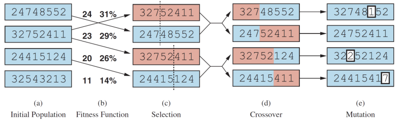
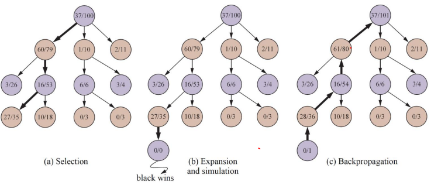

# Discrete State Space Search

[toc]

Each state in our search space

- Is discrete
- Represents a complete representation of a possible solution
- Has a “desirability” score
- Might have neighbors reachable through actions/moves

The goal is to find the maximum/minimum scoring state

#### Some Examples

**Bayesian network structure search**

A state is a candidate structure; the score is BIC; actions are to “add/remove/reverse” an edge

**8-Queens**

A state is placement of 8 queens on the board; the score is the number of pairs of queens attacking each other; the actions are to move a queen to another empty square

**Traveling salesman**

- We have weighted bidirectional graph of cities with a start city
- Visit every city *only* once and return to the start city
- A state is a travel plan; the score is the cost of the plan; the actions are to swap the order of two neighboring cities
- If we have $n$ cities then we'll have $\frac{(n - 1)!}{2}$ possible states

## The Search Landscape

.png)

### Hill Climbing

Also known as greedy search where we return the nearest local maximum from the initial state

```pseudocode
function Hill-Climbing(problem):
	current = problem.Initial
	while True:
		neighbor = highest valued successor state of current
		if Value(neighbor) <= Value(current):
			return current
        current = neighbor
/* most basic local search technique where at each step the current node is replaced by the best neighbor */
```

### Simulated Annealing

- We gave states temperatures where the warmer the temperature is, the more we *explore* with random successors
- The closer the temperature is to 0, the more the algorithm acts greedily like simple hill climbing

```pseudocode
function Simulated-Annealing(problem, schedule):
	current = problem.Initial
	for t = 1 to infinity: /* where t is time, T is temp */
		T = schedule(t) 
		/* schedule is function that maps t -> T
        eventually to T = 0 */
		if T = 0 then return current
		next = a randomly selected successor of current
		if Value(next) > Value(current):
			current = next
        else:
        	diff = next - current
        	/* diff value must be negative */
        	probability of e^(diff / T) that current = next
        	/* the higher T is, the more probable that we accept
        	next as current */
```

## Evolutionary Algorithms

- a population of states
- each state has a *fitness* score
- select candidate states from the population
- combine them to create offspring and optionally mutate them



* a draw back is that solutions must be able to be represented in a legal string fashion which may be very difficult

# Game Playing

**Games**

* a multiagent and competitive environment
* agents try to maximize their own utilities at the expense of the other agent's

**Constant-Sum Games**

- were the sum of the utilities in the end is constant
  - Win: `+1`, Lose: `-1`, Tie: `0.5`
- zero-sum is a constant-sum when the sum of utilities is 0 
  - Win: `+1`, Lose: `-1`, Tie: `0`

### Two-Player Game Tree

- two players: *MAX* and *MIN*
- *MAX* moves first
- both are maximizing their utilities
- in a constant-sum game search tree:
  - *MAX* chooses a "max" move
  - *MIN* chooses a "min" moves

#### Optimal Strategy

- leads to outcomes at least as good as any other strategy when one is playing on an infallible opponent

#### Minimax Algorithm

[slides](https://github.com/CS581/CS581-S23/blob/main/slides/3-search.pdf)

#### Alpha-Beta Pruning

[slides](https://github.com/CS581/CS581-S23/blob/main/slides/3-search.pdf)

#### Monte-Carlo Tree Search

```pseudocode
function Monte-Carlo-Tree-Search(state):
	tree = Node(state)
	while Is-Time-Remaing():
		leaf = Select(tree)
		child = Expand(leaf)
		result = Simulate(child)
		Back-Propagate(result, child)
	return the move in Actions(state) whose node has the highest number of playouts
```



1. turn the `state` into a `tree` (the purple root node signifies it is currently purple's turn)
2. select a leaf node from the `tree`, expand it, then select one its children as `child`
3. simulate `child` to completion to see which player wins
4. back propagate this information upwards:
   - each node $i$ has the values $w_i | n_i$ where $n_i$ is the number of playouts (i.e. simulations) and $w_i$ is the wins for who played last (i.e. the brown node's $w$ is the wins for purple in that state)
   - thus, on purple's turn, it will look at the three child of the root to select its next move

##### Exploration vs Exploitation Trade-Off

- How should we choose which node to select and which to expand?
- A node with $60|79$ seems more promising than  $2|11$ as it has a higher win percentage
- However,  $2|11$ has been explored a lot less than $60|79$ 
- UCT upper confidence bound for trees is a metric to choose to explore or exploit nodes
- Monte Carlo will traverse from the root to a leaf based on which child has highest UCT

$$
\text{UCT}= \frac{w_i}{n_i} + C \times \sqrt{\frac{\log N_i}{n_i}}
$$

* where the left is the exploitation term and the right is the exploration term
* $w_i$ and $n_i$ are the wins and playouts for a node
* $N_i$ is the playouts for the parent node
* $C$ is the exploration parameter (theory says its should be $\sqrt{2}$ but many use $1.4$)
