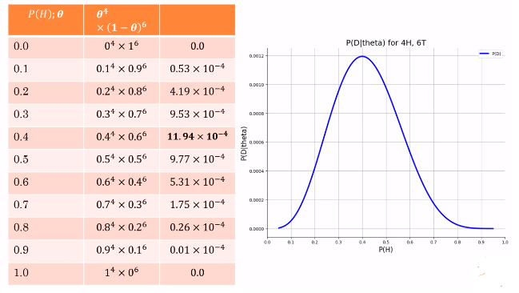
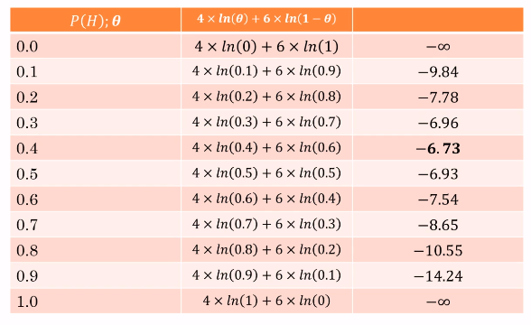

# Parameter Estimation

[toc]

## Maximum Likelihood Estimation

- Let's say you're flipping a thumbtack 10 times and the data you get is:
  $\{H, T, H, H, T, T, T, H, T, T\}$
- What is $P(H, T, H, H, T, T, T, H, T, T)$?
- If we assume $P(H) = \theta = 0.3$:
  - $0.3^4 \times 0.7^6 = 9.53 \times 10^{-4}$

- If we do this for various values of $P(H)$:

- Thus, $P(H)=0.4$ gives the maximum likelihood that we get that data back

### Log Probability of Data, Given $\theta$

- If we had $4000$ H and $6000$ T then `0.4^4000 * 0.6^6000 = 0` if precision can't hand that small of a value (Underflow)
- We can instead use logarithmic values which alleviates underflow problems
- In the previous example, if $P(H) = \theta = 0.3$:
  - $\ln(0.3^4 * 0.7^6)$
  - $4\ln0.3 + 6\ln0.7 \approx -6.956$

- Again, $P(H)=0.4$ gives the maximum likelihood (or the least negative one)

- With $4000$ H and $6000$ T
  - $4000\ln(0.4)+6000\ln(0.6)=-6730.12$

### Likelihood / Log-Likelihood

- Number of heads is $a$ and tails is $b$
- **Likelihood**: $L(\theta:\mathcal{D})=\theta^a(1-\theta)^b$
- **Log-likelihood**: $l(\theta:\mathcal D)=a \log(\theta)+b\log(1-\theta)$
- Note the $\theta$ that maximizes log-likelihood is the same as $\theta$ that maximizes likelihood
  - for non-negative $x,y$, $x \ge y \leftrightarrow \log x \ge \log y$
- To find maximizing $\theta$, take derivative of $l(\theta:\mathcal D)$ with respect to $\theta$ and set it to $0$

$$
\frac{\partial l}{\partial\theta} = \frac{a}{\theta} - \frac{b}{1-\theta} = 0 \\
\theta = \frac{a}{a+b}
$$

