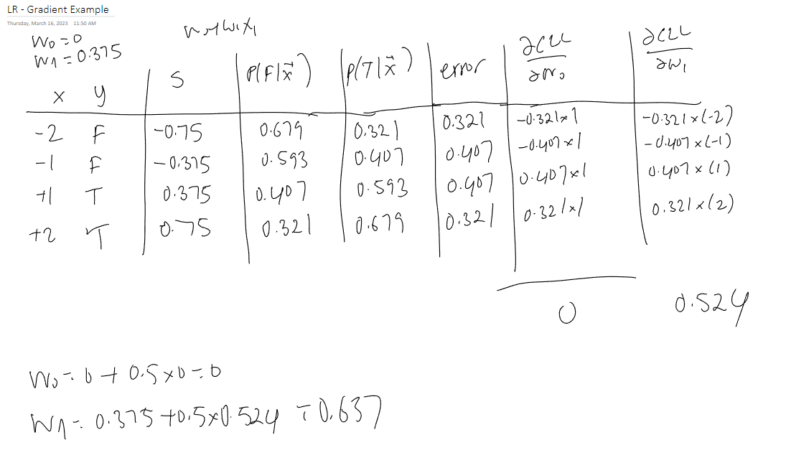

# Logistic Regression

[toc]

-  Recall that Naïve Bayes basically says $P(Y|\vec X) \propto P(Y)P(\vec X|Y)$ where $P(Y)P(\vec X|Y) = P(Y) \Pi(x_i|Y)$ are found through data where it *assumes* that the features are independent
- ==Logistic regression== learns $P(Y|\vec X)$ directly without going through $P(Y)P(\vec X|Y)$ 
- It assumes $P(Y|\vec X)$ follows the ==logistic function==:

$$
P(Y = \text{false}|X_1,X_2,...,X_n) = \frac{1}{1 + e^s} \\
P(Y = \text{true}|X_1,X_2,...,X_n) = \frac{e^s}{1+e^s}
$$

- Note that $\frac{1}{1 + e^s}$ and $\frac{e^s}{1 + e^s}$ sums to 1 such that it is a probability function
- where the sum $s(x_i)$ is

$$
s(x_i) = w_0 + \sum_{i=1}^n w_ix_i
$$

- $w_0$ is the bias term and every feature $x_i$ has a weight $w_i$

  - we can also rewrite the sum $s$ as a uniform sum

  $$
  s = \sum_{i=0}^nw_ix_i = \vec w \cdot \vec x
  $$

  - where we use $x_0=1$ always for all data instances

- "Learning" is how the weights are estimated

## Learning: Parameter Estimation

We're trying to find the weights $W$ that maximize the *conditional log-likelihood* given some dataset $\mathcal D$
$$
W \leftarrow \max_W \Pi_{d \in \mathcal D}P(Y[d]|X[d]) \\
W \leftarrow \max_W \sum_{d \in \mathcal D}\ln P(Y[d]|X[d]) \\
$$

- Given all data instances $d: \{x_1, x_2,..., x_n, y\}$, find the weights that maximize the probability logistic function for all in log space

- Recall previously for parameter estimation of $\theta$, we took the derivative of $l(\theta:\mathcal D)$ with respect to $\theta$ and set it to $0$

### Conditional Log-Likelihood CLL

Given $\mathcal D = \textlangle \vec X,Y \textrangle$, estimate $\vec W$ using ==conditional log-likelihood== $\text{CLL} = \sum_{d \in \mathcal D} \ln P(Y[d]|\vec X[d])$

- group the summation into $\text{false}, \text{true}$

$$
\text{CLL} = \sum_{y[d] = \text{false}} \ln P(\text{false}|\vec X[d]) + \sum_{y[d] = \text{true}} \ln P(\text{true}|\vec X[d])
$$

#### Calculating $\frac{\partial\text{CLL}}{\partial w_i} = 0$

- substitute for logistic functions

$$
\text{CLL} = \sum_{\text{false}} \ln \frac{1}{1 + e^s}  + \sum_{\text{true}} \ln \frac{e^s}{1+e^s} \\ =
\sum_{\text{false}} \ln{1} - \ln(1 + e^s)  + \sum_{\text{true}} \ln{e^s} - \ln(1+e^s) \\ =
\sum_{\text{false}} 0 - \ln(1 + e^s)  + \sum_{\text{true}} s - \ln(1+e^s) \\
$$

- take the **partial derivate** of $\text{CLL}$ with respect to *each* weight $w_i$

$$
\frac{\partial\text{CLL}}{\partial w_i} = 
\sum_\text{false} \frac{-1}{1+e^s}*\frac{\partial(1+e^s)}{\partial w_i} \\ +
\sum_\text{true} \frac{\partial s}{\partial w_i} - \frac{1}{1+e^s}*\frac{\partial (1+e^s)}{\partial w_i} \\ =
\sum_\text{false} \frac{-1}{1+e^s}*\frac{\partial e^s}{\partial w_i} +
\sum_\text{true} \frac{\partial s}{\partial w_i} - \frac{1}{1+e^s}*\frac{\partial e^s}{\partial w_i} \\ =

\sum_\text{false} \frac{-e^s}{1+e^s}*\frac{\partial s}{\partial w_i} +
\sum_\text{true} \frac{\partial s}{\partial w_i} - \frac{e^s}{1+e^s}*\frac{\partial s}{\partial w_i} \\
$$

- notice we can substitute $\frac{e^s}{1+e^s}$ for $P(\text{true}|\vec X[d])$

$$
\sum_\text{false} -P(\text{true}|\vec X[d])*\frac{\partial s}{\partial w_i} +
\sum_\text{true} \frac{\partial s}{\partial w_i} - P(\text{true}|\vec X[d])*\frac{\partial s}{\partial w_i} \\
$$

- now calculating $\frac{\partial s}{\partial w_i}$

$$
\frac{\partial s}{\partial w_i} = x_i[d] = x_i\\
\sum_\text{false} -P(\text{true}|\vec X)*x_i +
\sum_\text{true} x_i - P(\text{true}|\vec X)*x_i\\
$$

- *Finally*

$$
\frac{\partial\text{CLL}}{\partial w_i} =
\sum_\text{false} -(1 - P(\text{false}|\vec X))*x_i +
\sum_\text{true} (1 - P(\text{true}|\vec X))*x_i\\
$$

##### CLL Summary

> Notice that the terms $(1 - P(\text{false}|\vec X))$ and $(1 - P(\text{true}|\vec X))$ are both probability of errors
> $$
> \frac{\partial\text{CLL}}{\partial w_i} =
> \sum_\text{false}( -\text{Error}_{false}*x_i) +
> \sum_\text{true} (\text{Error}_{true}*x_i)\\
> $$
> Also notice that the probability of error for the false case has a negative gradient $(-)$ while the true case has positive $(+)$
>
> Finally, $\frac{\partial\text{CLL}}{\partial w_i} = 0$ **has no closed form solution** as it can never equal zero

### Gradient Optimization

- For maximizing / minimizing a function $f(x)$
- Take gradient of $f(x)$ with respect to $x$ and set to $0$

$$
\nabla f(x)=0
$$

- What if there is no analytical solution (*no closed form solution*)?
  - **Gradient ascent** for maximization of $f$
  - **Gradient descent** for minimization of $f$

#### Gradient Ascent & Descent

- Using a Taylor expansion, a function $f(x)$ can be approximated around $a$ as

$$
f(x) \approx f(a) + \nabla f(a) * (x-a)
$$

> <u>What this is saying:</u>
>
> say we have $x = a + \epsilon$
> $f(x) = f(a + \epsilon) \approx f(a) + f'(a) * \epsilon$

1. Start with some initial guess $x_0$
2. While change is not much $x_{i+1}=x_i + n * \nabla f(x_i)$ where $n$ is called the **learning rate** and is a user specified parameter

##### Example of Gradient Ascent

- $f(x)=-2x^2+8x+10$

- $f'(x)=-4x+8$
- learning rate $n=0.1$

| Iteration $i$ | $x_i$ | $f'(x_i)$ | $x_{i+1}=x_i + n * f'(x_i)$ |
| ------------: | ----- | --------- | --------------------------- |
|             0 | 0     | 8         | 0.8                         |
|             1 | 0.8   | 4.8       | 1.28                        |
|             2 | 1.28  | 2.88      | 1.568                       |

and so on until it converges to 2

> Note that if the learning rate is **too large**, the ascent may diverge and move too far from the optimal
>
> 
>
> Also if the learning rate is **too small**, it will take many iterations for the ascent to converge
>
> 
>
> The ascent also may converge on a **local optima** depending on the initial guess and learning rate
>
> 

##### Example of Gradient Ascent to Find $W$

- Say our dataset $\mathcal D$ is very small $\{(-1, \text{false}), (1, \text{true})\}$

- Our initial guess for the weights are $w_0=0, w_1=0$

- Assume the learning rate is $0.5$

- We then have these calculated values:

| $x_1$ | $y$  | $s=w_0+w_1x_1$ | $P(\text{false}|\vec x)$ | $P(\text{true}|\vec x)$ | Error $1-P$ | $\frac{\partial}{\partial w_0}$ | $\frac{\partial}{\partial w_1}$ |
| ----- | ---- | -------------- | ------------------------ | ----------------------- | ----------- | ------------------------------- | ------------------------------- |
| -1    | F    | 0              | 0.5                      | 0.5                     | 0.5         | $-0.5\times 1$                  | $-0.5 \times -1$                |
| 1     | T    | 0              | 0.5                      | 0.5                     | 0.5         | $0.5\times 1$                   | $0.5 \times 1$                  |
|       |      |                |                          |                         | Sum $\sum$  | 0                               | 1                               |
|       |      |                |                          |                         | Mean $1/N$  | 0                               | 0.5                             |

> ###### Reminder
>
> - Probabilities are calculated using [logistic function](#Logistic-Regression)
> - Error is 1 minus the probability of the instances' true label
> - The gradients are calculated using [this](#CLL-summary) but to summarize for this example
>
> $$
> \frac{\partial}{\partial w_i} = \text{Error} \times x_i
> $$
>
> - Recall that we use $-\text{Error}$ if the label is $\text{false}$
> - Also that we consider $x_0=1$ always 

- Next we sum the partials to get the $0$ and $1$
- We can also take the mean as well ($1/N$) where $N$ is the number of datapoints; however this can be considered part of the learning rate so it is no necessary
- Thus, out new weights are the **previous** iteration's weights plus the **gradient** times the **learning rate**

$$
w_0=0+0.5\times 0 =0\\
w_1 =0+0.5\times 0.5=0.25
$$

| $x_1$ | $y$  | $s=w_0+w_1x_1$ | $P(\text{false}|\vec x)$ | $P(\text{true}|\vec x)$ | Error $1-P$ | $\frac{\partial}{\partial w_0}$ | $\frac{\partial}{\partial w_1}$ |
| ----- | ---- | -------------- | ------------------------ | ----------------------- | ----------- | ------------------------------- | ------------------------------- |
| -1    | F    | -0.25          | 0.56                     | 0.44                    | 0.44        | $-0.44\times 1$                 | $-0.44\times -1$                |
| 1     | T    | 0.25           | 0.44                     | 0.56                    | 0.44        | $0.44\times 1$                  | $0.44\times 1$                  |
|       |      |                |                          |                         | Sum $\sum$  | 0                               | 0.44                            |
|       |      |                |                          |                         | Mean $1/N$  | 0                               | 0.22                            |

$$
w_0=0+0.5\times 0 =0\\
w_1 =0.25+0.5\times 0.44=0.47
$$

##### Another Example of Gradient Ascent

I did not go over this example; try to understand it

### Batching and Epochs

- When the dataset $\mathcal{D}$ is very large, instead of using gradient ascent on the entire set, ==batches== $B_i$ are takes where $B_i \sub \mathcal D$
- After every batch, the model is updated
- When all batches in a $\mathcal D$ are taken, an ==epoch== has passed

> - Note that even though the logistic function itself is a *non-linear* objective function,  *logistic classifier* is linear
> - This is because the decision is based on $s$ where $s$ is a linear combination
> - This is why in *scikit-learn*, it is imported as 
>   `fom sklearn.linear_model import LogisticRegression`

### The Meaning of Intercept $w_0$

- Can we interpret $w_0$ similar to $P(Y)$ in Naïve Bayes?
- No, $w_0$ depends on both the class distribution and the scale of the features

### Categorical Features

- Logistic regression's parameters are feature weights so features need to have values that *can* be multiplied by a weight
- If we have ==binary features==, we can either use
  -  $0|1$ which is for **indictor** functions as $0$ means no weight is effected
  - $-1|+1$ which is for non-indicator functions
- What if we have categorical features that have more that 2 possible values like `Brown,Black,Blue`
  - use ==one-hot-encoding== where instead of making the feature a single variable, we make it multiple indicator function

### Regularization

We prefer *smaller weights*

- Probabilities use logistic function, so the larger the weights are, the close it converges to 1
- Error is 1 minus that, which means that the best weight we can have is $\infin$ weight as error would then be 0 to maximize CLL
- However, consider if your features have some error margin in the measurement $\epsilon$ where $x_i \pm \epsilon$
- The larger the weights are, $w_i(x_i \pm \epsilon)=w_ix_i + w_i\epsilon$ meaning the **error or noise gets amplified**

#### $L_2$ Regularization

- Objective function
  - $W \leftarrow \max_W(\sum \ln P(Y[d] | X[d]) - \frac{\lambda}{2}||w||^2)$
  - [Recall](#Learning:-Parameter-Estimation) that $\text{CLL} = \sum \ln P(Y[d]|\vec X[d])$
  - So we're adding an $L_2$ "quadratic  penalty" 
  - Trade-off between fitting data and model complexity
- Assuming $n$ features

$$
W \leftarrow \max_W(\sum \ln P(Y[d] | X[d]) - \frac{\lambda}{2}
\sum_{i=1}^nw_i^2 \\
\text{deriving for the gradiant} \rightarrow \frac{\partial\text{CLL}}{\partial w_i} - \lambda w_i
$$

- Where $\lambda$ is the penalty term
- When you have a lot of data the CLL part takes over
- When you don't have a lot of data, we force the weights to be close to zero

#### $L_1$ Regularization

$$
W \leftarrow \max_W(\sum \ln P(Y[d] | X[d]) - \beta \sum_{i=1}^n|w_i|
$$

- Instead of taking the squared of the weights (quadratic penalty), it takes the absolute value

#### $L_2$ vs $L_1$ (with Example)

- $L_2$ forces the large weights to get closer to zero and places emphasis on the large weights
  -  tends to shrink all weights towards zero
-  $L_1$ also penalizes large weights but the emphasis is not necessarily on large weights
  -  tends to force some weights to be exactly zero
  - because some weights become zero, it is a kind of *feature selection*

> Say we have 2 weights $w_i=9,w_j=2$
>
> ###### $L_2$ Penalty
>
> - $w_i \rightarrow (9-\epsilon)^2 = 81 + \epsilon^2 - 18\epsilon$
>   - The savings: $81 - (81 + \epsilon^2 - 18\epsilon) = 18\epsilon-\epsilon^2$
> - $w_j \rightarrow (2-\epsilon)^2 = 4+\epsilon^2-4\epsilon$
>   - The savings: $4 - (4+\epsilon^2-4\epsilon) = 4\epsilon-\epsilon^2$
> - The savings of $w_i$ is larger showing $L_2$ puts emphasis on larger weights
> - Thus, it almost never gets 0 weights as it prefers to shrink larger weights
>
> ###### $L_1$ Penalty
>
> - $w_i \rightarrow 9-\epsilon$; The savings: $9 - (9-\epsilon) = \epsilon$
> - $w_j \rightarrow 2 - \epsilon$; The savings: $2 - (2-\epsilon)=\epsilon$
> - The savings are the same!

