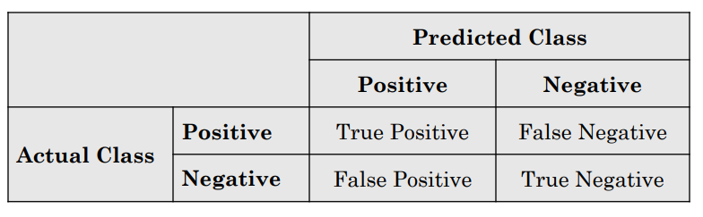
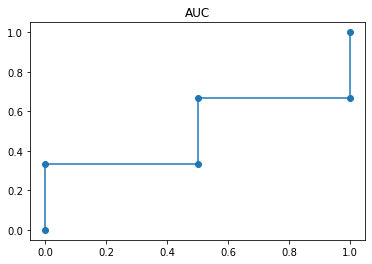
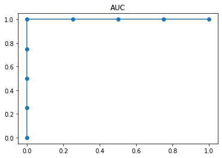
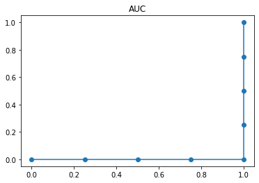

# Classifier Evaluation

[toc]

## 0/1 Error & Accuracy

- The simplest measure is "is the prediction correct?"
- Given a dataset, ==accuracy== is the percentage of objects the model's prediction are for 

> ###### Problems
>
> - All mistakes are considered equal
>   - misclassifying a ham email as spam and a spam email as ham are considered the same
> - If a class is dominant, its often easy to get high accuracy by simply predicting most objects as the dominant class

## Types of Errors

- Assume a target / positive class
  - `spam`, `has_heart_disease`, `approved`
- ==False Positive== is when you misclassify an object as positive (type I error)
- ==False Negative== is when you misclassify an object as negative (type II error)

## Confusion Matrix and Important Measurements

$$
\text{Accuracy} = \frac{\text{Number Correct}}{\text{Total}} = \frac{TP+TN}{TP+TN+FP+FN}\\ \\\text{Precision} = \frac{\text{True Positive}}{\text{Predicted Postive}} = \frac{TP}{TP+FP} \\ \\
\text{Recall} = \text{TPR} = \frac{\text{True Postive}}{\text{Actual Positive}} = \frac{TP}{TP+FN} \\ \\
\text{F1} = \frac{2*\text{Precision}*\text{Recall}}{\text{Precision}+\text{Recall}}
$$

- ==Accuracy== measures overall performance of the model
- ==Precision== measures how accurate the the positive predictions are
- ==Recall== measures how well the model is able to identify positive observations
- ==F1 score== provides a single metric to evaluate the model's performance that balances precision and recall 

##  Area Under the Curve AUC 

- instead of using a threshold (where if probability is more than say 0.5, the instance is labeled positive), assume the classifier orders instances by how likely they are to be positive
- so if we know there are 10 positive cases in the data, we can take the first 10 in the ordering as positive and the rest as negative
- to calculate ==AUC==, plot the ROC curve and compute the area

For example, if our rankings are `[P, P, N, P, N, P, N, N]`, the AUC is as such:

this is drawn incorrectly, but `P` goes up by `1 / total` and `N` to the right

- where the area under the curve here is `13 / 16`
- ideally, the AUC should be `1` and worst case `0`:

 

## True Error

Given $h(x)$ (our classifier), we are interested in:
$$
\text{True Error}= \sum_{x\sim \bf X}P(x)1[\![h(x) \ne c(x)]\!]
$$

- where $\bf X$ is the space of all possible instances
- $P(x)$ is the probability of seeing instance $x$ in the *real world*
- $1[\![h(x) \ne c(x)]\!]$ (the **Error**) is $1$ if the prediction by $h$ is incorrect and $0$ otherwise ($c(x)$ is the true class label)

For example, give a dataset and the following $P(x),x(x),h(x)$

| $x_1$ | $x_2$ | $P(\vec x)$ | $c(x)$ | $h(x)$ | Error |
| ----- | ----- | ----------- | ------ | ------ | ----- |
| T     | T     | 0.1         | A      | B      | 1     |
| T     | F     | 0.2         | A      | A      | 0     |
| F     | T     | 0.4         | B      | B      | 0     |
| F     | F     | 0.3         | A      | B      | 1     |

$$
0.1 \times 1 + 0.2 \times 0 + 0.4 \times 0 + 0.3 \times 1 = 0.4 \text{ (True Error)}
$$

> ###### Problems
>
> - the space of all possible instances $\bf X$ is exponentially large
> - we don't know $P(x)$ 

## Sample

- When the space is very large, we sample from $P(x)$
- When $P(x)$ is not known or not possible, we collect a ==representative sample==
- Let $\mathcal D \sim P(x)$ be a representative sample

> ==True Mean== $\sum_{x\sim\bf X}P(x)x$
>
> ==Sample Mean== $\frac{1}{|\mathcal D|}\sum_{x\in\mathcal D}x$

For example, if the space of possibilities of $\bf X$ is either 3 (40% of the time) and 5 (60% of the time)
then our sample should be made up of about 40% 3's and 60% 5's

### Sample Error

$$
\frac{1}{|\mathcal D|}\sum_{x\in\mathcal D}1[\![h(x)\ne c(x)]\!]
$$

## Splitting the Dataset

1. [Train-test splits](#train-test-split)
2. [Train-validation-test splits](#Train-validation-test-split)
3. [Cross-validation (k-fold)](#Cross-Validation)

### Train-Test Split

- Randomly split (shuffle) the data into two disjoint sets
- Typically, 2/3 for train and 1/3 for test
- Train your model on the train subset then evaluate it on the test
- **Caveats**
  - You need a large dataset for this to really work
  - You *can't* tune you models based on the test data (that's *cheating*)

### Train-Validation-Test Split

- Split data into three disjoint sets
- Train on training set
- Evaluate on validation set
- Pick the model that performs best on the validation set
- Test the model on the test data and report it's performance
- **Caveat**:
  - You *really* need a big dataset because you now have 3 sets

### Cross-Validation

- Also known as a ==k-fold==
- Split your data into $k$ disjoint sets
- Each time, one set is the test, the rest is train
