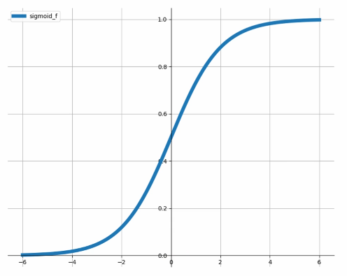
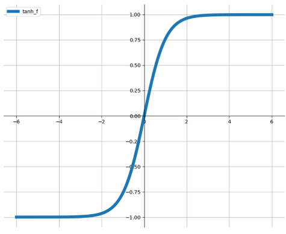
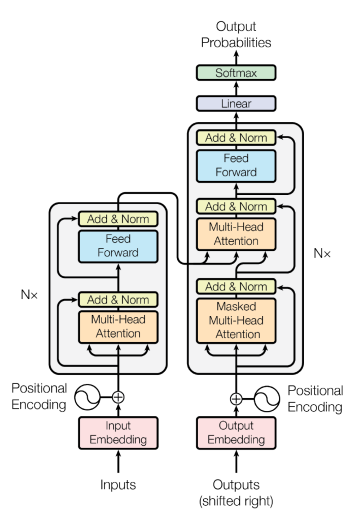

#  Neural Networks

[toc]

## Artificial Neural Networks

> *Inspired* by biological neurons :heart:
>
> 1943 - one of the first neural compactional models was proposed by MacCulloch and Pitts
>
> 1958 - Perceptron
>
> 1975 - Backpropagation

Takes a weighted sum of inputs (signals it receives through dendrites)
$$
w_0 + \sum_{i=1}^k w_ix_i \\
\sum_{i=0}^k w_ix_i \leftarrow \text{Assuming $x_o=1$ is always true}
$$
Passes this sum through its activation function (output at its axon)
$$
f(\sum w_ix_i)
$$

<hr/>

## Perceptron


$$
y = \text{sign}(w_0 + \sum w_ix_i)= \text{sign}(\vec w \cdot \vec x)
$$

- where $y$ is `+1` if $\text{sign}$ is greater 0 and `-1` if less than 0
- the bipolar step function or $\text{sign}$ is the ==activation function== of the perceptron

### Example Uses of Perceptron

#### Logical `AND`

| $x_1$ | $x_2$ | $y=x_1\and x_2$ | $h$                           |
| ----- | ----- | --------------- | ----------------------------- |
| -1    | -1    | -1              | $\text{sign}(w_0-w_1-w_2)=-1$ |
| -1    | +1    | -1              | $\text{sign}(w_0-w_1+w_2)=-1$ |
| +1    | -1    | -1              | $\text{sign}(w_0+w_1-w_2)=-1$ |
| +1    | +1    | +1              | $\text{sign}(w_0+w_1+w_2)=+1$ |

- we need to find a solution to $w_0,w_1,w_2$
- one solution is $w_1=-1,w_1=+1,w_2=+1$


#### Logical `OR`

- one solution is $w_1=+1,w_1=+1,w_2=+1$


#### Logical `XOR`


- This is nonlinearly separable!
- The perceptron can't do nonlinear classification (similar to logistic regression)
  - however, we can easily represent negation $\neg x$ with $w_0=0,w_1=-1$
  - $\text{sign}(w_0+w_1)=\text{sign}(-1)=-1,\text{sign}(w_0-w_1)=\text{sign}(+1)=+1$
  - we can express `XOR` as $(x_1 \and \neg x_2)\or(\neg x_1 \and x_2)$
  - we can now represent `XOR` using a *multilayered* perceptron


> Note that the output of a perceptron is nonlinear although the decision is linear
>
> - the decision is linear (i.e. the decision boundary is a hyperplane)
> - the output, however, is a nonlinear transformation as it applies the [bipolar step function](#Bipolar-Step-Function)

<hr/>

## Various Activation Functions


- [Identification function](#Identity-Function)
- [Bipolar step function (sign function)](#Bipolar-Step-Function)
- [Binary sigmoid](#Binary-Sigmoid-Function)
- [Hyperbolic tangent](#Hyperbolic-Tangent)

### Identity Function

$$
f(\vec w \cdot \vec x) = \vec w \cdot \vec x
$$

- typically used for output neurons when the task is regression
- should not be used in hidden layers

### Bipolar Step Function

$$
f = \text{sign}(\vec w \cdot \vec x)
$$


- returns either 1 or -1 (except right on the decision boundary)
- useful for hidden layers and output layer
- however it is *discontinuous* and it is problematic for learning algorithms that require derivation (functions need to be continuous to have their derivate taken)

### Binary Sigmoid Function

$$
f = 1/(1+e^{\sum_{i=o}^kw_ix_i})=\frac{1}{1+e^{-s}} \\
s = \sum_{i=0}^kw_ix_i
$$



- equal to the probability of true case from [logistic regression](7-Logistic-Regression.md#Logistic-Regression)
- the output of binary sigmoid is between 0 and 1
- useful for output layer when the task is classification
- the output can be interpreted as a *probability*

### Hyperbolic Tangent


$$
f = \tanh = \frac{e^s-e^{-s}}{e^s+e^{-s}} \\
s = \sum_{i=0}^kw_ix_i
$$

- also called $\tanh$
- similar to binary sigmoid but between -1 and +1
- useful for output layer when the task is classification
- useful for both hidden and output layers
- it is a *continuous* version of the [step function](#Bipolar-Step-Function)

<hr/>

## Feedforward Neural Network


- ==Feedforward== refers to how information flows from input to output in a single direction, without any feedback loops.
- A ==dense layer== is where every node in the layer connected to the each node in the next layer
- A Logistic regression model can be thought of as a feedforward network with no hidden layers such that it can perform *linear classification*

> ###### Having Multiple Output Nodes
>
> - ==Multiclass Classification== is when we have classes $\{c_1, c_2,..., c_k\}$ and each instance belongs to one class
>   - We can use a *SoftMax* activation function which is similar to [sigmoid](#Binary-Sigmoid-Function) but can provide a probability distribution across all the classes
>   - This is how [PokéScanner](https://github.com/fchv/PokeScanner) works
> - ==Multilabel Classification== is when we have labels $\{c_1, c_2,..., c_k\}$ but these labels are *binary* such that each instance can be assigned multiple labels 
>   - We can use a [sigmoid](#Binary-Sigmoid-Function) activation function for each output node

<hr/>

## Learning the Weights

1. Define an error (loss) function
2. Take its derivate with respect to the weights
3. Perform [gradient descent](7-Logistic-Regression.md#Gradient-Ascent-&-Descent) (minimize the loss function) 

### Some Error / Loss Functions

- Classification: these three are referring to [same thing](#Cross-Entropy,-Negative CLL)
  - Log-loss
  - Cross Entropy
  - Negative [conditional log likelihood](7-Logistic-Regression.md#Conditional-Log-Likelihood-CLL) (CLL)

- Regression: squared error

#### Cross Entropy or Negative CLL

- First recall what CLL is
- Assume the *true label* $t$ can be $0,1$
- $y=P(t=1|\vec x)$

$$
\text{CLL} = \sum_{t=0}\ln{P(t=0|\vec x)} + \sum_{t=1}\ln{P(t=1|\vec x)} \\
= \sum_{t=0}\ln{(1-y)} + \sum_{t=1}\ln{y} \\
$$

- Now do simplification tricks

$$
= \sum_{t=0}(1-t)\ln{(1-y)}+\sum_{t=1}t\ln{y}
$$

- where in the LHS $t=0$ and in the RHS $t=1$ so its really multiply by $1$

$$
= \sum_\text{all}(1-t)\ln(1-y)+t\ln{y}
$$

- by combining the summation, its a kind of mask because when $t=1$, one side is 0 and when $t=0$, the other side is 0
- ==Cross Entropy== is $\text{Cross Entropy} = -\text{CLL}$

#### Squared Error

- $\frac{1}{2}(t-y)^2$
- where $t$ is the true target value and $y$ is the prediction

### Backpropagation Algorithm

Say we have the following from a neural network


> - Where each neuron has an activation function $f$ such that
>   $y=f_y(w_d*f_d(w_c*f_c(w_b*f_b(w_a*f_a(w_x*x)))))$
> - To update the weights, we try to minimize the *error function* $E$
> - To update $w_d$, we need to assign $w_d \coloneqq  w_d-n\frac{\partial E}{\partial w_w}$ where $n$ is some learning rate
> - Thus for each weight $w$, we need to find $\frac{\partial E}{\partial w}$

Applying the chain rule:
$$
\frac{\partial E}{\partial w_x} = 
\frac{\partial E}{\partial y} *
\frac{\partial y}{\partial D} *
\frac{\partial D}{\partial C} *
\frac{\partial C}{\partial B} *
\frac{\partial B}{\partial A} *
\frac{\partial A}{\partial w_x} \\
\frac{\partial E}{\partial w_A} = 
\frac{\partial E}{\partial y} *
\frac{\partial y}{\partial D} *
\frac{\partial D}{\partial C} *
\frac{\partial C}{\partial B} *
\frac{\partial B}{\partial w_A} \\
\frac{\partial E}{\partial w_B} = 
\frac{\partial E}{\partial y} *
\frac{\partial y}{\partial D} *
\frac{\partial D}{\partial C} *
\frac{\partial C}{\partial w_B} \\
\frac{\partial E}{\partial w_C} = 
\frac{\partial E}{\partial y} *
\frac{\partial y}{\partial D} *
\frac{\partial D}{\partial w_C} \\
\frac{\partial E}{\partial w_D} = 
\frac{\partial E}{\partial y} *
\frac{\partial y}{\partial w_D} \\
$$

- Notice that there are a cascade of common terms, starting with $\frac{\partial E}{\partial y}$
-  Assuming our error $E$ is cross entropy, we can <span style="color:orange">find</span> $\frac{\partial E}{\partial y}$

$$
E = -(1-t)\ln(1-y)+t\ln{y} \\
\frac{\partial E}{\partial y} = -(1-t)*\frac{1}{1-y}*(-1)-t\frac1y*(1) \\
= \frac{1-t}{1-y}-\frac ty = \frac{(1-t)y-t(1-y)}{y(1-y)}
$$

#### Derivatives of the Activation Functions

$f$ is the activation functions, $s$ is the weighted sum of incoming signals
$$
\text{When } f(s) \equiv \text{binary sigmoid} \\
\frac{\partial f(s)}{\partial w} = f(s) \times (1-f(s)) \times \frac{\partial s}{\partial w}\\\\
\text{When } f(s) \equiv \tanh \\
\frac{\partial f(s)}{\partial w} = (1+f(s)) \times (1-f(s)) \times \frac{\partial s}{\partial w}
$$

##### How to Derive Binary Sigmoid


$$
\frac{\partial E}{\partial w_x} = \frac{\partial E}{\partial y} * \frac{\partial y}{\partial A} * \frac{\partial A}{\partial w_x}\\
\frac{\partial E}{\partial w_A} = \frac{\partial E}{\partial y} * \frac{\partial y}{\partial w_A}
$$

- To update $w_A$ we need to <span style="color:yellow">find</span> $\frac{\partial E}{\partial w_A}$; assume the activation function for $y$ is [sigmoid](#Binary-Sigmoid-Function) $\frac{1}{1+e^{-w_A\cdot A}}$
-  We already <span style="color:orange">found</span> $\frac{\partial E}{\partial y}$, now we need to find $\frac{\partial y}{\partial w_A}$

$$
y = \text{sigmoid}(w_A\cdot A) =\frac{1}{1+e^{-w_A\cdot A}} = (1 + e^{w_A \cdot A})^{-1}\\ 
\frac{\partial y}{\partial w_A} = (1+e^{-w_A \cdot A})^{-2} * e^{-w_A \cdot A}*A \\
= \frac{1}{(1+e^{-w_A \cdot A})^2} *  e^{-w_A \cdot A}*A \\
= \frac{1}{1+e^{-w_A \cdot A}} *  \frac{e^{-w_A \cdot A}}{1+e^{-w_A \cdot A}}*A \\
\text{Substitute for $y$}\\
= y*(1-y)*A
$$

- Thus we can <span style="color:yellow">see</span>

$$
\frac{\partial E}{\partial w_A} = \frac{(1-t)y-t(1-y)}{\cancel{y(1-y)}} * \cancel{y*(1-y)}*A\\
= [(1-t)y-t(1-y)] * A
$$

- We call $[(1-t)y-t(1-y)]$ the ==residual error==

<hr/>

#### Backpropagation Example


$$
\frac{\partial E}{\partial w_x} = 
\frac{\partial E}{\partial y} * 
\frac{\partial y}{\partial B} * 
\frac{\partial B}{\partial A} * 
\frac{\partial A}{\partial w_x}
\\
\frac{\partial E}{\partial w_A} = 
\frac{\partial E}{\partial y} * 
\frac{\partial y}{\partial B} * 
\frac{\partial B}{\partial w_A}
\\
\frac{\partial E}{\partial w_B} = 
\frac{\partial E}{\partial y} * 
\frac{\partial y}{\partial w_B}
\\
$$

Starting with $\frac{\partial E}{\partial w_B}$
$$
\frac{\partial E}{\partial w_B} = 
\frac{\partial E}{\partial y} * 
\frac{\partial y}{\partial w_B}\\\\
\frac{\partial E}{\partial y} = \frac{(1-t)y-t(1-y)}{y(1-y)} \\\\

\frac{\partial y}{\partial w_B} = \frac{\partial(\text{sigmoid}(w_B\cdot B))}{\partial w_B} = y*(1-y)*B\\\\
\frac{\partial E}{\partial w_B} =  \frac{(1-t)y-t(1-y)}{\cancel{y(1-y)}} * \cancel{y*(1-y)}*B \\
= [(1-t)y-t(1-y)] * B
$$

> $$
> \frac{\partial E}{\partial w_B} = \frac{\partial E}{\partial y} * y(1 - t) * B \\
> = \text{residual error} * B
> $$

Now for $\frac{\partial E}{\partial w_A}$
$$
\frac{\partial E}{\partial w_A} = 
\frac{\partial E}{\partial y} * 
\frac{\partial y}{\partial B} * 
\frac{\partial B}{\partial w_A}\\\\

\frac{\partial E}{\partial y} = \frac{(1-t)y-t(1-y)}{y(1-y)} \\\\

\frac{\partial y}{\partial B} = \frac{\partial(\text{sigmoid}(w_B\cdot B))}{\partial B} = y * (1-y) * w_B \\\\

\frac{\partial B}{\partial w_A} = \frac{\tanh(w_A\cdot A))}{\partial w_A} = \\(1 - \tanh(w_A\cdot A))(1 + \tanh(w_A\cdot A)) *
\frac{\partial(w_A\cdot A)}{\partial w_A} \\
= (1 - \tanh(w_A\cdot A))(1 + \tanh(w_A\cdot A)) * A\\\\
$$

> $$
> \frac{\partial E}{\partial w_A} =  \frac{\partial E}{\partial y} * y(1 - t) * w_B * (1 - B)(1 + B) * A
> $$

Now for $\frac{\partial E}{\partial w_x}$
$$
\frac{\partial E}{\partial w_x} = 
\frac{\partial E}{\partial y} * 
\frac{\partial y}{\partial B} * 
\frac{\partial B}{\partial A} * 
\frac{\partial A}{\partial w_x} \\\\

\frac{\partial E}{\partial y} = \frac{(1-t)y-t(1-y)}{y(1-y)} \\\\

\frac{\partial y}{\partial B} =  y * (1-y) * w_B \\\\

\frac{\partial B}{\partial A} = (1 - \tanh(w_A\cdot A))(1 + \tanh(w_A\cdot A)) * w_A\\\\

\frac{\partial A}{\partial w_x} = \text{sigmoid}(w_x\cdot X)*(1 -\text{sigmoid}(w_x\cdot X)) * X \\\\
$$

> $$
> \frac{\partial E}{\partial w_x} =  \frac{\partial E}{\partial y} * y(1 - t) * w_B * (1 - B)(1 + B) * w_A * A(1 - A) * X
> $$

####  The Crux of Backpropagation Algorithm

1. Start with $\frac{\partial E}{\partial y}$
2. Multiply by derivative of the next rightmost <span style="color:pink">node</span> function $\mathcal A$
   - if it is sigmoid $\mathcal A(1-\mathcal A) = \sigma(1 - \sigma)$
   - if it is tanh $(1-\mathcal A)(1+\mathcal A) = (1-\tanh)(1+\tanh)$
3. If you are deriving with respect to the weight feeding into that <span style="color:pink">node</span>, multiply by the derivative of the next left node's function $\mathcal A$;
   else multiply by the weight feeding into that <span style="color:pink">node</span> and continue at step 2

##### Backpropagation "Crux" Example


Find $\frac{\partial E}{\partial w_{A1}}$
$$
\frac{\partial E}{\partial w_{A1}} = \frac{\partial E}{\partial y} * y(1-y) * A_1
$$
Find $\frac{\partial E}{\partial w_{22}}$
$$
\frac{\partial E}{\partial w_{22}} = \frac{\partial E}{\partial y} * y(1-y) * w_{A2} * (1-A_2)(1+A_2)*X_2
$$


Find $\frac{\partial E}{\partial w_A}$
$$
\frac{\partial E}{\partial w_A} =  \frac{\partial E}{\partial y} * y(1-y) * w_D * (1-D)(1+D) * w_C * C(1-C) * w_B * B(1-B) * A
$$
Find $\frac{\partial E}{\partial w_x}$
$$
\frac{\partial E}{\partial w_A} =  \frac{\partial E}{\partial y} * y(1-y) * w_D * (1-D)(1+D) * w_C * C(1-C) * w_B B(1-B) * w_A * (1-A)(1+A) * X
$$
<span style="color:red">look up examples of backpropagation with numbers as that is what will be asked on the exam</span>

## Overfitting

- Neural networks are powerful tools
- Even with a single hidden layer, they act as *universal approximators* such that can approximate arbitrary functions arbitrarily close
- It is easy to overfit networks (i.e. fit to a training set of data so well that it fails in future unseen predictions)

<hr/>

## Deep Learning

- Uses several hidden layers with millions of parameters
- If a neural network with a single hidden layer is a *universal approximator*, then [why go deeper](https://arxiv.org/abs/1611.00740)? 
  - in short, for *generalization* purposes

**Examples of Deep Learning Networks**

1. [Convolutional neural networks (CNN)](#Convolutional-Neural-Networks-CNN)
2. [Recurrent neural networks (RNN)](#Recurrent-Neural-Networks-RNN)
   - Long Short-Term Memory networks (LSTM)
3. [Transformer](#Transformers)

### Convolutional Neural Networks CNN :framed_picture:

- Given a (for example, greyscale) image of 32 by 32 pixels
- a CNN, uses convolutional layers with kernels or ==filters== of say ==size== 3 by 3 with some associated weights (9 of them)
  - convolution also have ==strides== that shift the filters across vertically and horizontally across the image
  - filters produce features maps based on their associated weights (certain patterns the CNN picks up during training)

> 
>
> - This is an example of a 1D convolution operation 
> - with a kernel size of 3 (takes 3 inputs) 
> - and a strid of 2 (the kernel is shifted down every 2 units or "pixels")

- Pooling layers aggregate the feature maps that convolutional layers produce 
- Pooling is a down-sampling operation that takes a block of input data and reduces it to a single value
  - like convolution, pooling has a *kernel size* and a *stride*
  - however, unlike convolution, weights are fixed and not learned
  - pooling reduces the size of the features maps such as through
    - average pooling
    - max pooling

#### Example of CNN

```python
import tensorflow
print(train_images.shape)
# >> (50000, 32, 32, 3)
# our training data has 50000 instances of 32 x 32 pixels with 3 channels (rgb)
class_names = ['airplane', 'car', 'bird', ...]
# we have 10 class labels
model = models.Sequential()
```

> ###### Logistic Regression Structure
>
> ```python
> model.add(layers.Flatten(input_shape=(32,32,3)))
> # Output Shape: (None, 3072) |  Param #: 0
> model.add(layers.Dense(10, activation='softmax'))
> # Output Shape: (None, 10) |  Param #: 30730
> ```
>
> - the `Flatten` layer makes a flat shape of $32 \times 32 \times 3=3072$ and no parameters (i.e. no weights)
> - the `Dense` layer is a fully connected layer with $3072 * 10 + 10=30730$ weights (plus 10 for the bias weights)

> ###### CNN Structure
>
> ```python
> model.add(layers.Conv2D(1, (3,3), activation='relu', input_shape=(32,32,3)))
> # 1 convolution operation with kernel size of 3 by 3 and a relu activation to w_x * X
> # Output Shape: (None, 30, 30, 1) |  Param #: 28
> model.add(layers.MaxPooling2D((2,2)))
> # Output Shape: (None, 15, 15, 1) |  Param #: 0
> model.add(layers.Flatten())
> # Output Shape: (None, 225, 1) |  Param #: 0
> model.add(layers.Dense(10, activation='softmax'))
> # Output Shape: (None, 10) |  Param #: 2260
> ```
>
> - the `Conv2D` layer has $3\times 3\times 3+1=28$ parameters where each 3 by 3 kernel also has 3 RGB channels and plus 1 for the bias weight 
>   - it has 30 by 30 output shape for a stride of 2 by 2 with 3 by 3 kernel size across images of 32 by 32 pixels  
>   - note that by default, the stride of `Conv2D` is 2 by 2
> - the `MaxPooling2D` has an output shape of 15 by 15 because the input was 30 by 30 and its stride is 2 by  2
> - the `Flatten` has an output shape of $15\times 15=225$
> - the `Dense` layers has $225\times 10 + 10$ parameters
>
> ```python
> model.add(layers.Conv2D(5, (3,3), activation='relu', input_shape=(32,32,3)))
> # now we have 5 kernel size of 3 by 3
> # Output Shape: (None, 30, 30, 5) |  Param #: 140
> model.add(layers.Flatten())
> # Output Shape: (None, 4500, 1) |  Param #: 0
> model.add(layers.Dense(10, activation='softmax'))
> # Output Shape: (None, 10) |  Param #: 45010
> ```
>
> - the `Conv2D` now has $3\times 3\times 3\times 5+5=140$ parameters for 5, 3 by 3 kernels on 3 RGB channels with 5 extra bias weights
> - we can add a `MaxPooling2D` to decrease total parameter count 

### Recurrent Neural Networks RNN

- Lets say I have the sentences "I ate rice for dinner" and "Another sentence is this"
- The sentences are of different lengths so we can add empty tokens or trim them to be the same length
- There is also relationships  between tokens such as "I ate..." will typically be followed by a type of food


- Recurrent neural networks unfold the input (the sentence) use the same weights on each node's input vector such that it remembers and captures relationships between sequences
- Thus recurrent networks are good for sequenced data
- However, when sequences are too long, it tends to "forget what it saw"
- Long short-term memory (LSTM) networks are specialized RNNs build for "remembering" long sequences
  - LSTMs are used for many language processing tasks like [Google Translate](https://en.wikipedia.org/wiki/Google_Neural_Machine_Translation)

### Transformers



- Transformers get rid of recurrent structures completely by working at the token level instead of the entire sequence
- Thus, they are more parallelizable and require significantly less time to train
- This is the network behind [ChatGPT](https://en.wikipedia.org/wiki/GPT-3) :sunglasses:
  - GPT-3 is a "transformer network with a 2048-token-long context and then-unprecedented size of 175 billion parameters, requiring 800GB to store" :open_mouth:

### Other Network Concepts

- Autoencoder
  - the input and output are the same shape
  - input gets encoded (i.e. compressed)
  - and output was decoded
  - it gets rid of noise and finds out what are the most important features
  - this is good for compressing data (image, video data) 
- Deep autoregressive model :man_shrugging:
- Generative adversarial networks (GAN) :man_shrugging: