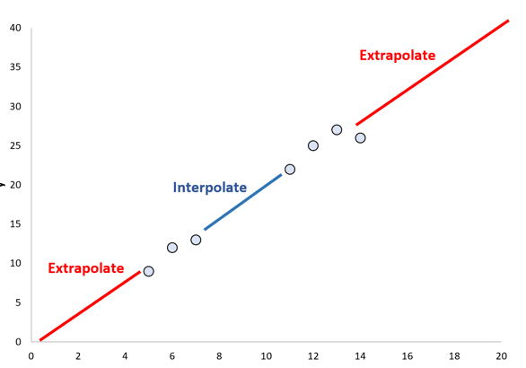

# Introduction

[toc]

- This class is recorded. Consider just watching the recordings as it is hard to concentrate in class.
- Find out where the syllabus is for the class.

## Machine Learning

### Statistics

- tests relationships between variables; highly interpretable
- assesses uncertainty

### Machine Learning (ML)

- learning patters from data & making predictions on new data
- many models are black box

> "Many models are wrong, but some are more useful" - George Box

### Artificial Intelligence (AI)

- set of techniques to enable machines to mimic human behavior
- ML subset of AI

## Concept Learning 

- introduce a general function from specific training examples
- example is classifying heart disease by patient records labeled as `heartDistease` and `~heartDisease`
- **Goal**: induce a general function that fits to the training data well and generalizes well to unseen / future data

### Possible Scenarios of Learning

- **Interpolation**: filling in the gaps to predict data similar to that you trained on
- **Extrapolation**: being able to predict on data never seen before

### Problem Formulation

- define a space of hypotheses (functions)
- search for a hypothesis that fits well to the training data
- to search efficiently, utilize the structure of the hypothesis space

#### Enjoy Sports Example

- say we have 6 attributes; each has 2 possible values
- we are predicting if someone enjoys sports or not (2 possible values)
- the instance space is $2 \times 2 \times 2 \times 2 \times 2 \times 2$ (6 attributes with 2 possible values)
- and the number of possible decision functions is $2^\text{|instance space|}$ (`EnjoySport` is yes or no) 

##### Hypothesis Representation

- $h(x) = 1$ if `EnjoySport` is Yes, $0$ otherwise
- how should we represent $h(.)$?
- a simple solution is a conjunction ($\and$) of constraints on the attributes:
  - $<\text{Sky}, \text{AirTemp}, \text{Humidity}, \text{Wind}, \text{Water}, \text{Forcast}>$
  - $?$ indicates any value is acceptable
  - $\varnothing$ means no value is acceptable
- for example:
  - $<\text{Sunny},?,?, \text{Strong}, ?,? >$
  - Sky must be Sunny, Wind must be Strong, and other attributes can be any value
- $c(x)$ is the true function that is not given (refer to [true concept](#true-concept))

### Propositional Logic Language

- Operators
  - $\neg$ negation
  - $P \and Q$ conjunctions where $P,Q$ are conjuncts
  -  $P\or Q$ disjunction
  - $\implies$ implies
  - $\iff$ if and only if

#### Grammar / Syntax

- Sentence $\rightarrow$ Atomic | Complex
- Atomic Sentence $\rightarrow$ True | False | Variable
- Complex Sentence $\rightarrow$ Sentence operator Sentence (i.e. negation or implies...)

### True Concept

- let the true concept be $c(x)$ that we don't know
- we have training set of $<x,c(x)>$ pairs
- we define a hypothesis space for $H$ where we hope $c\in H$ and we search for $h\in H$ such that
  - $h(x) = c(x) \forall_x\in D$

#### Most General / Specific Hypothesis

- most general is $<?,?,?,...>$ where $h(x)=1\forall_x\in X$
- most specific is $< \varnothing, \varnothing, \varnothing ,... >$ where $h(x)=1\forall_x\in X$
- note that it takes just one $\varnothing$ in this formulation to make $h(x)=0$ for all 

####  "More General" Relation

- let $h_j,h_k$ be Boolean valued functions over $X$
- $h_j$ is "more general" than $h_k$ (written as $h_j \ge h_k$)  if and only if 
  - $(\forall_x\in X)[h_k(x)=1 \implies h_j(x)=1]$
  - whenever $h_k$ says positive, $h_j$ also says positive ($h_j$ may say positive to other instances that $h_k$ says negative)

### Algorithms

1. [Find-S](#Find-S-Trace)
2. List-Then-Eliminate
3. Candidate-Elimination

#### Version Space

- A hypothesis $h$ is consistent with dataset $D$ and target $c$ if and only if $h$ agrees with $c$ on each example in $D$
- ==Version space== with respect to hypothesis space $H$ and dataset $D$ is the set of all hypotheses in $H$ that are consistent with all examples in $D$

#### Find-S Trace

The search begins with $h_0$ the most specific hypothesis then considers increasingly general hypotheses 

- Disadvantages
  - Find-S finds the most specific hypothesis in the version space
  - why not find the most general?
  - what if the training data has errors
  - what if the specific hypothesis Find-S finds is not unique

#### List-Then-Eliminate

1. $ \text{VS} \leftarrow$ a list of every hypothesis in $H$
2. for each example in $D$
   - remove any hypothesis $h$ in $\text{VS}$  where $h(x)\neq c(x)$
3. Output $ \text{VS}$

-  Advantages
  - Outputs all consistent hypotheses
- Disadvantages
  - need to list all possible hypotheses 
  - impossible / impractical for infinite / large hypothesis spaces

#### Candidate-Elimination

- This is an integration of the previous 2
- Start with $S$ (specific boundary) that has only the most-specific hypothesis and $G$ (general boundary) that has only the most-general hypothesis and modify $S$ and $G$ with each training data
