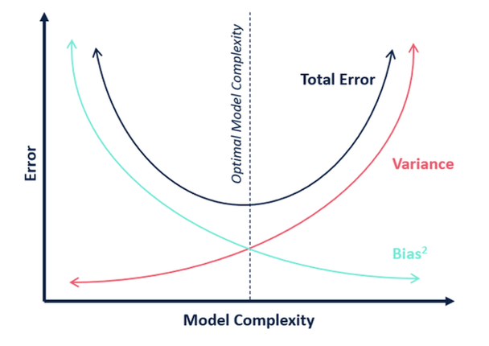

## Decision Trees DTs

[toc]

### Number of Possible DTs

- given 1 binary feature $X$ (true / false) & a binary class $Y$ (yes / no)
  - size of instance space
    - $2 \times 2 = 4$
  - size of function space
    - $2^4 = 16$
  - number of syntactically different decision trees?

### How would you learn a DT?

- naive DT learning algorithm (==NDT==)
  1. the node at the $i$^th^ level is the $i$^th^ feature
  2. the leaf is the last feature
- questions
  - what's the empirical error (error on training data)?
    - 0
  - can you use it for predictions?
    - not really

#### NDT Example

- with no learning bias, we have no predictions
- with inductive bias, similar instances should have similar labels

- with this tree we can make predictions
- however, we are also trying to find the optimal (simplest / fewest splits) tree

### Inductive Bias

- given 2 trees that are consistent with training data, we prefer the *smaller* one
- the **simplicity principle**: simpler solutions that work are preferred over more complex one
- this does not mean simplicity is a rule; rather a preference
- finding the smallest tree that is consistent with training data is *NP-complete*
- what do we do? Be greedy:
  - start with the "best" features at the top and then the next "best"
- is this guaranteed to be optimal?
  - no but faster than exponential
- how to measure how *good* a feature is?

### Purity

- feature $X_i$ is "better" than $X_j$ if it leads to a "purer" split
- for example, given a dataset with 5 Yes and 5 No cases
  - $X_1$ splits the data into <2Y, 3N> and <3Y, 2N>
  - $X_2$ splits the data into <1Y, 4N> and <4Y, 1N>
  - $X_3$ splits the data into <0Y, 5N> and <5Y, 0N>
  - $X_3>X_2>X_1$
- a node is pure if it contains instances that belong to same class
- some *impurity* measures are ==Entropy== & ==Gini Index==

$$
\text{Entropy} = -p\log_2 p-(1-p)\log_2(1-p)\\\\
\text{Gini Index} = 1-\sum_i p_i^2
$$

- where $p$ represents the proportion of instances that belong to one class

### Locally Optimal Feature 

- a feature $X_i$ is ==locally optimal== if the *impurity* is
  - **smallest after** we split using $X_i$

#### Locally Optimal Feature Example

- before the split on $X_1$ we have <3A, 2B>

- entropy is
  $$
  -[(\frac35\log_2\frac35)+(\frac25\log_2\frac25)]=0.971
  $$

- to split, refer to our data and check the counts of $Y$ on each feature value of $X_1$

- after the split, the true branch has entropy of
  $$
  -[(\frac23\log_2\frac23)+(\frac13\log_2\frac13)]=0.918
  $$

- and the false branch has entropy of
  $$
  -[(\frac12\log_2\frac12)+(\frac12\log_2\frac12)]=1
  $$

- then we take a weighted average
  $$
  \frac35 \times 0.918 + \frac25 \times 1 = 0.951
  $$

### Information Gain IG

$$
\text{Information Gain} = \text{Entropy before}-\text{Entropy after}
$$

#### Information Gain Example

- continuing the [previous example](#Locally Optimal Feature Example), the IG is

$$
\text{IG}(X_1) = 0.971 - 0.951 = 0.02
$$

- to find our first split on the tree, we would also calculate $\text{IG}$ for $X_2,X_3$ and choose the split with the highest $\text{IG}$

### DT Algorithm (ID3)

1. start with empty tree
2. at each iteration
   - pick the locally optimal feature and split on it
   - split the dataset into subsets based on the values of that feature
   - repeat the process for each subset
   - stop when all leaves are pure (or no more features left to split)

### Features with many Categorical Values

- let
  - a node has $m$ data points
  - feature $F_i$ has $n$ possible values
- on average, each split by each value of $F_i$ will have $m/n$ data points
- when $n$ is large, $m/n$ data points are expected to be more likely pure

#### Gain Ratio

- the solution to the above is to use ==gain ratio== instead of IG
- Gain Ration = IG / Entropy of split proportions

$$
H(S) = -\sum \frac{c_1}m\log \frac{c_i}{m}
$$

### Continuous Features

- let $F_i$ be a continuous feature (i.e. temperature)
- assume that you would like to create a binary split (i.e. $F_i > x$)
- we can do a binary search across an interval of values and find the best split for $x$

### Overfitting

- given a hypothesis $h$
  - $\text{error}_\text{train}(h)$: error of $h$ on train set
  - $\text{error}_\text{distribution}(h)$: error of $h$ on entire dataset
- $h\in H$ overfits the train set if there is an $h'\in H$ such that
  - $\text{error}_\text{train}(h) < \text{error}_\text{train}(h')$ 
  - $\text{error}_\text{distribution}(h) > \text{error}_\text{distribution}(h')$

### When to stop growing the tree?

- stop when the leaf is pure
- otherwise stop when no attributes are left
- if there are errors in training data
  - the tree maybe too large
- we can also do
  - early stopping based on criteria (pre-pruning)
  - post-prune the tree
- usually this is done with a grid search based on multiple criteria

#### Post-Pruning using Validation Data

- keep separate data for validation
- grow full tree on training set
- prune a node as long as pruning it improves performance on validation set 

---

## Ensemble Learning

- can multiple learners help?

  - averaging over models reduces variance
    $$
    \text{Var}(\bar X) = \frac{\text{Var}(X)}{N}
    $$

  - for $N$ independent predictors of same type

- averaging over models of same type **does not** increase bias :happy:

- problems:

  - one training set
  - how to create multiple *independent models* 

### Bagging (Bootstrap Aggregation)

- bootstrap sampling

  - draw $N$ samples with replacements from the dataset of size $N$
  - take repeated bootstrap samples from the training set
  - each point has probability of $(1-\frac1n)^n$ of being selected
  - sample is expected to contain $\approx 1-e^{-1}$ proportion of the original training set (around 63.2%)

- bagging

  - create $m$ bootstrap samples
  - train classifier on each of them
  - aggregate the results using majority vote

- best case:
  $$
  \text{Var}(\text{Bagging}(L(D))) = \frac{\text{Var}(L(D))}{N}
  $$

- in practice: *models are correlated*

### Random Forest

- intrude another source of randomness: *random projections*
- this will give complex decision boundries

### Gradient Boosting

- gradient boosting is a way to reduce bias
  - instead of increasing model complexity, make weak learners more relevant 
  - consider independent models as an expert
  - each individual can have high bias, but team of experts can be objective

