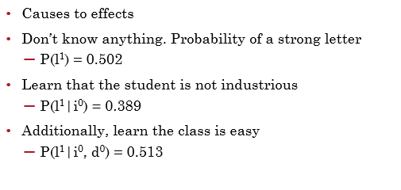

# Probabilistic Graphical Models

[toc]

- to extract information from the data, we would like to represent a joint distribution $P$ over $\mathcal X:\{X_1,X_2,...,X_n\}$ task - conditional distribution $P(\mathcal X|Y)$
- the naive represent is to specify a value for each possible combination
  - to make a tractable mode, we need to introduce an inductive bias
- real-world data is structured; domain specific dependencies
- we would like to decompose $P(X_1,X_2,...,X_n)$ into series of simpler distributions like $P(X_1,X_2)$ & $P(X_3,X_4,X_5)$ that reflect our domain knowledge

## Mathematical Tools

### Probability

### Independence

- marginal independence
  - represent a joint distribution $P$ over $\mathcal X:\{X_1,X_2,...,X_n\}$ where all $X_i$ are binary
  - how many independent parameters?
    - $2^n-1$
  - assuming $\forall_{i\ne j}X_i\perp X_j$
  - $P(X)=P(X_1)P(X_2)...P(X_n)$
  - now how many independent parameters?
    - $2n$
- conditional independence
  - *compactness* - fewer parameters to specify
  - *intuition* - easy to specify
  - *modularity* - adding a new variable does no cause us to change all entries in joint table

### Graphs

- ==degree== of $X_i$ is number of edges $X_i$ is part of
- ==indegree== of $X_i$ is number of directed edges pointing to $X_i$
- **degree of a graph** is max degree of a node in graph

---

## Bayesian Networks

- a directed acyclic graph whose nodes are random variables and edges represent (intuitively) the direct influence of one node over another
  - a **data structure** that provides the skeleton for representing a joint distribution compactly in a factorized way
  - a compact representation for a set of conditional independence assumptions about a distribution 
- naive bayes is special Bayesian network 

### Bayesian Network Structure

- a Bayesian Network Structure $\mathcal G$ is directed acyclic graph
- nodes represent random variables $X_1,...,X_n$
- $\text{Pa}(X_i)$ denote parents of $X_i$ 
- $\text{ND}(X-i)$ denote variables that **are not** descendants of $X_i$
- $\mathcal G$ assumes $X_i \perp \text{ND}(X_i) | \text{Pa}(X_i)$
- these independencies are called the ==local independencies==

### Bayesian Network Factorization

$$
P(X_1,...,X_n) = \prod_i P(X_i|\text{Pa}(X_i))
$$

- these factorization is useful because we want to reduce the amount of parameters as much as possible

#### Local Independencies Example

### Reasoning Patterns

- ==causal reasoning== causes to effects
  - A → B → C

- ==evidential reasoning==  effects to causes
  - A ← B ← C

- ==intercausal reasoning== explaining away
  - A → B ← C

### Independencies in graphs

- we have seen *local independence*
- are there additional independence statements we can make based on graph structure?
  - yes
- will these additional independence reduce parameters
  - no

#### Dependence & Information Flow

$X,Y$ are independent if the information can't flow from one to other

- no trail between $X,Y$
  - information can't flow (independent)
- $X,Y$ connected by an edge
  - information can flow (not independent)
- $X,Y$ are not connected by edge but *there is a trail* between them
  - depends...

##### Trails

- ==casual trail== X → Z → Y
  - information can flow between $X,Y$ if $Z$ is not observed
  - but if $Z$ is observed, it blocks information flow ($X \perp Y|Z$)
- ==evident trail== X ← Z ← Y
  - information can flow between $X,Y$ if $Z$ is not observed
  - but if $Z$ is observed, it blocks information flow ($X \perp Y|Z$)
- ==common cause== X ← Z → Y
  - information can flow between $X,Y$ if $Z$ is not observed
  - but if $Z$ is observed, it blocks information flow ($X \perp Y|Z$)
- ==common effect== X → Z ← Y (v-structure)
  - information can flow between $X,Y$ only if $Z$ or at least one of $Z's$ descendants is observed

