# Probabilistic Graphic Models Continued

I don't understand this section at all.

[toc]

## Querying a distribution

- all variables $\mathcal X$, evidence variables $E$
- probability query
  - $P(Y|e)$
- MAP query (Maximum A Posteriori)
  - $W = \mathcal X\backslash E$ (i.e. all non evidence variables)
  - $\text{MAP}(Y | e) = \underset{w}{\text{argmax }}P(w,e)$
- marginal MAP query
  -  $\text{MAP}(Y | e) = \underset{y}{\text{argmax }}P(y,e)$
  - let $Z = \mathcal X\backslash E \cup Y$
  - $\text{MAP}(Y | e) = \underset{y}{\text{argmax }}\sum_zP(z,y|e)$

> a MAP query is concerned with finding the most likely configuration of non-evidence variables (i.e. "weights") given observed evidence, based on the posterior distribution

## Forward Sampling

- used for Bayesian networks & marginal probabilities 
- for each variable $V_i$ that is ready
  - sample a value $v_i$ for $V_i$ using $P(V_i| \text{Pa}(V_i))$ 
- repeat this process $M$ times to generate $M$ instances 
- a variable is ready if
  - it has no parents, or
  - you have sampled all its parents
- to compute marginal *use* [maximum likelihood estimate](9-Classification-and-Probability.md#Maximum Likelihood Estimation MLE)

### Forward Sampling Example 

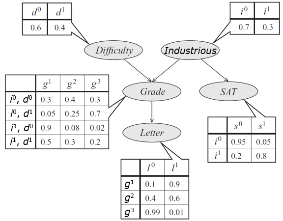

1. $D$ & $I$ are ready
2. sample $D$ from $P(D): d^0$
3. only $I$ is ready
4. sample $I$ from $P(I): i^1$
5. $G$ & $S$ are now ready
6. sample $G$ from $P(G|i^i,d^0):g^1$
7. $S$ & $L$ are ready
8. sample $S$ from $P(S|i^1):s^0$
9. $L$ is ready
10. sample $L$ from $P(L|g^1):l^0$
11. the instance is $\textlangle d^0, i^1,s^0,g^1,l^0 \textrangle $
12. repeat the process from step 1 $M$ times

### Plate Notation

- describes dependencies in a compact way

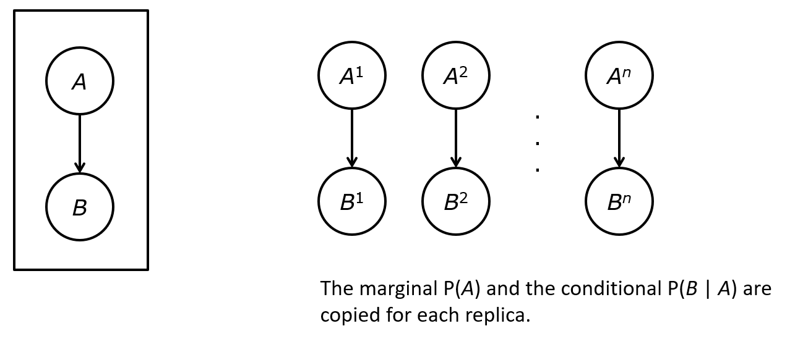

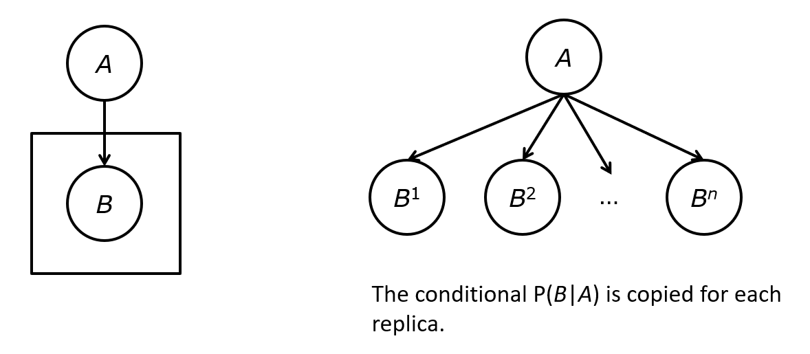

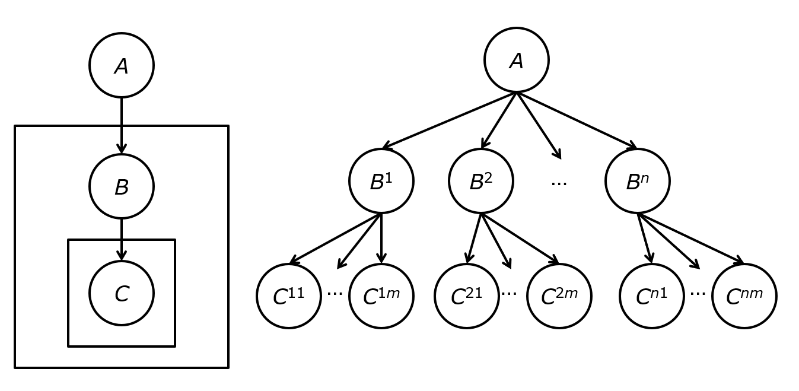

### Latent Dirichlet Allocation

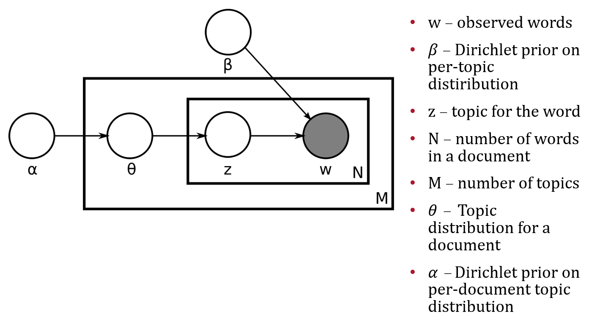

---

## Markov Networks MN

- there are distributions that can't be represented by Bayesian networks
- guaranteeing acyclicity can be hard

### Example

- we'd like a graph where
  - $A \perp C | B,D$
  - $B\perp D|A,C$
- $(A,B),(B,C),(C,D),(D,A)$ are correlated but no causal direction exists
- (Alice, Charles) pair & (Bob, Debbie) pair do not talk to each other directly
- (Alice, Bob), (Bob, Charles), (Alice, Debbie) pairs agree most of the time but
  (Charles, Debbie) pair disagree most of the time

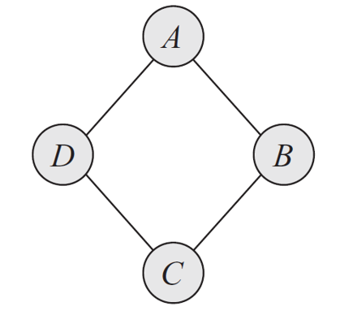

- however, the graph is *undirected* & *cyclic*

### Graphs

|                        | Bayesian Networks                                           | Markov Networks                                              |
| ---------------------- | ----------------------------------------------------------- | ------------------------------------------------------------ |
| **Structure**          | directed acyclic                                            | undirected graphs                                            |
| **Parameters**         | conditional probability distributions                       | ?                                                            |
| **Joint Distribution** | $P(\mathcal X)= \prod P(X_i|\text{Pa}(X_i))$                | ?                                                            |
| **Independencies**     | $X_i\perp \text{ND}(X_i)|\text{Pa}(X_i)$ ND-separation | separation pairwise independencies local independencies |

#### Independencies in Markov Networks

1. Separation
   - $X \perp Y|Z$ if $X,Y$ are separated in $\mathcal H$ given $Z$
2. pairwise independencies
   - $X \perp Y| \mathcal X \backslash \{X,Y\}$
3. local independencies
   - $X\perp \mathcal X \backslash \text{MB}(X) | \text{MB}(X)$ where $\text{MB}$ stands for **Markov Blanket**
   - a Markov Blanket of variable $X$ in a MN $\mathcal H$ is its neighbors

#### Marginals on the (Maximal) Cliques?

- consider the simple graph of $A-B$
  - can we say $P(A,B)=P(B,A)$
- now consider $A-B-C$
  - can we say $P(A,B,C)=P(A,B)P(B,C)$

#### Parameterization

- parameterization is the least intuitive concept about MNs
- in Bayesian Networks: $P(X_i | \text{Pa}(X_i))$
- in MNs:
  - can't use probability distribution directly but
  - MNs provide more flexibility in parameterization

##### Factors

- let $D$ be a set of random variables
- a ==factor $\phi$== is a function from $\text{Val}(D)$ to $\mathbb R$
- a factor is nonnegative if all entries are nonnegative
- the *scope of a factor* (denoted as $\text{Scope}(\phi)$) is the set of variables $D$ it is associated with

###### Factors Example

- take the structure $A-B-C$
- factors: $\phi(A,B)$ and $\phi(B,C)$
- remember that factors are functions from $D$ to $\mathbb R$ 
- how can we represent the join $P(A,B,C)$ using factors

##### Gibbs Distribution

- a distribution $P$ is a ==Gibbs distribution== parameterized by a set of factors $\Phi = \{\phi(D_1),...,\phi(D_k)\}$ if it is defined as follows

$$
P(X_1,...,X_n) = \frac{1}{Z}\prod_{i=1}^k \phi(D_i)
$$

###### Factor Graph Example 

- MN as a clique over 3 variables $A,B,C$

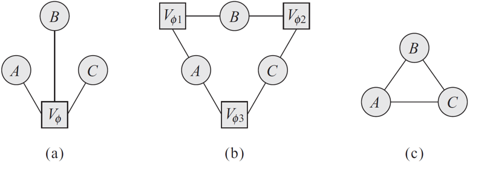

##### Log-Linear Models

$$
\phi(D) = e^{(-\epsilon(D))}
$$

- $\epsilon(D)=-\ln(\phi(D))$ is often called the *energy function*
- in statistical physics, the probability of a physical state depends inversely on its energy
- ==Log-Linear models== guarantee that the factors are positive, guaranteeing that the probability is positive

$$
P(X_1,...,X_n) = \frac1Z \prod_{i=1}^k\phi_i(D_i)\\
= \frac1Ze^{-\sum_{i=1}^k\epsilon_i(D_i)}
$$

##### Relationships

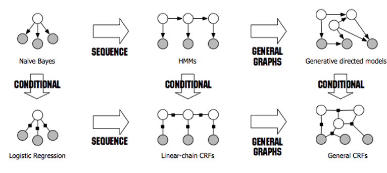

- conditional random fields CRF

##### Markov Network Factorization

- we say that a distribution $P$ with $\Phi = \{\phi(D_1),...,\phi(D_k)\}$ factorizes over a MN $\mathcal H$ if each $D_i (i=1,...,k)$ is a complete subgraph of $\mathcal H$
- the factors $\phi(D_i)$ are called **clique potentials**
- $D_i$ can be maximal cliques but they do not have to be

###### Pairwise Markov Random Fields

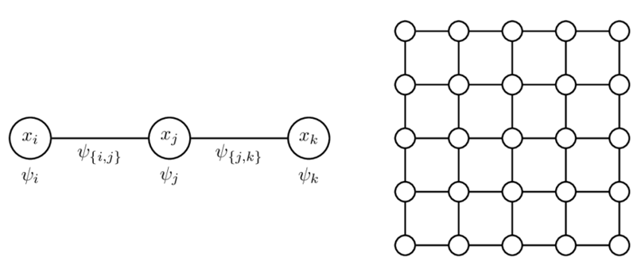

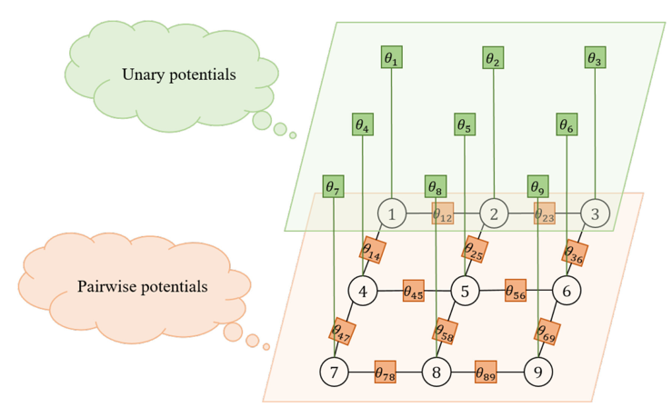

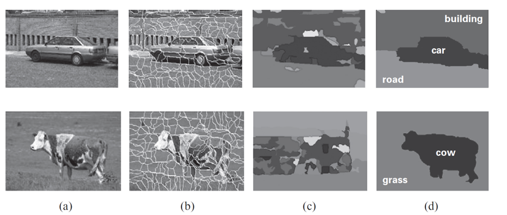

##### Parameterization

- factors over maximal cliques
- pairwise Markov random fields do not introduce additional independencies but
  - number of parameters is quadratic instead of exponential 
  - sets of distributions that can be represented over maximal cliques & pairwise interactions are not the same
