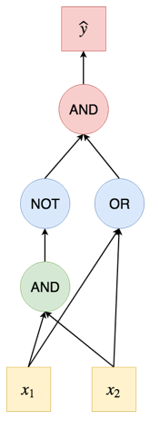

# Neural Networks

[toc]

## Perceptron

$$
y=\text{sign}(w_0+\sum w_ix_i)
$$

### What an Artificial Neuron Does

- take weighted sum of inputs
  - $w_0 + \sum_{i=1}^kw_ix_i$
  - assuming that there is always a constant $x_0=1$ then
    $\sum_{i=0}^kw_ix_i$
- passes this sum through its activation function $f$

### Examples of Perceptron Application

refer to this [link](G:\My Drive\School\3-Junior-Spring\CS 581 Advanced Artificial Intelligence\9-Neural-Networks.md#Example Uses of Perceptron) for more details

- logical `NOT`
- logical `AND`
- logical `OR`
- logical `XOR`

#### Simple Multilayer Network for `XOR`

---

## Various Activation Functions

- [identity function](#Identity Function)
- [bipolar step function](#Bipolar Step Function)
- [bipolar sigmoid](#Bipolar Sigmoid)
- [binary sigmoid](#Bipolar Sigmoid)
- [hyperbolic tangent](#Hyperbolic Tangent)
- [ReLU](#ReLU)

### Identity Function

$$
f(\sum_i^k w_ix_i)=\sum_i^k w_ix_i
$$

- typically used for output neurons when task is regression
- linear combination of linear functions is another linear function
  - hence, using the identity function in the hidden layers does not increase network's representative power

### Bipolar Step Function

$$
f(\sum_i^k w_ix_i) = \text{sign}(\sum_i^k w_ix_i)
$$

- returns either $+1,-1$ (except exactly on the decision boundary)
- useful for both hidden & output layer
- however, it's discontinuous & is problematic for learning algorithms that require derivation

### Bipolar Sigmoid

$$
f(\sum_i^k w_ix_i)=\frac{2}{1+e^{-\sum_i^k w_ix_i}}-1
$$

- this is a rescaled version of *binary* sigmoid ($[0,1]$)
- the output of *bipolar* sigmoid is $[-1,+1]$
  - useful for output layer when task is classification
  - useful for hidden layer

### Binary Sigmoid

$$
f(\sum_i^k w_ix_i)=\frac{1}{1+e^{-\sum_i^k w_ix_i}}
$$

- output is $[0,1]$
  - output can be interpreted as probability
  - useful for output layer when task is classification

### Hyperbolic Tangent

- output is $[-1,+1]$
  - useful for output layer when task is classification
  - useful for hidden layer

### ReLU

$$
f(\sum_i^k w_ix_i) = \sum_i^k w_ix_i \text{ if } w_ix_i > 0\\
0 \text{ otherwise}
$$

- typically used for hidden layers (especially for computer vision tasks)

---

## Deep Learning

- several hidden layers
  - millions of parameters
- big data, big computation
- if a neural network with a single hidden layer is a *universal approximator*, why go deep?

