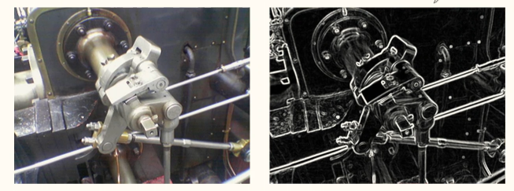

# Dimensionality Reduction and Unsupervised Learning

[toc]

## Dimensionality Reduction

### Motivation

- remove useful features
- learn a low dimensional representation
- visualization

### Approaches

- feature selection
- feature extraction

#### Feature Selection

- select a subset of features
- several approaches:
  - **univariate feature selection**
    - mutual information
    - Chi2
  - **recursive feature elimination**
    - using an external estimator
    - recursively remove the least useful features
  - **sequential feature selection**
  - **model-based feature selection**
    - L1 regularization
    - random forest
    - boosting
    - variance inflation factor

#### Feature Extraction

- feature extraction, projection, latent representation learning, manifold learning, ...
- given an input, project it into another dimension (often lower)\
- unsupervised
  - [principal component analysis](#Principal Component Analysis ) 
  - ...
- supervised
  - linear discriminant analysis
  - deep learning

---

## Principal Component Analysis PCA

- given a dataset $x$ with $d$ dimensions, project it into $k<d$ dimensions with minimum loss of information
  - $z = w^\top x$
  - where $x$ is the input dataset
  - $z$ is the projection
- PCA maximizes the variance in the projected space so that objects are spread out
  - $\underset{w}{\text{argmax }} \text{Var}(z)$
  - recall $\text{Var}(aX+b) = a^2\text{Var}(X)$
  - so $\text{Var}(z)=w^\top \text{Var}(x)w$
  - we can trivially maximize variance by multiplying $w$ by a large constant 
    - hence we enforce $w$ is unit length
    - $ww^\top=1$
  - objective:
    - maximize $w^\top \text{Var}(x)w$ subject to $ww^\top=1$

### Constraint Optimization Example

Maximize $xy$ subject to $x+y=10$.
$$
f = xy - \lambda(x+y-10)\\\\
\frac{df}{dx} = y -\lambda = 0 \implies y = \lambda \\
\frac{df}{dy} = x -\lambda = 0 \implies x = \lambda \\ 
\frac{df}{d\lambda} = x + y = 10 \implies \lambda + \lambda = 10
\implies 2\lambda = 10 \implies \lambda = 5\\\\
x = y= 5
$$

### PCA with 1 Dimension 

- maximize $\text{Var}(z_1)=w_1^\top \text{Var}(x)w_1$ subject to $w_1^\top w_1=1$
- let the variance of $x$ be the covariance matrix $\Sigma$
- objective: maximize $w_1^\top \Sigma w_1$ subject to $w_1^\top w_1=1$
- LaGrange: maximize $w_1^\top \Sigma w_1 - \lambda (w_1^\top w_1-1)$
- take derivative with respect to $w_1$ & set to 0
  - $2\Sigma w_1-2\lambda w_1=0$
  - $\Sigma w_1 = \lambda w_1$
- $w_1$ is an eigenvector & $\lambda$ is an eigenvalue of $\Sigma$
- because we maximize variance
  -  maximize $w_1^\top\Sigma w_1=w_1^\top \lambda w_1=\lambda w_1^\top w_1 = \lambda$
  - $w_1$ is the eigenvector that corresponds to the largest eigenvalue of $\Sigma$

---

## Feature Engineering

- using domain knowledge to transform data
- Sobel operator in computer vision

$$
G_x = \begin{bmatrix}
1&0&-1\\
2&0&-2\\
1&0&-1
\end{bmatrix} * A\\
G_y = \begin{bmatrix}
1&2&1\\
0&0&0\\
-1&-2&-1
\end{bmatrix} * A\\
G = \sqrt{G_x^2+G_y^2}
$$

- where the $*$ operator is *convolution*

---

## Auto Encoder

- a neural network architecture where the input & output are the same
  - $x \rightarrow h \rightarrow x$
  - input $x$ is encoded into $h$ where
  -  $h$ is typically has lower dimensionality that $x$ 
  - and $h$ is decoded back to $x$ with same error