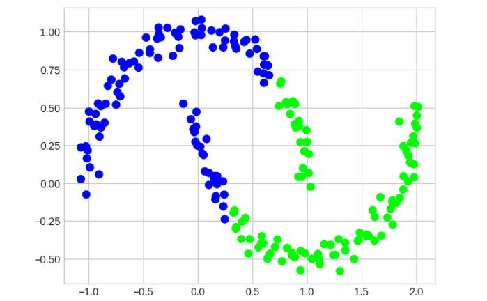
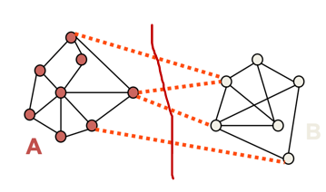
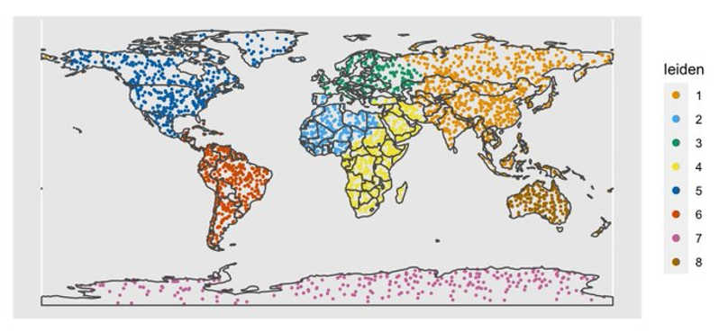

# Unsupervised Learning

[toc]

## Motivation

- there is no supervision (i.e. no target variable)
- find groups / clusters in the data

## Clustering

- intuitively, ==clusters== are the groups in the data for which points within the same group are more similar than points in different groups

### Various Approaches

- K-Means
- expectation maximization EM
  - a general approach that can be used for many other tasks (one of which is clustering)
- spectral clustering

---

### K-Means

- given data, find $k$ prototype vectors & assign each data point to its closest prototype vector such that
  - the sum of the distances to the closest prototype vector is minimized
- let $D=\{x_j\}_{i=1}^N$ be the data & $\{m_i\}_i^k$ be the prototype vectors
- objective:
  - minimize $\sum_{j=1}^N \underset{i}{\text{min }} \text{distance}(x_j,m_i)$
  - a typical distance metric is Euclidian distance

#### K-Means Algorithm

- initialize $k$ centers $\{m_i\}_{i=1}^k$
- repeat until convergence
  - assign each data point $x_j$ to the closest cluster center
  - re-compute each center $\{m_i\}_{i=1}^k$ as the mean of the points that are assigned to that center

#### K-Means Summary

- requires specifying the number of clusters beforehand
- no guarantee for convergence to global minimum
- output is highly dependent on initial centroids
  - sometimes it is useful to use actual data points for centroid instead of random
- sometimes clusters can become empty
- assumes that clusters are spherical

---

## EM for Mixture of Gaussians

- very much like Bayes' classifier where we have $P(C)$ and $p(x|C)$ and we use that for computing $P(C|x)$ except
  - in this case, classes are not given to use
  - so we take an iterative approach

### Notation

- $P(C_i)$: prior probability of component $C_i$
  - a multinomial distribution 
- $P(x_j|C_i)$: probability that component $C_i$ generated by $x_j$
  - a gaussian distribution with mean $\mu_i$ and variance $\sigma_i^2$
  - this can be easily generalized to multivariate Gaussian distribution with mean $\mu_i$ and covariance $\Sigma_i$
- $P(C_i|x_j)$: probability that $x_j$ belongs to component $C_i$
  - via Bayes' rule: $P(C_i|x_j) \propto P(x_j|C_i)P(C_i)$
- $n_i$: expected number of instances that belong to component $C_i$
  - $n_i = \sum_{j=1}^N P(C_i | x_j)$

### EM Algorithm

- ==E== (expectation) step: compute cluster component assignments

  - $P(C_i|x_j) \propto P(x_j|C_i)P(C_i)$

- ==M== (maximization) step: recompute parameters

  - $n_i = \sum_{j=1}^N P(C_i|x_j)$

    - weighted counts, where weights are $P(C_i|x_j)$

  - $P(C_i) = \frac{n_i}N$

  - $P(x_j|C_i) \sim N(\mu_i, \sigma_i^2)$
    $$
    u_i = \frac{\sum_{j=1}^n P(C_i|x_j)x_j}{n_i}
    $$

    - weighted mean where weights are $P(C_i|x_j)$

    $$
    \sigma_i^2 = \frac{\sum_{j=1}^N P(C_i|x_j)(x_j-m_i)^2}{n_i}
    $$

    - weighted variance where weights are $P(C_i|x_j)$

---

## Spectral Clustering

- EM and K-Means are limited by data shape assumptions
- potential solution: assign points that are close to each other to the same cluster
- the basic idea of spectral clustering is group samples based on graph communities
- we need to construct graph over data points 
- *similarity graph with a Gaussian kernel* is a common approach

- i.e. cut the edges between dissimilar nodes

### Min-Cut Algorithm

- refer to this [link](G:\My Drive\School\3-Junior-Spring\CS 579 Online Social Network Analysis\Ch-6-Community-Analysis.md#Balanced Communities)

I didn't understand this part

### Leiden Clustering Example

