# Model Evaluation

[toc]

- given a labeled dataset $\mathcal D = \{\textlangle x_i,y_i \textrangle \}$
- train a classifier $f:\mathcal X \rightarrow \mathcal Y$ using $\mathcal D$
- how can we tell if $f$ performed "well" can what is "well?"

##  True Error

 The probability that a random sample from the *population* is misclassified
$$
\sigma_{x\sim \mathcal X}P(x)I[h(x) \neq c(x)]
$$

- $\sigma_{x\sim\mathcal X}(...)$ is the sum foreach $x$ drawn from $\mathcal X$
- $\mathcal X$ is the space of all possible instances
- $P(x)$ is probability of seeing instance $x$
- $I[...]$ is 1 if prediction by $h$ is incorrect, 0 otherwise
- Problems:
  - $\mathcal X$ is super large
  - we don't know $P(x)$

## Sampling

- when space is large, sample from $P(x)$
- when $P(x)$ is not known, or its possible to sample, collect a ==representative sample==
- let $\mathcal D \sim P(x)$ be a representative sample
  - ==True Mean==: $\sigma_{x\sim\mathcal X}(P(x)\times x)$
  - ==Sample Mean==:  $\frac{1}{|\mathcal D|}\sigma_{x\in\mathcal D}(x)$

### Sample Error

Let $\mathcal D \sim P(x)$ be a representative dataset
$$
\frac{1}{ | \mathcal D|} \sigma_{x \in \mathcal D}I[h(x)\neq c(x)]
$$

- binomial distribution

  - $n$ experiments, each with $p$ success probability 
  - $n$ data points, each with $p$ true error
  - sample error is based on a binomial distribution where exactly $k$ objects are incorrectly labeled
  - +what is the probability that $k$ objects are incorrectly labeled?
    - $P(\xi = k)$ is the probability of labeling $k$ data points incorrectly
    - $n$ is the number of samples
    - probability of misclassification is $1 - p$

  $$
  P(\xi = k) = {k \choose n} \cdot (1-p)^k \cdot p^{n-k}
  $$

  - what is the expectation?
    $$
    E(\xi) = (1-p)n
    $$

## Accuracy

- the simplest measure is "is the prediction correct?"
- ==accuracy== percentage of objects the model's predictions are correct for

$$
f_A = \frac 1 n \sum_{i=1}^n I[y_i = \hat y_i]
$$

- where $n$ is number of samples
- $y_i$ is true label
- $\hat y_i$ is predicted label
- $I$ is indicator function (1 if actual label matches predicted and 0 otherwise)

### Problems with Accuracy

- all errors are considered equal
  - for example, when misclassifying a spam email as important, it is considered equally bad as misclassifying an important email as spam 
  - i.e. false negative is the same as false positive
- if there is a class imbalance (i.e. one class is dominant over others), it's often easy to get high accuracy by just predicting all objects as the dominant class 
- all true cases are considered equal
  - for example, email from your family, boss, bank, social media updates, etc. are all considered equally important, which might or might not be true

### Types of Classification Errors - Confusion Matrix

- first, assume a positive class (a target)
  - for example, the label spam is our positive class
- ==False Positive==: falsely classifying an object as positive (a.k.a. *Type I* error)
- ==False Negative==: falsely classifying an object as negative (a.k.a. *Type II* error)

|                                      |      | Predicted Class |                |
| -----------------------------------: | ---: | :-------------: | :------------: |
|                                      |      |       $+$       |      $-$       |
| Actual Class (a.k.a. *Ground Truth*) |  $+$ |  True Positive  | False Negative |
|                                      |  $-$ | False Positive  | True Negative  |

#### *Accuracy*

$$
\text{Accuracy} = \frac{\text{Number Correct}}{ \text{Data Size}} = \frac{ \text{TP} + \text{TN} }{\text{ TP} \text{ TN} + \text{ FP} + \text{ FN} }\\
$$

#### *Precision*

$$
\text{Precision} = \frac{ \text{ TP} }{ \text{ Predicted Positive} } = \frac{ \text{ TP} }{ \text{ TP} + \text{ FP } } \\
$$

#### *Recall* / True Positive Rate / Sensitivity

$$
\text{ TPR} = \text{ Recall} = \frac{\text{True Positive}}{\text{Actual Positive}} = \frac{\text{TP}}{\text{TP} + \text{ FN}}
$$

#### False Positive Rate / Fall-Out

$$
\text{FPR} = \text{Fall-Out} = \frac{\text{False Positive}}{\text{Actual Negative}} = \frac{\text{FP}}{\text{TN} + \text{FP} }  
$$

#### False Negative Rate / Miss Rate

$$
\text{FNR} = \text{Miss Rate} = \frac{\text{False Negative}}{\text{Actual Positive}} = \frac{\text{FN}}{\text{TP} + \text{FN} }    
$$

#### *F1 Score*

$$
\text{F1} = \frac{\text{2} \cdot \text{Precision} \cdot \text{Recall}}{ \text{Precision} + \text{Recall} }
$$

### Multiclass Confusion Matrix

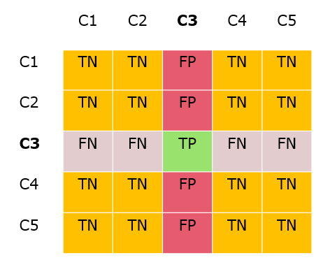

- to calculate F1 for a multiclass confusion matrix, you can calculate the F1 score for each label
- treat each class as the positive class when calculating $\text{F1}_{\text{C1}},\text{F1}_{\text{C2}},\text{F1}_{\text{C3}},...$
- take the average $\frac{1}{n_\text{C}}\sum_{i=1}^{n_\text{C}}\text{F1}_{\text{C}i}$

## Cost-Sensitive Classification

- given a probabilistic output for an object, say $\textlangle p, 1-p \textrangle $, how do we decide which class to assign?
- simplistic approach is to check if $p>0.5$ and assign accordingly
- this assumes FP and FN are equally costly
- we can change the ==decision threshold== in cases that FP and FN are different costs

### Cost Matrix

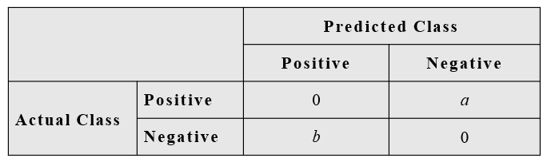

Given $\textlangle p,1-p \textrangle $ and the above cost matrix, under what conditions (in terms of $a,b,p$) would you classify an object as positive?

## Area Under the Curve AUC

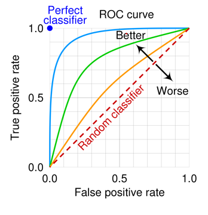

- under the ROC curve (Receiving Operating Characteristic)
- the X axis is FPR
- and Y axis is TPR
- the curve is plotted by varying the *decision threshold*

### Example

Given a model and a dataset, move down the decision threshold and plot the new TPR and FPR

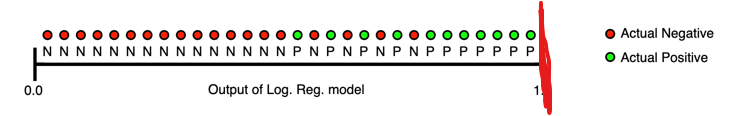

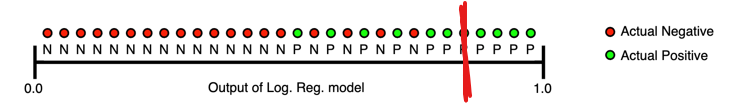

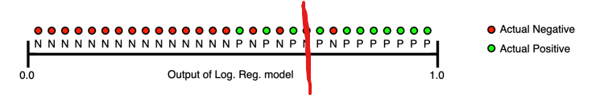

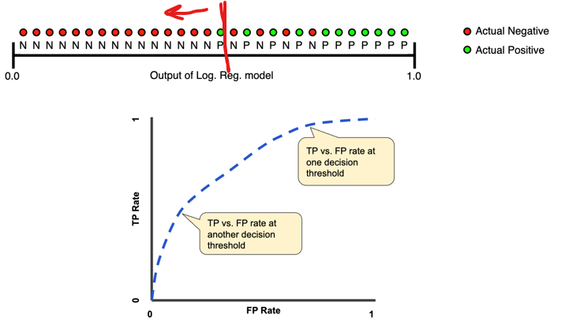

The better your model is, the closer the ==AUC== (Area Under the Curve) is to 1

## Regression

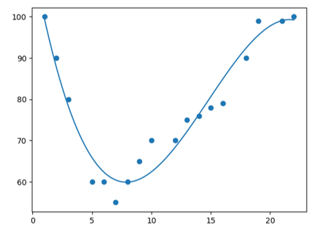

- in classification problems, the target $Y$ is discrete
- when $Y$ is continuous, the task is ==regression==

### Regression Error

#### Average Distance

$$
f_{\text{avgdist}}(y, \hat y) = \frac 1 n \sum_{i=1}^n (y-\hat y)
$$

- $n$ number of samples
- $y_i$ ground truth
- $\hat y_i$ prediction

The issue with this is the sign of the error can cause the summation to cancel each other out.

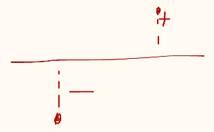

In this case, $f_{\text{avgdist} }=0$.

#### Mean Absolute Error MAE

$$
f_{\text{MAE}} = \frac {1} {n} \sum_{i=1}^n|y_i - \hat y_i|
$$

The issue with this is that because it is an absolute value function, it is *not differentiable* at zero (sharp corner) which can lean to bad computational results.

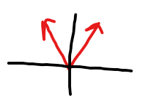

#### Mean Squared Error MSE

$$
f_{\text{MSE}} = \frac 1 n \sum_{i=1}^n(y_i-\hat y_i)^2
$$

- this is differentiable everywhere
- easy to compute (good efficiency)
- however, it is more sensitive to large errors (because of the square)

#### Root Mean Squared Error

$$
f_{\text{RMSE}} = \sqrt{\frac 1 n \sum_{i=1}^n(y_i-\hat y_i)^2}
$$

- this tries to solve the issue of sensitivity with $f_{\text{MSE}}$ (bringing it to the same scale)
- in practice, it just gets more cumbersome in terms of efficiency
- it doesn't provide significant improvement to performance to justify

## Practical Consideration

### Splitting the Dataset

1. [train-test splits](#train-test-split)
   - the test set can be used to estimate the performance of the model and its potential for generalization
2. [train-validation-test splits](#train-validation-test-split)
   - this is useful for comparing multiple models across their performance of a validation set before reporting a final performance across the test set
3. [cross-validation](#cross-validation)
   - better utilizes the data in case the size of the dataset is limited

#### Train-Test Split

- randomly split the data into 2 disjoint sets
- typically 2/3 for training and 1/3 for testing
- train your model on training data and evaluate on the test data (using a performance metric)
- report the model's performance on the test data
- caveats:
  - you need a large dataset
  - you can't tune parameters on the test data (you can't have information leakage between the two sets)
  - assumes the dataset to be uniform such that random sampling is fair; however this is usually not the case and the split can have an impact on the performance of the model

#### Train-Validation Test Split

- split your data into 3 disjoint sets
- train your model(s) on the training data
- evaluate your model(s) on the validation data
- pick the model that performs best on the validation data
- test the model on the test data and report its performance
- typically 60% for train, 20% for validation, 20% for test
- caveat:
  - you need a really big dataset for this to work

#### Cross Validation

- split your data into $k$ disjoint sets
- each time, one set is the test set and the rest is the training

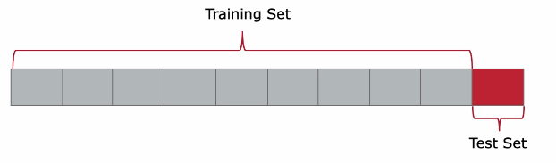

- you can also split it with one set as a validation set and one permanent set as the test set for better model tuning

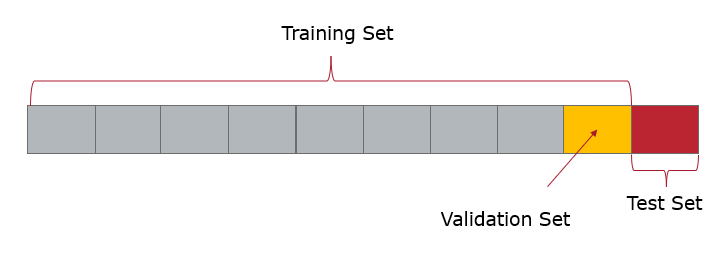

- caveats:
  - usually we average the metrics of the models across all combinations which can hide imbalance in performance

##### Imbalanced Dataset

In case the dataset is imbalanced, there are some strategies for better sampling:

1. ==Stratified Cross Validation== splitting the dataset into folds while preserving the original class distribution in each fold
2. ==Weighted Sampling== increases the importance of classes with smaller number of experiments (this can be done by repeating objects across multiple samples)

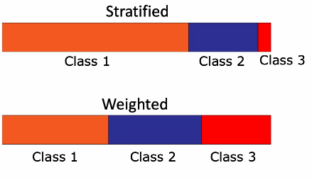

##### Grouped Cross-Validation

- useful when dealing with data that has inherent group structures
  - for example, lets say we have a clinical trial for a new drug
  - patients are monitored over a period of several months where measurements are taken at regular internals
  - in this case, it would be useful to group each patients set of measurements (samples) in separate groups
- split your data into $k$ folds based on group information
- now, the train and test sets are made at the *group level* (i.e. no samples from the same group is present both in test and train sets)

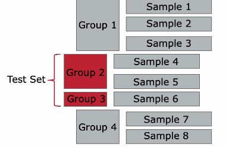

 

## Error and Model Complexity

### Bias / Variance Tradeoff

> "Without assumptions you cannot make predictions"

| High Bias                                                    | High Variance                                                |
| ------------------------------------------------------------ | ------------------------------------------------------------ |
| make strong assumptions simple model *underfitting* | allowing model to infer lots of interdependencies in data very complex model *overfitting* |
| 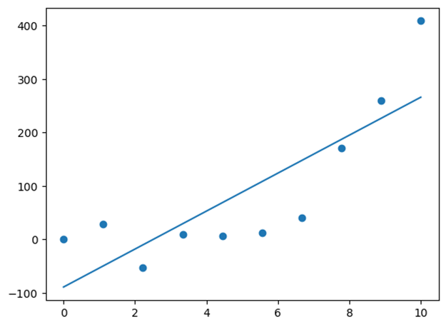 | 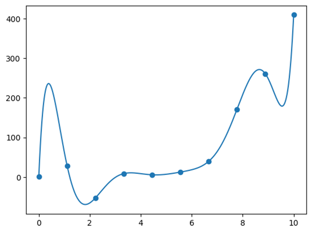 |

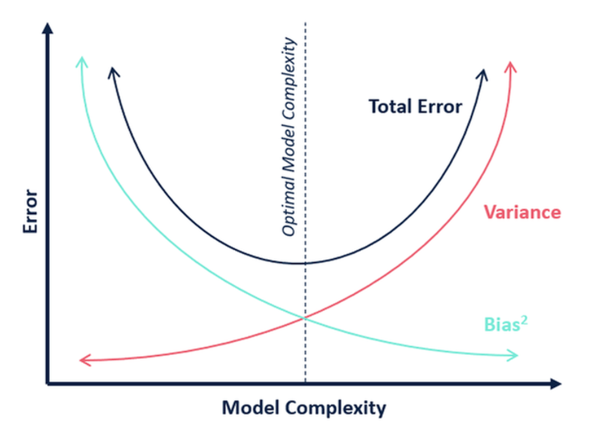
