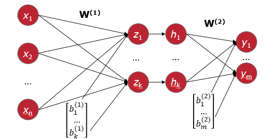
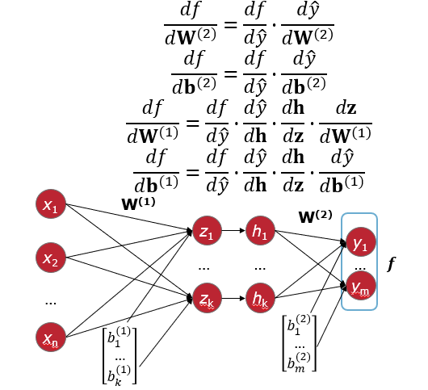
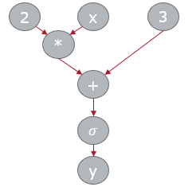

# Neural Networks Continued

[toc]

## Learning the Weights

- define an error (loss) function
- take its derivative with respect to the weights
- perform gradient descent

## Fully Connected Neural Network

- fully connected layer
- series of linear transformations
  - $z_i=\sum_{j=1}^nw_{ij}w_j+b_i^{(1)}$
- activation function: $h_i = \sigma(z_i)$

### Forward Pass

- computing $z$ from $x, W^{(1)},b^{(1)}$: $z_i=\sum_{j=1}^nw^{(1)}_{ij}x_j+b_i^{(1)}$
- compute hidden layer $h$ from $z,\sigma$: $h_i=\sigma(z_i)$
- compute output $\hat y$ from $h, W^{(2)}, b^{(2)}$: $\hat y_i = \sum_{j=1}^k w_{ij}^{(2)}h_j+b_i^{(2)}$

### Backpropagation

- define loss function $f(\hat y)$
- use Jacobian matrices
- apply chain rule to compute gradient for each element

#### Chain Rule

- consider function $h(x)=f(g(x))$
- then its derivative over $x$ can be computed as
  - $h'(x)=f'(g(x))g'(x)$
  - or $\frac{dh}{dx} = \frac{df}{dg} \frac{dg}{dx}$

#### Jacobian Matrix

- while [Hessian](7-Gradient-Descent.md#Hessian Example) describes second-order derivatives, Jacobian corresponds to first-order

$$
J = \begin{bmatrix}
\frac{df_1}{dx_1} & ...& \frac{df_1}{dx_n}\\
...&...&...\\
\frac{df_1}{dx_n} & ... & \frac{df_m}{dx_n}
\end{bmatrix}
$$

#### Applying chain rule to the neural network

- refer to this [link](G:\My Drive\School\3-Junior-Spring\CS 581 Advanced Artificial Intelligence\9-Neural-Networks.md#The Crux of Backpropagation Algorithm)

---

## Some Error / Loss Functions

- classification: log-loss / cross entropy
  - $-(1-y)\times \ln(1-\hat y)-y \times \ln(\hat y)$
  - $y$ is true target value ($0,1$)
  - $\hat y$ is probability of class 1
- regression: squared error
  - $\frac12 (y-\hat y)^2$

### Derivatives of the Activation Functions

- refer to this [link](G:\My Drive\School\3-Junior-Spring\CS 581 Advanced Artificial Intelligence\9-Neural-Networks.md#Derivatives of the Activation Functions)
- where $f$ is the activation function
  - $h$ is the weighted sum
- $f(z(x)) \equiv $ Binary Sigmoid
  - $\frac{\partial f(z(x))}{\partial x} = f(z(x)) \times (1-f(z(x))) \times \frac{\partial z(x)}{\partial x}$
- $f(z(x)) \equiv \tanh$
  - $\frac{\partial f(z(x))}{\partial x} = (1+f(z(x))) \times (1-f(z(x))) \times \frac{\partial z(x)}{\partial x}$

### Autograd

- the architecture of the neural network changes quite frequently
- optimization steps can be this flexible
- gradients can be computed automatically
- Autograd is a PyTorch module responsible for computational steps & computing derivatives

#### Main Idea

- represent a function as a computational tree
  - $y = \sigma(2x+3)$
    

---

## Overfitting

- neural networks are powerful tools
- even with a single hidden layer, they are "universal approximators"
  - i.e. they can approximate arbitrary functions arbitrarily close
- therefore, it is very easy to overfit them
- to prevent overfitting utilize
  - domain knowledge
  - shared parameters
  - validation data
  - regularization
  - dropout

---

## Weight Initialization

- neural networks are *non-convex* ML models
- because of this, initial values of the weights & biases play a significant role
  - model may get stuck in a local minimum
- common approach:
  - initialize weight matrix with zero-mean gaussian with $\sigma = \frac{1}{\sqrt{\text{cols}(W)}}$
  - helps ensure that gradients are usually non-zero
  - optional consideration: orthogonalize the rows of weight matrix to reduce correlation in pre-activation layers
