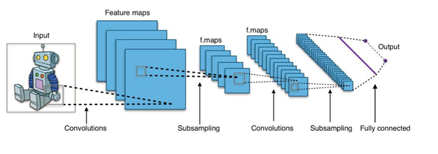
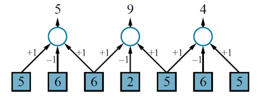
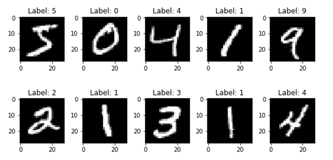
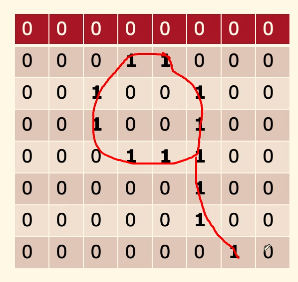
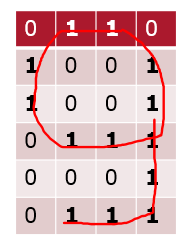
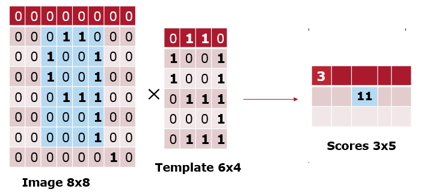
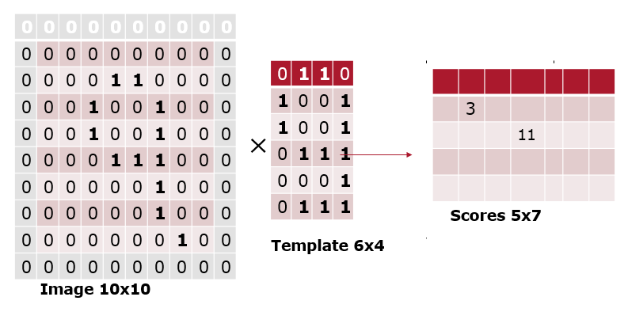
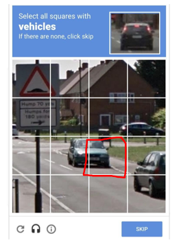
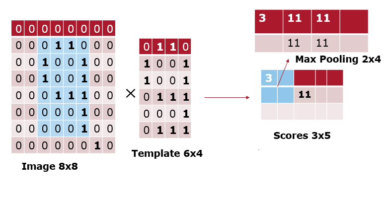

# Convolutional Neural Networks

[toc]

## Convolution Operation

- this is an example of a 1D **convolution operation** with a *kernel size* $l=3$ and a *stride* $s=2$ 
- the result would usually be fed through a nonlinear activation function before going to the next hidden layer (not shown)

## Convolution and Pattern Recognition

- consider the MINST dataset

- encoding an example image `9` would be

- and our template (i.e. gold-standard) `9` is

- the convolution would be

- an issue is that scores for the bright instances (i.e. simply having a value close to 1) would be inflated
  - the solution is to use cosine distance instead of just dot product

### Padding

- what if only *part of the pattern* is present on the image?

- pad the input with zeros so that our kernel can match on part of the input
  - usually part of the image is enough to provide sufficient detail such as how a human can recognize that square contains *part* of a car in  captcha
    

### Pooling

- we do not expect our pattern to appear multiple times in overlaps
- we are consolidating information about the region via pooling
- pooling aggregates a set of adjacent units
  - like convolution, it has a kernel & stride size
  - unlike convolution, weights are fixed (not learned)
-  examples of pooling:
  - average pooling
  - max pooling

go over examples
