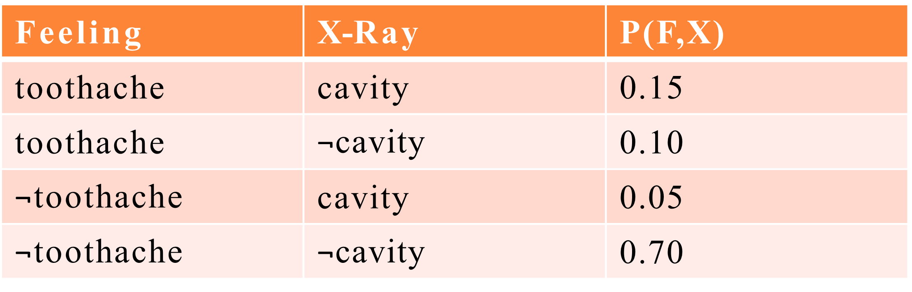
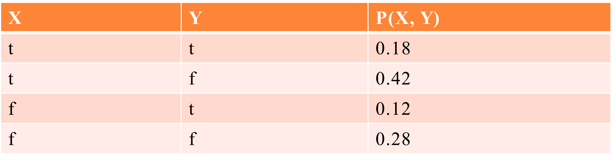
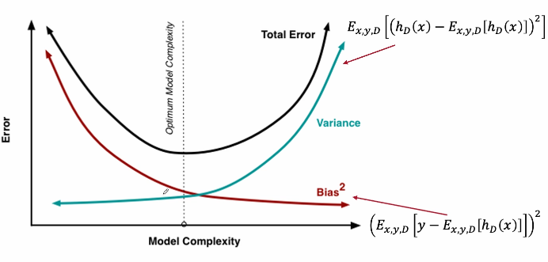
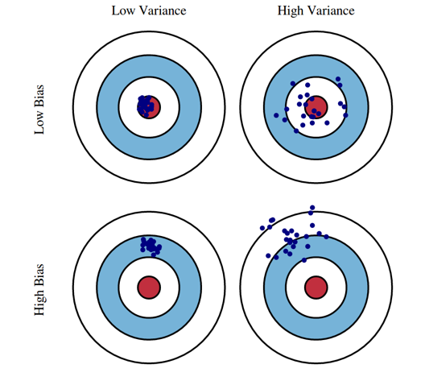

# Probability

[toc]

- given a domain with $n$ independent variables $X_1, X_2,..., X_n$ each has $v_1,v_2,...,v_n$ possible values, what is the size of the instance space?
  - $v_1 \times v_2 \times ... \times v_n$
  - assuming $v = 2$ for *True* and *False*, then we have $2^n$ (exponential)
- given a sample dataset and a hypothesis $h$, calculate the mean, variance, and 95% confidence interval for the error rate of $h$
- given $P(\text{Symptoms}|\text{Diseases}),P(\text{Diseases}), P(\text{Symptoms})$ calculate $P(\text{Diseases}|\text{Symptoms})$
- given a probability distribution $p_1,p_2,...,p_k$ calculate its entropy

## Random Variables

- pick a variable of interest
  - for example, $\text{Age}, \text{Gender}$
- every variable has a domain
  - Binary (*True*, *False*)
  - Categorical
  - Real-valued
- **Possible World** an assignment to all variables of interest

### Notation

- $X$ is a random variable
- $x$ is particular value of $X$ 
- $\text{Val}(X)$ set of values $X$ can take
- $\bold X$ is a set of random variables
- $\bold x$ is an assignment to all variables in $\bold X$
- $P(x)$ short hand for $P(X=x)$
- $P(x,y)$ short hand for $P(X=x \cap Y=y)$

## Probability Model

- a **Probability Model** associates a probability $P(w)$ with each possible world $w$
  - sums to 1 over all possible worlds
- an event is the set of possible worlds where a given predicate is true
  - for example, rolling 2 dice
  - possible worlds are $(1,1),(1,2),...,(6,6)$; 36 possible worlds
  - predicate: two dice sum to 10
  - event: $\{(4,6),(5,5),(6,4)\}$

## Axioms of Probability

1. the probability $P(a)$ of a proposition $a$ is a real number $[0,1]$
2. $P(\text{true})=1, P(\text{false})=0$
3. $P(a\or b)=P(a)+P(b)-P(a\and b)$
4. $P(\neg a) = 1-P(a)$

### Joint Distribution Example

| Feeling    | X-Ray   | $P(\text{F}, \text{X})$ |
| ---------- | ------- | ----------------------- |
| toothache  | cavity  | 0.15                    |
| toothache  | ¬cavity | 0.10                    |
| ¬toothache | cavity  | 0.05                    |
| ¬toothache | ¬cavity | 0.70                    |

### Marginalization

$$
P(\text{X}) = \sum_\text{F} P(\text{F}, \text{X}) \\
\\ = P(\text{toothache}, X) + P(¬\text{toothache}, X)
\\ = \textlangle 0.15 + 0.05, 0.1 + 0.7 \textrangle \\\\
P(\text{F}) = \sum_\text{X} P(\text{F}, \text{X}) = \textlangle 0.15+0.1, 0.05+0.7 \textrangle \\
$$

## Conditional Distribution

$$
P(A|B) = \frac{P(A\and B)}{P(B)} \\\rightarrow\\
P(A\and B)=P(A|B)P(B)
$$

$$
P(\text{cavity = true}|\text{toothache = true}) = \frac{P(t,c)}{P(t)} = \frac{0.15}{0.15+0.10} 
$$

### Bayes' Rule

$$
P(A|B) = \frac{P(B|A)P(A)}{P(B)} \\
P(Y|X)=P(X|Y)P(Y)/P(X) = \alpha P(X|Y)P(Y)
$$

#### Class Example

- 100 students in the class
- 10 of them work hard $h$, 90 do not $\neg h$
  - $P(h)=0.1$
  - $P (\neg h)=0.9$
- We are told that 70% of students where $h$ got an A or $a$
  - $P(a|h) = 0.7$
  - $P(\neg a|h)=0.3$
- What is $P(h|a)$?

$$
P(H|A)=\alpha P(A|H) P(H) = \textlangle \alpha * 0.7 * 0.1, 
\alpha * 0.3 * 0.9 \textrangle \\
\alpha(0.07 + 0.27)=1 \\
\alpha = 1/0.34
$$

## Chain Rule

$$
P(A_1,A_2,A_3,...,A_n) \\= P(A_1)P(A_2|A_1)P(A_3|A_1,A_2)...P(A_k|A_1,A_2,...,A_{k-1})
$$

- note that you can pick any order of $A$ then

$$
P(\text{first})P(\text{second}|\text{first})P(\text{third}|\text{first}, \text{second})...P(\text{last}|\text{all previous})
$$

## Marginal Independence

- an event $\alpha$ is **independent** of event $\beta$ ($\alpha \perp \beta$) if
  - $P(\alpha|\beta) = P(\alpha)$ or $P(\beta)=0$
- $\alpha \perp \beta$ if and only if $P(\alpha,\beta) = P(\alpha)P(\beta)$? can you prove this?
- $\alpha \perp \beta$ implies $\beta \perp \beta$ can you prove this?

- to show that in this distribution, $X \perp Y$, show that $P(X=x,Y=y)=P(X=x,Y=y)$ for all $x\in \bold X$ and $y \in \bold Y$

$$
P(X=t,Y=t) \stackrel{!}{=} P(X=t)P(Y=t)\\
P(X=t,Y=t) = 0.18 \\
P(X=t) = 0.18+0.42=0.6\\
P(Y=t) = 0.18+0.12 =0.3\\
P(X=t)P(Y=t) = 0.6*0.3=0.18\\
\\
P(X=t,Y=f) \stackrel{!}{=} P(X=t)P(Y=f)\\
P(X=f,Y=t) \stackrel{!}{=} P(X=f)P(Y=t)\\
P(X=f,Y=f) \stackrel{!}{=} P(X=f)P(Y=f)
$$

## Conditional Independence

- event $\alpha $ is independent of event $\beta $ given event $\gamma$ ($\alpha \perp \beta | \gamma)$ if
  - $P(\alpha | \beta, \gamma) = P(\alpha | \gamma)$ or
  - $P(\beta ,\gamma)=0$
- a distributions $P$ satisfies $\alpha \perp \beta | \gamma)$ if and only if  $P(\alpha , \beta |\gamma) = P(\alpha |\gamma)P(B|\gamma)$ can you prove this?

## Number of Parameters

- assuming *everything is binary*
- $P(X_1)$ requires
  - 1 independent parameter 
- $P(X_1,X_2,...,X_3)$ requires
  - $2^n-1$ independent parameters
- $P(X_1|X_2)$ requires
  - 2 independent parameters
- $P(X_1,X_2,...,X_n|X_{n+1},X_{n+2},...,X_{n+m})$ requires
  - $2^m * (2^n - 1)$ independent parameters

## Probability Density Function

- we define probability density function

$$
P(X \le a)= \int_{-\infin}^a p(x)dx\\
P(a\le X \le b) = \int_a^b p(x)dx
$$

- where  $p(x)$ is non-negative integrable function where

$$
\int_{\text{Val}(X)} p(x)dx = 1
$$

## Conditional Probabilities

### Y discrete, X continuous

- consider $P(Y|X=x)$ where $Y$ is *discrete* but $X$ is continuous
- $P(Y|X=x) = P(Y,X=x)/P(X=x)$ is incorrect as $P(X=x) \rightarrow 0$
- instead use

$$
P(Y|X=x) = \lim_{\epsilon \rightarrow 0} P(Y|x- \epsilon \le X \le x + \epsilon) 
$$

### Y continuous, X discrete

- consider $P(Y|X=x)$ where $Y$ is *continuous* but $X$ is *discrete*
- you will use separate probability density functions for each value of $x \in \bold X$

## Expectation

- $E_P[X] = \sum_x xP(x)$
- $E_P[X] = \int_x x p(x) dx$

### Expectation Properties

- $E_P[aX+b]=aE_p[X]+b$
- $E_P[X+Y]=E_p[X]+E_p[Y]$
- $E_P[X|y] = \sum_x xP(x|y)$

## Variance

- $\text{Var}_P[X]=E_P[(X - E_P[X])^2]$
- you can [expand](https://en.wikipedia.org/wiki/Variance#Definition) the first expression into the second one
- $\text{Var}_P[X] = E_P[X^2]-E_P[X]^2$

### Variance Properties

- $\text{Var}_P[aX+b]=a^2 \text{Var}_P[X]$
- $\text{Var}_P[X+Y] = \text{Var}_P[X] + \text{Var}_P[B] + 2 \text{Cov}_P[X,Y]$

> $\text{Var}_P[X+Y] = \text{Var}_P[X] + \text{Var}_P[B]$ is true if $X \perp Y$

# Bias-Variance Trade-Off 

- given the set $D$ of datasets $D_i$, models $h_i$, and true function $c$
- compute the expected error
  - $E_D[(h-c)^2]$
  - i.e. what is the expected error of the models $h_i$ with respect to $c$ where the expectation is taken over possible samples (datasets)

## Derivation

$$
f_{\text{MSE}} = \frac 1 n \sum_{i=1}^n (h_D(x_i)-\hat y_i)^2\\\\
E[\text{error}] = E_{x,y,D}[[h_D(x)-y]^2] = E_{x,y,D}[[(h_D(x)-\bar h(x))+(\bar h(x)-y)]^2]\\\\
=  E_{x,y,D}[(h_D(x))^2] - 2E_{x,y,D}[h_D(x)]E_{x,y,D}[y]+E_{x,y,D}[y^2]
$$

- $E_{x,y,D}[y] = y$ as it is a *constant value*

$$
=  E_{x,y,D}[(h_D(x))^2] - 2yE_{x,y,D}[h_D(x)]+y^2
$$

- the first term $E_{x,y,D}[(h_D(x))^2]$ can be expanded as such

$$
E_{x,y,D}[(h_D(x))^2] = E[h(x)^2] - 2E[h(x)]^2 + 2E[h(x)]^2 \\
= E[h(x)^2] - 2E[h(x)]E[h(x)] + E[h(x)]^2 + E[h(x)]^2\\
= E[h^2(x) - 2h(x)E[h(x)] + E[h(x)]^2] + E[h(x)]^2\\
= E[(h(x) - E[h(x)])^2] + E[h(x)]^2
$$

- recall that 
  - expected value of the sum of several random variables is equal to the sum of their expectations
    - $E[A + B] = E[A] + E[B]$
  - the expectation of an expectation is just the expectation itself as expectations are constant
    - $E[E[A]] = E[A]$
- this gives us

$$
E[(h(x) - E[h(x)])^2] + E[h(x)]^2 - 2yE[h(x)] + y^2
$$

- the terms $E[h(x)]^2 - 2yE[h(x)] + y^2$ can be expended as

$$
E[h(x)]^2 - 2yE[h(x)] + y^2 = (E[y - E[h(x)]])^2
$$

- this finally gives us

$$
E[\text{error}] = E[(h(x) - E[h(x)])^2] + (E[y - E[h(x)]])^2
$$

- where the left term is *variance* and the right term is *bias^2^* 
- note that $E[h(x)]$ can also be referred to as $\bar h(x)$ 

## Bias vs Variance

- **High Bias**
  - more assumptions
  - simpler models
- **High Variance**
  - fewer assumptions
  - more complex models
  - overfit on small data

