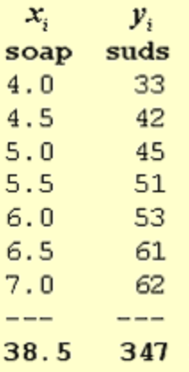
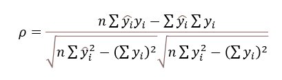
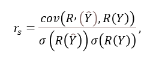
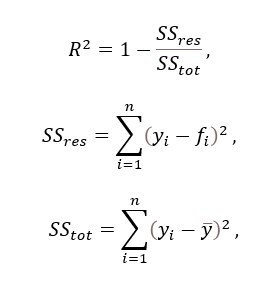

# Linear-Regression

[toc]

## Representation

- $x$ is the input vector (i.e. the object)
- $r$ is the true value of the regression
- $f(x)$ is the true underlying function 
- $g(x)$ is the estimated underlying function 
- $\epsilon$ is the noise
- $p(r|x)$ is the conditional distribution of $r$ & $x$
- $D$ is the data set of $\textlangle x,y \textrangle$

## Regression Function

$$
r = f(x) + \epsilon 
$$

- $\epsilon $ (noise) can exist to several reasons
  - input variables are insufficient to capture everything
  - noisy sensors
- $\epsilon $ is typically assumed to be a zero mean Gaussian with constant variance $\sigma^2$
  - $\epsilon \sim \mathcal N(0,\sigma^2)$

## How to Learn $f(x)$

$$
\hat f(x) = \sum_{i=1}^n x_iw_i
$$

- one typical approach is
  - assume parametric form
  - formulate an objective function 
  - optimize (maximize or minimize) it
- *note* not all learning approaches are parametric

## Maximizing Conditional Log-Likelihood

- assuming $\epsilon \sim \mathcal N(0, \sigma^2)$ then
  - $p(r|x)\sim \mathcal N(g(x|w),\sigma^2)$
- given the dataset $D$ that has $N$ instances and the parameter vector $w$, the conditional log-likelihood $\text{CLL}$

$$
\text{CLL} = \sum \ln (p(r|x))\\
= \sum \ln (\frac{1}{\sqrt {2\pi}\sigma }e ^\frac{-(r-g(x|w))^2}{2\sigma^2}) \\
= - N\ln (\sqrt{2\pi}\sigma) - \frac{1}{2\sigma^2}\sum(r-g(x|w))^2
$$

- **maximization of CLL = minimize squared loss**

$$
\underset{w}{\text{argmax }} \text{CLL} =
\underset{w}{\text{argmax }} \cancel {N\ln (\sqrt{2\pi}\sigma) - \frac{1}{2\sigma^2}} \sum (r - g(x|w))^2\\
= \underset{w}{\text{argmax }} \sum (r - g(x|w))^2
$$

- we can cancel out these terms as they are *constant*

### The Estimated Underlying Function $g(x|w)$

- popular approach is to assume a linear function 
- assume $x$ has $k$ features
  - $x = \textlangle x_1,x_2,...,x_k \textrangle$ 
- then a polynomial of degree 1, linear regression is

$$
g(x|w) = w_0 + \sum^k_{i=1}w_ix_i
$$

## Regression Loss 

### MSE

$$
f_\text{MSE}(y,\hat y;w) = \frac{1}{2n}\sum_{i=1}^n (x^{(i)\top}w - y^{(i)})^2
$$

- where $x^{(i)\top}w$ is the $i$^th^ instance of $x$ in $D$ and $w$ are the parameters (weights)

$$
x^{(i)} = \textlangle x_1^{(i)},x_2^{(i)},... \textrangle\\
w = \textlangle w_1, w_2, ... \textrangle \\\\

x^{(i)\top}w = \begin{bmatrix}
x_1^{(i)}\\
x_2^{(i)}\\
...
\end{bmatrix}
\begin{bmatrix}
w_1, w_2,...
\end{bmatrix} = \sum_j x_j^{(i)}w_j
$$

### MAE

$$
f_\text{MSE}(y,\hat y;w) = \frac{1}{2n}\sum_{i=1}^n |x^{(i)\top}w - y^{(i)}|
$$

### Regression Gradient

$$
\nabla f_\text{MSE}(y,\hat y;w) = \frac{1}{2n} \sum_{i=1}^n \nabla_w [(x^{(i)\top}w - y^{(i)})^2] \\
= \frac1n \sum_{i=1}^n x^{(i)} (x^{(i)\top}w-y^{(i)})\\
= \frac1n \sum_{i=1}^n (x^{(i)\top}wx^{(i)}-x^{(i)}y^{(i)})
$$

- equate the gradient to 0 and solve for $w$

$$
0 = \sum_i x^{(i)}x^{(i)\top}w - \sum_i x^{(i)} y^{(i)} \\
\sum_i x^{(i)}x^{(i)\top}w = \sum_i x^{(i)} y^{(i)}\\\\
w = (\sum_i x^{(i)}x^{(i)\top})^{-1} \sum_i x^{(i)} y^{(i)}
$$

## Linear Regression 2D Example

$$
f_\text{MSE}(w_1,w_2) = \frac12(x_1w_1+x_2w_2-y)^2\\
\frac{\partial f_\text{MSE}}{\partial w_1}(w_1,w_2) = x_1(x_1w_1+x_2w_2-y)\\
\frac{\partial f_\text{MSE}}{\partial w_2}(w_1,w_2) = x_2(x_1w_1+x_2w_2-y)\\

\nabla_w f_\text{MSE}(w) = \begin{bmatrix}
\frac{\partial f_\text{MSE}}{\partial w_1} \\
\frac{\partial f_\text{MSE}}{\partial w_2}
\end{bmatrix} 
= \begin{bmatrix}
x_1\\x_2
\end{bmatrix} (x_1w_1+x_2w_2-y)\\
= x(x^\top w-y)
$$

-  our predicted values from a dataset of $n$ objects is

$$
\hat y = X^\top w \\
= \begin{bmatrix}
x_1^{(1)} & x_2^{(1)} \\
... & ... \\
x_1^{(n)} & x_2^{(n)}
\end{bmatrix} 
\begin{bmatrix}
w_1\\w_2
\end{bmatrix} = = \begin{bmatrix}
y^{(1)} \\
... \\
y_2^{(n)}
\end{bmatrix} 
$$

## Linear Regression Bias

$$
\hat y = x^\top w + b
$$

- with out the bias, the value $(0,0)$ must always be on our regression model
- by introducing bias in the above form, our previous computations will get messy
- instead, we transform our input and weight parameters as

$$
\overset \sim x = \begin{bmatrix}
x\\1
\end{bmatrix}, \overset \sim w = \begin{bmatrix}
w\\1
\end{bmatrix}
$$

- in matrix form, we have

$$
X = \begin{bmatrix}
← & x^1 & → \\ 
& ... & \\
← & x^n & → 
\end{bmatrix} \\
\overset \sim X = \begin{bmatrix}
1 & ← & x^1 & → \\ 
1 & & ... & \\
1 & ← & x^n & → 
\end{bmatrix} \\
\overset \sim w = (\overset \sim X^\top \overset \sim X)^{-1} \overset \sim X y
$$

### Closed-Form: Linear Regression Soap Example

$$
X = \begin{bmatrix}
1 & 4.0\\
1 & 4.5 \\
1 & 5.0 \\
1 & 5.5 \\
1 & 6.0 \\
1 & 6.5 \\
1 & 7.0
\end{bmatrix} \\

X^\top X = \begin{bmatrix}
7 & 38.5\\
 38.5 & 218.5
\end{bmatrix} \\

X^\top Y = \begin{bmatrix}
\sum_{i=1}^n y_i\\
\sum_{i=1}^n x_iy_i
\end{bmatrix} = \begin{bmatrix}
347\\1975
\end{bmatrix} 
$$

- recall how to calculate $2 \times 2$ inverses

$$
A = \begin{bmatrix}
a & b\\ 
c & d 
\end{bmatrix}\\ 
A^{-1} = \frac{1}{ad-cb}\begin{bmatrix}
d & -b\\
-c & a
\end{bmatrix}\\ 
$$

- also make sure the determinant of $X^\top X$ is not 0

$$
(X^\top X)^{-1} = \begin{bmatrix}
4.46 & -0.78\\
-0.78 & 0.14
\end{bmatrix}\\
w=(X^\top X)^{-1}X^\top Y = \begin{bmatrix}
-2.67\\9.51
\end{bmatrix}
$$

## Regularization

- ==L~2~ regularization== $\sum w^2$
  - minimize squared-loss + L~2~ penalty
  - also called *Ridge regression*
  - **smoothing**
    - penalizes large coefficients but doesn't force them to become exactly zero
      - useful for when you want to prevent parameters from being too large
    - less sensitive to small variation in data
      - stable and robust to noise

$$
f_\text{MSE} = \frac12 \sum_{i=1}^n(g(x_i;w)-y_i)^2 + \lambda \sum_{j=1}^mw_j^2
$$

- ==L~1~ regularization== $\sum |w|$
  - minimize squared-loss + L~1~ penalty
  - also called *Lasso regression*
  - **feature selection** by eliminating features
    - encourages some of the model's coefficients to become 0 (sparsity)
      - reduces complexity
    - useful for when you suspect only a subset of features are relevant so the model automatically selects and utilizes the most important ones

$$
f_\text{MSE} = \frac12 \sum_{i=1}^n(g(x_i;w)-y_i)^2 + \lambda \sum_{j=1}^m|w_j|
$$

- ==ElasticNet== 
  - a combination of the two

$$
f_\text{MSE} = \frac12 \sum_{i=1}^n(g(x_i;w)-y_i)^2 + \sum_{j=1}^m (\lambda_1 |w_j| + \lambda_2 w_j^2)
$$

---

## More Regression Metrics

- ==Pearson Correlation Coefficient==
  - returns value in $[0,1]$ where 1 mean our model adequately describes the data 

- ==Spearman Correlation Coefficient==
  - assesses whether there is a consistent, *non-linear relationship* between two sets of data points

- ==Coefficient of Determination $R^2$==
  - measures the proportion of the total variance in the target that is explained by the predictors in the model
  - values closer to 1 indicates a better fit of the model

---

# Python

## NumPy

- numerical python
- efficiently handle large arrays of data
- `ndarray` important for *vectorization* (ability to perform element-wise operations on arrays without `for` loops)

##  Pandas

- data manipulation library
- `Series` 1D labeled homogeneous array (size-immutable)
- `DataFrame`  2D tabular structure (size-mutable)
- `Panel` 3D arrays

## Scikit-Learn

- general purpose ML library

## Demo

- Check out the bias-variance demo [here](CS584\notebooks\bias-variance.ipynb)
- Check out the regularization demo [here](CS584\notebooks\regularization.ipynb)

