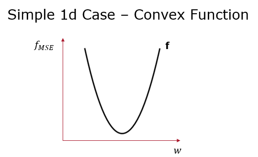
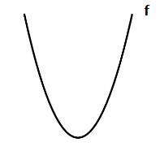

# Gradient Descent 

[toc]

## Linear Regression Bias 

$$
\overset \sim w = (\overset \sim X^\top \overset \sim X)^{-1} \overset \sim X y
$$

- recall how the closed form calculated of weights in [linear regression](5+6-Linear-Regression.md)
- $\overset \sim X^\top \overset \sim X$ may not always be invertible and the closed form may not be calculable
  - we can use pseudoinverse as well

### Optimization Problem

$$
\underset{w}{\text{min }}f_\text{MSE}(y,\hat y;w)
$$

#### Convexity

- "bowl-shaped"

$$
\frac{df_\text{MSE}}{dw}= \frac{\nabla f_\text{MSE}}{\nabla w}
$$

- what property ensures existence of only one local minimum
  - from left to right, the slope of function never decreases
  - meaning ==second derivative== (derivative of slope) is always *non-negative* $\frac{d^2f}{dw^2} \ge 0$

#### Convexity in Higher Dimensions 

- determined by second derivative matrix, ==Hessian== $H$
  - square matrix of 2nd order partial derivatives combinations

$$
H=\begin{bmatrix}
\frac{\partial^2f}{\partial x_1^2}  & \frac{\partial^2f}{\partial x_1 \partial x_2} & ... & \frac{\partial^2f}{\partial x_1 \partial x_n} \\
\frac{\partial^2f}{\partial x_2 \partial x_1}  & \frac{\partial^2f}{\partial x_2^2} & ... & \frac{\partial^2f}{\partial x_2 \partial x_n} \\
... & ... & ... & ... \\
\frac{\partial^2f}{\partial x_n \partial x_1}  & \frac{\partial^2f}{\partial x_n \partial x_2} & ... & \frac{\partial^2f}{\partial x_n^2}
\end{bmatrix}
$$

- for a function to be convex, $H$ should be [positive semi-definite (PSD)](#Positive Semi-Definite PSD) for every input $x$   

##### Positive Semi-Definite PSD

- a real symmetric matrix $X$ is ==PSD== if
  - all its [eigenvalues](https://lpsa.swarthmore.edu/MtrxVibe/EigMat/MatrixEigen.html) are non-negative
  - for every vector $z$, $z^\top Xz \ge 0$

##### Hessian Example

$$
f(x,y) = 12x^2 + 4y^2 - 5\\
\frac{\partial f}{\partial x} = 24x, \frac{\partial f}{\partial y} = 8y\\\\
H = \begin{bmatrix}
\frac{\partial^2 f}{\partial x^2} & \frac{\partial^2 f}{\partial x \partial y}\\
\frac{\partial^2 f}{\partial y \partial x} &
\frac{\partial^2 f}{\partial y^2}
\end{bmatrix} = \begin{bmatrix}
24 & 0\\0 & 8
\end{bmatrix}
$$

---

## Gradient Descent

- ==gradient descent== is a hill-climbing algorithm that makes incremental changes to weight vector $w$ depending on the value of gradient (i.e. slope)

### Gradient of MSE

$$
\nabla_w f_\text{MSE}(y,\hat y;w) = 
\nabla_w [\frac{1}{2n}\sum_{i=1}^n(x^{(i)\top}w-y^{(i)})^2]
\\ = \frac1n X(X^\top w-y)
$$

### Gradient Descent Algorithm 

> - randomly initialize weights $w$ (call this $w^{(0)}$)
> - compute loss function gradient $\nabla_w f(w^{(0)})$
> - update weights by moving in opposite direction, multiplied by learning rate $a$
>
> $$
> w^{(1)} \leftarrow w^{(0)}-\alpha \nabla_w f(w^{(0)})\\
> ...\\
> w^{(i)} \leftarrow w^{(i-1)}-\alpha \nabla_w f(w^{(i-1)})
> $$
>
> - repeat until convergence
>
> $$
> |f(w^{(t)}) - f(w^{(t-1)})| < \delta
> $$

