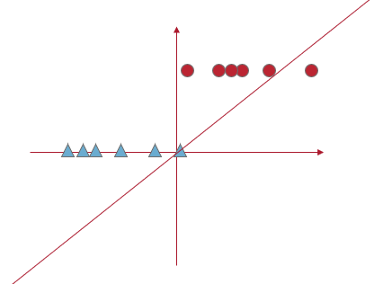
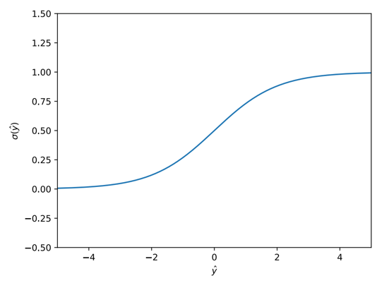

# Stochastic Gradient Descent Classification

[toc]

## Gradient Descent Drawbacks

- requires to go over every point in dataset
- selecting learning rate is non-trivial
- *note* that convergence to global minimum is guaranteed only for convex functions  

## Stochastic Gradient Descent SGD

$$
\nabla_w f_\text{MSE}(y,\hat y;w) = \frac1n X(X^\top w-y)
$$

- observe that gradient is averaged over $n$ samples
- the idea behind ==Stochastic Gradient Descent== (SGD) is randomly select a small subset of training set or ==batch== (sometimes called *mini-batch*)
- compute the gradient & update weights for *each* batch
- a single pass over training set is called ==epoch==
  - in practice SGD is done over multiple epochs
- convergence with randomized sample over different epochs is either faster or has the same speech as convergence with non-randomized sampling

### SGD Algorithm

- randomly initialize weights $w^{(0)}$

- select batch size $\overset \sim n < n$ (much less)

- shuffle training set

- for $i = 1$ to $\lceil \frac{n}{\overset \sim n} \rceil$

  - select a batch $B$ containing $\overset \sim n$ samples

  - compute the corresponding gradient
    $$
    g_B = \frac{1}{\overset \sim n} \sum_{i \in B} \nabla_w f(y_i, \hat y_i;w)
    $$

  - update weights $w^{(i)} \leftarrow w^{(i-1)} - \alpha g_B$

- repeat for the number of epochs

### SGD Summary

- Pros:

  - much faster training speed
  - despite noise algorithm converges to local minimum

- Cons:

  - if learning rate is not **annealed** convergence is not guaranteed

    - ==anneal== means gradually reduce or adjust the learning rate during the training process

  - necessary condition is
    $$
    \lim_{t \rightarrow \infin} \sum^t_{i=1} |\alpha_t|^2 < \infin
    $$

    - which means that if we sum all the squared learning rates as the number of iterations approaches infinity, our sum *must* be less than infinity

### SGD Extensions: AdaGrad

- let $g^{(k)} = \nabla f_{i,k}(x^{(k-1)})$

- for each step:
  $$
  x_j^{(k)} = x_j^{(k-1)} - \alpha \cdot \frac{g_j^{(k)}}{\sqrt{\sum_{l=1}^k (g_j^{(l)})^2}}
  $$
  

- i.e. the learning rate is divided by the square root of the sum of the squares of the gradients of the previous steps

  - the learning rate decreases as the gradient increases
- Pros:
  - adaptive step size

---

## Logistic Regression

- *note* **linear regression** gives us predictions for continuous values 
  - where **linear regression** gives us likelihood $[0,1]$ for classification
- in binary classification problems where the label is either 1 or 0, a linear regression model will try to fit a linear function on our dataset
  
- instead, we use a sigmoid function 
  

$$
\sigma(x) = \frac{1}{1 + e^{-x}}
$$

### Sigmoid Function Properties

- $\sigma(-z) = 1 - \sigma(z)$
- $\frac{\partial \sigma}{\partial z} = \sigma(z)(1-\sigma(z))$

### What is Logistic Regression?

$$
\hat y = \sigma(x^\top w)
$$

- there is no analytical solution so we must use gradient descent

#### Gradient Descent

$$
f_\text{MSE}(w) = \frac12 (\hat y - y)^2 \\= \frac12 (\sigma(x^\top w) - y)^2
\\\\
\nabla_w f_\text{MSE}(w) = \nabla_w [\frac12 (\sigma (x^\top)-y)^2]\\
= x(\sigma(x^\top w)-y)\sigma(x^\top w)(1-\sigma(x^\top w))\\
= x(\hat y-y)\hat y(1-\hat y)
$$

- the issue with the gradient is that $\hat y$ is between $[0,1]$ so the product of $x(\hat y-y)\hat y(1-\hat y)$ will be *very* small leading to ==vanishing gradient problem==
- the alternative is to work in *log space*

#### Log-Loss

$$
f_{\log}(w) = -y\log\hat y - (1-y)\log(1-\hat y)\\\\

\nabla_w f_{\log}(w) = \nabla_w[-(y\log \hat y - (1-y)\log (1-\hat y))]\\
= -x(y-\sigma(x^\top w)) \\= x(y-\hat y)
$$

