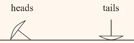
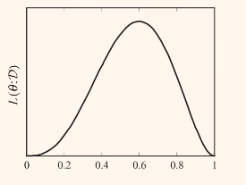
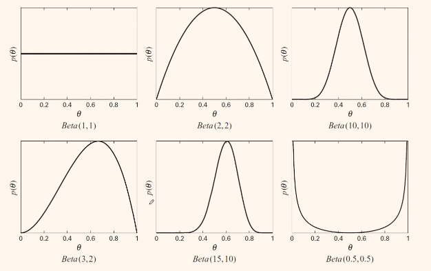
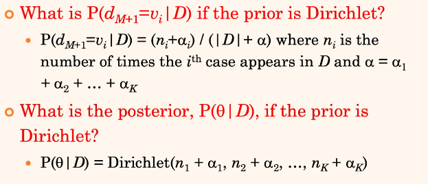
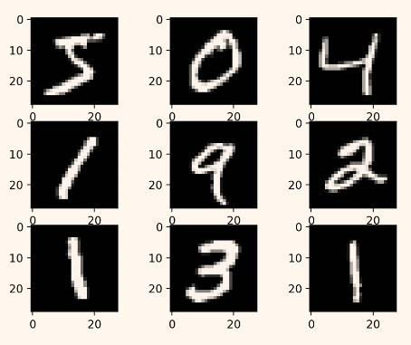

# Classification and Probability

[toc]

## Probabilistic Perspective

### Parameter Estimation

- given dataset $\mathcal D : \{\textlangle \vec X [m], \vec Y[m]\textrangle\}$, how can we estimate
  - $P(Y)$
  - $P(X_i|Y)$ (observing these features given the class for Bayes' rule)
- our intuition tells us to count the number of observation out of many iterations

#### Counting Example: Thumbtack

- say we're flipping a thumbtack

- $P(\text{Heads}) = \theta, P(\text{Tails}) =1-\theta$
- assume we flip it $(a+b)$ times where it comes heads $a$ times
  - $a=4,b=6$
  - $a=42,b=58$
  - $a=407,b=593$
- it is difficult to prove that probabilities we have under different iterations
  - it also becomes cumbersome to find confidence intervals for large datasets
- instead we use 2 different approaches
  - [Maximum Likelihood Estimation](#Maximum Likelihood Estimation MLE)
  - [Bayesian Estimation](#Bayesian Estimation)

#### Maximum Likelihood Estimation MLE

- given a dataset $\mathcal D$
  - find a "good" scoring $\theta\in[0,1]$
  - let $f(\theta:\mathcal D)$ be the score of $\theta$ given $\mathcal D$
  - learning: $\underset{\theta\in[0,1]}{\text{argmax }} f(\theta:\mathcal D)$
- what is the probability of seeing the sequence $H,T,T,H,T$?
  - $\theta * (1-\theta)*(1-\theta)*\theta*\theta = \theta^3(1-\theta)^2$

- when is $\mathcal L(\theta:\mathcal D)$ maximum?
- we run into very small values so instead we should work in log space

##### Likelihood / Log-Likelihood

- number of heads is $a$, number of tails is $b$
- ==likelihood== $\mathcal L(\theta :\mathcal D)=\theta^a (1-\theta)^b$
- ==log-likelihood== $l(\theta: \mathcal D) = a\log\theta + b\log(1-\theta)$
- note that they're maximized by same $\theta$
- take derivative of $l(\theta:\mathcal D)$ with respect to $\theta$ & set to 0

#### Bayesian Estimation

- the problem with MLE is that it 
  - gives same estimate of $\theta=0.4$ if we have 4 H and 6  T vs 4000 H and 6000 T
- in Bayesian estimation, rather than a single $\theta$
  - we assume a prior belief about $\theta$ or $P(\theta)$ and we estimate
    - the posterior distribution over $\theta$: $ p(\theta|\mathcal D)$  
    - the probability distribution for the next loss:   $P(d_{m+1}|\mathcal D)$ 

##### Posterior: $p(\theta | \mathcal D)$

$$
p(\theta | \mathcal D) = \frac{p(\theta)P(\mathcal D |\theta)}{P(\mathcal D)}
$$

- $P(\mathcal D)$ does not depend on $\theta$; hence it can be treated as a constant from perspective of $\theta $

$$
p(\theta | \mathcal D) \propto p(\theta) P(\mathcal D|\theta )
$$

- next assume *each data point is independent* given $\theta:d_i \perp d_j | \theta$

$$
P(\mathcal D|\theta) = \prod_{i=1}^m P(d_i|\theta )
$$

- hence the posterior becomes

$$
p(\theta | \mathcal D) \propto p(\theta)\prod_{i=1}^m P(d_i|\theta )
$$

##### Prediction: $P(d_{m+1}|\mathcal D)$

$$
P(d_{m+1}|\mathcal D) = \int_0^1 P(d_{m+1}|\theta,\mathcal D)p(\theta |\mathcal D)d \theta
$$

- *assuming $\theta:d_i \perp d_j | \theta$* & using the posterior equation from previous slide

$$
P(d_{m+1}|\mathcal D) \propto \int_0^1 P(d_{m+1}|\theta)p(\theta)\prod_{i=1}^m P(d_i|\theta )d \theta
$$

##### Beta Distribution

- $\theta \sim \text{Beta}(\alpha, \beta )$ if $P(\theta ) = \gamma \theta^{\alpha-1}(1-\theta )^{\beta -1}$ where $\gamma$ is normalizing constant 
- **mean**: $\alpha / (\alpha + \beta )$
- **mode**: $(\alpha -1)/(\alpha + \beta -2)$
- note that the mode is closer to the mean when $\alpha,\beta $ are large 

- *note* that $\text{Beta}(1,1)$ is *uniform prior*

##### Dirichlet Priors

- generalizes beta distribution for multinomials

  - $\theta \sim \text{Dirichlet}(\alpha_1,...,\alpha_K)$ if $P(\theta) \propto \prod_{k=1}^K \theta _k^{\alpha_k -1}$

- ???

  

##### Bayes Classifier

$$
P(Y|\vec X) = \frac{P(\vec X|Y)P(Y)}{P(\vec X)} = \frac{P(Y)P(X_1,X_2,...,X_n|Y)}{P(X_1,X_2,...,X_n)}\\\\
P(X_1,X_2,...,X_n) = \sum_yP(Y=y)P(X_1,X_2,...,X_n|Y=y)\\\\
$$

- assuming all variables are binary, how many independent parameters are needed for Bayes classifier?
  - we need $2*(2^n-1)+1 = 2^{n+1}-1$ parameters

##### Naive Bayes Assumption

$$
X_i \perp X_j | Y
$$

##### Naive Bayes Classifier

- Bayes rule gives

$$
P(Y|X_1,X_2,...,X_n) = \frac{P(Y)P(X_1,X_2,...,X_n)}{\sum_y P(y)P(X_1,X_2,...,X_n|y)}
$$

- assuming $X_i \perp X_j | Y$, naive Bayes gives

$$
P(Y|X_1,X_2,...,X_n) =  \frac{P(Y)\prod P(X_i|Y)}{\sum_y P(y)\prod P(X_i|y)}
$$

- assuming all variables are binary, how many independent parameters are needed for Bayes classifier?
  - we need $2n$

##### Zero Probabilities 

- assume
  - $P(X_i = \text{True}|\text{yes})=0$ and $P(X_i = \text{True}|\text{no})>0$
  - $P(X_j|\text{yes}) > 0$ and $P(X_j|\text{no})>0$ for all other features
  - what is $P(\text{yes}|X_i)$ if $X_i=\text{true}$ 
    - *it will be 0*
- assume
  - $P(X_i = \text{True}|\text{yes})=0$ and $P(X_i = \text{True}|\text{no})=0$
  - $P(X_j|\text{yes}) > 0$ and $P(X_j|\text{no})>0$ for all other features
  - what is $P(\text{yes}|X_i)$ if $X_i=\text{true}$ 
    - *you will get a zero division $\frac00$*
- we can use Laplace Smoothing to solve

##### Laplace Smoothing

- for parameter estimates, instead of MSE, use Bayesian
- assume uniform prior
- use the mean of the posterior as the parameter 
- given a multinomial distribution $x=\textlangle x_1,x_2,...,x_d \textrangle$

$$
p = \frac{x_i+\alpha }{N + \alpha d}
$$

##### Naive Bayes Implementations

- ==Bernoulli / categorical naive bayes==
  - features are assumed be binary / categorical
- ==Multinomial naive bayes==
  - $P(X|y)$ is multinomial distribution
- ==Gaussian naive bayes==
  - each $p(x_i|y)$ is Gaussian distribution 

---

## Logistic Regression

- learns $P(Y|X)$ directly, without going through $P(X|Y)$ & $P(Y)$
- assumes $P(Y|X)$ follows the logistic function 
- **learning**: estimate the weights $w_0,w_1,...,w_n$
- maximize (conditional) log-likelihood

$$
W \leftarrow \underset{W}{\text{argmax }} \prod P(Y[d]|X[d])\\
W \leftarrow \underset{W}{\text{argmax }} \ln\prod P(Y[d]|X[d])
$$

- loss function is (where $p$ is $\hat y$)

$$
\mathcal L(p) = \prod_{i=1}^N p^{y_i}(1-p)^{1-y_i}\\
\ln\mathcal L(p) = \prod_{i=1}^N [y_i\ln p + (1-y_i)\ln(1-p)]
$$

---

## Multi-Class Problems

- an example of this is the MNIST dataset

### Approaches

- use binary classification for every class (i.e. each classifier tries to distinguish its target class from every other class)
  - simple, requires few parameters 
- learn to predict each class ([Multi-Class Classification](#Multi-Class Classification))
  - more parameters but can capture more patterns in data

### Multi-Class Classification

- instead of using log loss for 2 classes, we use [cross-entropy](#Cross-Entropy) (negative log-likelihood)

#### Cross-Entropy 

$$
f_\text{CE} = -\sum_{i=1}^n\sum_{k=1}^c y_k^{(i)}\log\hat y_K^{(i)}
$$

#### SoftMax Regression

- learn $c$ logistic regressions simultaneously

$$
z_1 = x^\top w^{(1)}\\
z_2 = x^\top w^{(2)}\\...\\
z_c = x^\top w^{(c)}\\ \implies \\
Z= W^\top X
$$

- normalize across all classes
- ensure probabilistic interpretation
  - outputs are non-negative
  - sum to 1

$$
\hat y_k = \frac{\text{exp}(z_k)}{\sum_{k'=1}^c \text{exp}(z_{k'})}
$$

#### Gradient Descent

$$
\nabla_w f_\text{CE}(Y,\hat Y;W) = \frac1n X(\hat Y-Y)
$$

- where we ==one-hot encode== $Y$
