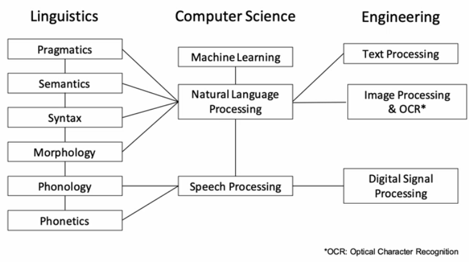

# Introduction

[toc]

# Language, Linguistics, & NLP

## Some Terminology

- **Natural language processing**: study of exploiting (making decisions) or generating language represented as text
- **Computational linguistics**: use of computational tools to understand or learn the structure of human languages

### Phenetics

Study of speech sounds

### Phonology

The structure and patterning of sound within a language

### Morphology

- internal structure of words
- ==morphemes== include stems, prefixes, suffices, and infixes
- Applications: stemming / lemmatization

### Syntax

The structure of words and phrases within a sentence

### Semantics

The representation of *meaning* in a language

### Pragmatics

- How language is used to achieve specific intentions
- i.e. "I ate *most* of your cookies" $\implies$ "I did not eat *all* of your cookies"

### Sociolinguistics

How language uses patterns associated with specific groups

### Historical Linguistics

How language changes over time

### Psycholinguistics

Cognitive function of linguistics (i.e. brain area in language production)

> Not all NLP relates to a single domain but rather it may span across many

## Why is NLP Hard?

- Ambiguity of language structures
  - words have different meanings
  - syntactical ambiguity gives multiple interpretations
  - **Neologisms**: new words / phrases (i.e. "googling")