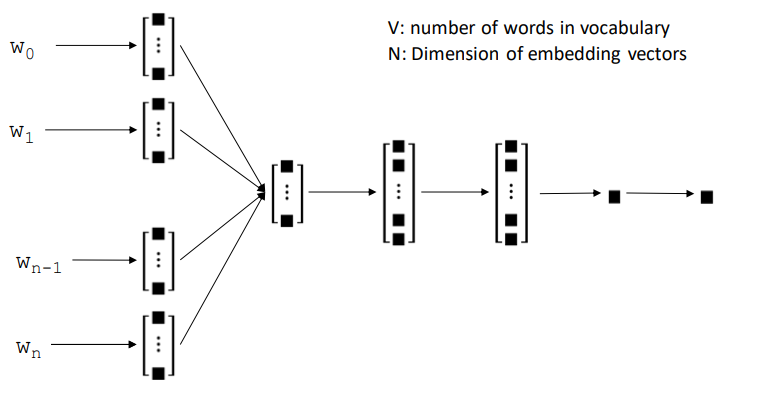
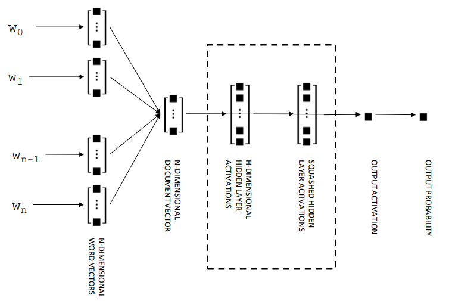
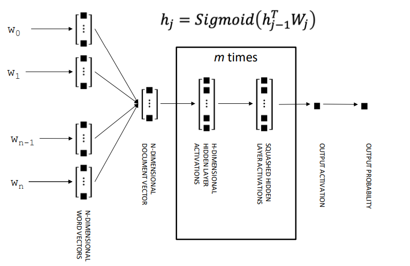
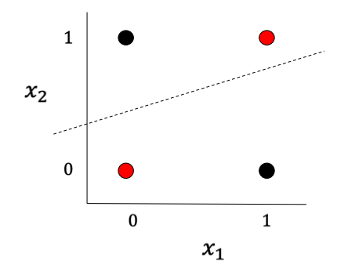
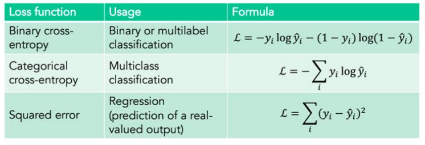
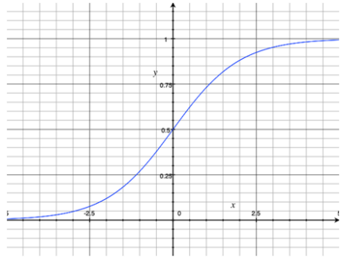
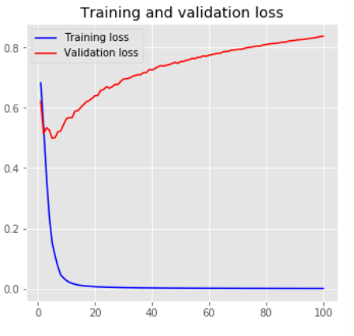
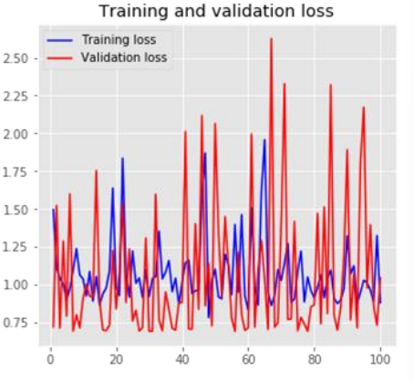

# Feed-forward Neural Networks

## Text Categorization with Neural Networks

- text categorization architecture
  - input layer: bag of words or dense word embeddings (`word2vec`)
  - one or more hidden layers 
    - *fully-connected* layers
  - probabilistic output layer: 
    - logistic sigmoid (binary classification) or
    - SoftMax (multiclass classification)

### Feed-forward text categorization network

1. word → document representation
   $$
   d = \sum_{i=1}^n \frac{E_{w_i}}{n}
   $$

2. document representation → hidden layer (logistic sigmoid nonlinearity)
   $$
   h = \text{sigmoid}(d^\top W_1)= \frac{e^{d^\top W_1}}{1+e^{d^\top W_1}}
   $$

3. hidden layer → output probability 
   $$
   p=\text{sigmoid}(h^\top o)=\frac{e^{h^\top o}}{1 + e^{h^\top o}}
   $$

###  Comparison to logistic regression

#### Logistic Regression Summary

1. words → document representation
   $$
   d = \sum_{i=1}^n \frac{E_{w_i}}{n}
   $$

2. document representation → output probability 
   $$
   p = \text{sigmoid}(d^\top o) = \frac{e^{d^\top o}}{1 + e^{d^\top o}}
   $$

### Feed-forward text categorization network with *multiple hidden layers*

---

## What's the point of nonlinearities?

- deep neural networks can model nonlinearities 
- this gives it expressive capacity
  - some functions can't be learned without them
  - such as XOR

- matrix multiplication is just a linear operation
- XOR requires a non-linear decision boundary

### Expressive capacity of neural networks

- a feed-forward neural network with 
  - fully connected layers
  - at least one hidden layer with nonlinear activations (such as sigmoid)
- can represent any function of its inputs with arbitrary precision
- feed-forward neural network is a.k.a. "universal function approximator"

### What is the point of multiple hidden layers?

- a network with a single hidden layer can represent any function as well as a network with multiple hidden layers
  - **but** it may require an exponentially greater number of nodes
- deeper networks are better for representing complex relationships between inputs and outputs
  - **but** they can introduce difficulties for optimization
    - regularization helps
    - also residual connections (advanced topic) ?

### Hidden layers are only useful with nonlinearities

- remember that without nonlinear activation functions, each layer of a feedforward neural network is just a linear transform of the previous layer 
  - i.e. matrix multiplication
  - successive matrix multiplications are always expressible as a single matrix multiplication

### Multilabel vs Multiclass

- **multilabel classification**
  - labels are *not* mutually exclusion
  - i.e. a document can be labeled with *multiple labels*
  - probabilities do *not* sum to 1
  - logistic **sigmoid** nonlinearity at output layer
- **multiclass classification**
  - labels are mutually exclusion
  - probabilities *must* sum to 1
  - **SoftMax** nonlinearity at output layer

---

## Revisiting Gradient Descent

### Loss Functions 

### Gradient descent

1. define a lost function to be minimized
   - for logistic regression *this is* **cross entropy loss** (a.k.a. logistic loss)
2. compute **gradient of loss** with respect to parameters
3. update parameters in the direction of gradient

#### Batches, Stochastic Gradient Descent, and Minibatch

- **batch gradient descent** accumulate updates across entire dataset before applying
  $$
  \theta_{t+1} \leftarrow \theta_t - \eta \sum_{i=1}^{|D|} \nabla \log L(\theta;\vec x_i;y_i)
  $$

  - where $\eta$ is learning rate
  - **this is slow!**

- **stochastic gradient descent** update parameters after gradient calculated for each training exemplar 
  $$
  \theta_{t+1} \leftarrow \theta_t - \eta \nabla \log L(\theta;\vec x_i;y_i)
  $$

  - **this is fast but a lot less stable**

- **minibatch** process updates for smaller samples of dataset
  $$
  \theta_{t+1} \leftarrow \theta_t - \eta \sum_{i=1}^n \nabla \log L(\theta;\vec x_i;y_i)
  $$

  - **this is *faster* but less stable**

---

## Neural Network Tool Chest

###  Nonlinearities

- the general constraints on **nonlinearities** (or *activation functions*) is that they are 
  - **monotonic** (continuously increasing or decreasing) and 
  - **differentiable** (smooth)
- the primary nonlinear function used are
  - SoftMax
  - logistic sigmoid
  - hyperbolic tangent $\tanh$
  - rectified linear ReLU

#### SoftMax

- only used at the output layer of a network to get probabilistic / normalized outputs for multiclass classification problems

#### Logistic Sigmoid

- most commonly-used activation function for hidden layer of network 
- also at output layer for binary classification tasks
- produces activations constrained to range $[0,1]$

#### Hyperbolic Tangent

- sigmoid-like activation function that *allows* negative outputs
- use in LSTMs (disucessed later in semester)
- produces activations constrained to range $[-1,1]$

#### ReLU

- rectified linear unit
- produces sparse activations (many zeros)
- technically not differentiable at 0 but can be dealt with computationally
- produces activations constrained to $[0,\infin]$ 

---

## The Art of Network Engineering

### Parameters and Hyperparameters

- **parameters** model-internal values that are set through training in order to optimize against some loss function
  - examples: word embeddings, weight matrices between network layers
- **hyperparameters** model architecture or optimization decisions that are fixed in advance of training
  - examples: learning rate $\eta$, number of hidden layers, number of nodes per layer, regularization hyperparameters

### Hyperparameters in neural networks

- many models have hyperparameters
  - Naïve Bayes - smoothing hyperparameter 
  - logistic regression - L~1~ / L~2~ penalties
  - KNN - $k$ neighbors
- but neural networks have *a lot* of them; to find the right ones:
  - choose a value and hope for the best
  - search many values and select the best one based on development data

### Regularization in neural networks

- **regularization** discouraging or regulating model complexity
- especially important for neural networks due to the **curse of dimensionality**
  - in a high-dimensional space, there are many possible parameterizations (decision surfaces) that have equivalent performance according to our loss function

- **L~1~ / L~2~ penalties** from logistic regression are used in neural networks as well
  - different regularization penalties maybe associated with weights at different layers
- another regularization technique is **early stopping**
  - halting training before the loss has been fully minimized
  - monitor performance on development dataset
- **dropout** is a regularization technique specific to neural networks 
  - during training, a **fixed percentage** of outputs at each layer are randomly set to 0
  - this introduces noise into the inputs of the next layer, discouraging large weights
  - also discourages *co-adaption* nodes in a later that jointly perform a single function that can cause training to stall in a local minimum

---

## Troubleshooting Neural Networks 

### Evaluation

- neural networks have great expressive capacity
  - therefore, we need to ensure that we monitor performance on held-out data to **avoid overtraining**
- neural networks are difficult to optimize 
  - therefor we need to monitor performance to ensure convegence

### Common Issues

#### Overtraining

- monitor performance on held-out set

#### Non-Convergence

- reduce learning rate
- if convergence is too slow, then increase learning rate

