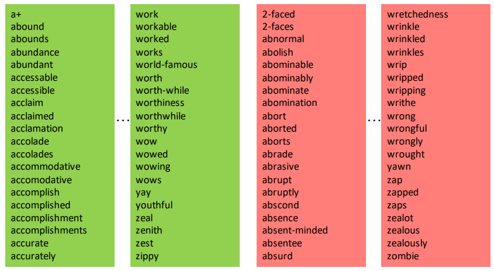
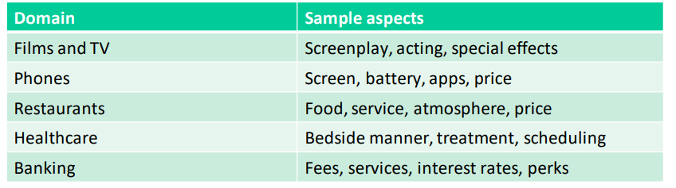
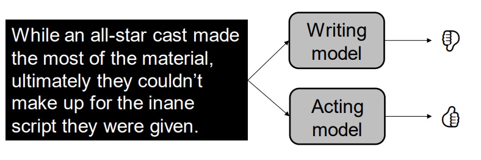
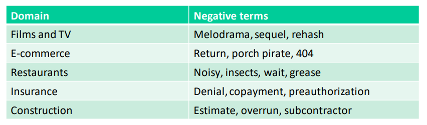
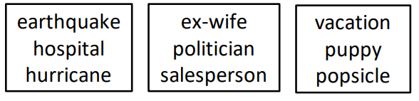
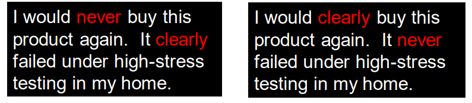

# Sentiment Analysis

[toc]

## What is it?

- goal:
  - label the affective content of a text along a positive to negative scale
  - determining the speaker's orientation toward the topic of discussion
- a.k.a. *opinion mining*

### Sentiment and *subjectivity*

- **sentiment** is *affective polarity*
  - positivity or negativity of the content
- but what if it's just factual, not evaluative?
  - i.e. "an oxygen atom has 8 protons"
- in a sentiment task, we could say that these sentences are **neutral**
  - only **subjective** tasks can have sentiment
- **subjective detection** identify opinions and non-factual content

### Sentiment and *emotion*

- *emotion* is clearly related to sentiment but more fine-grained

### Sentiment and stance

- *stance* is the side of an issue taken by the speaker
  - usually binary (align or doesn't align with sentiment)
- **stance classification** identify author's position of support or opposition

---

## Models for Sentiment Analysis

### Sentiment analysis as text categorization

- is sentiment a classification task *or* a regression task?
  - are texts either positive or negative; or can we put them on a scale
- sentiment is usually treated as a classification task, even though intuitively there are gradations

#### Lexicon-based sentiment analysis 

- to use a sentiment lexicon
  - just count the positive / negative words in the example (or sum the scores if your lexicon has scores for words)
  - or do normal text classification and use the lexicon as your vocabulary
- pros:
  - curated list makes it less likely that the model will learn *weird* correlations 
    - i.e. non-emotional terms as predictors of sentiment
- cons:
  - *subjective decisions* in list creation
  - limits sophistication of sentiment classifier

#### Bag-of-words sentiment modeling

- alternate (or complement) to lexicon-based sentiment analysis
- given some labeled training data, just build a text categorization model to predict positive or negative label
  - Naive Bayes, logistic regression, etc.
- pros:
  - resulting classifier will be well-suited to domain of interest
  - can leverage state-of-art machine learning for high accuracy
- cons:
  - some of the relationships learning by the model may be questionable from validity perspective
  - finding good training data is a challenge

#### Annotation for sentiment analysis

- where to get training data for sentiment?
  - star ratings / likes dislike ratio / net promotor score
  - manual annotation
- unfortunately, the contexts in which we have a lot of training data are also the contexts in which sentiment models add the least value
  - *if your reviews already have star ratings, is sentiment analysis needed?*
- collecting annotations for modeling is a lot of work!
  - sometimes needs labeling by multiple annotators to ensure the labeling is reliable
- who does the work?
  1. **scientists / students**
     - high quality
     - not scalable
     - free
  2. **crowdsourced workers**
     - low quality
     - scalable
     - inexpensive
  3. **dedicated workers**
     - high quality
     - scalable
     - expensive

---

## Sentiment & Aspect

- **aspect** is the characteristic or object of opinion focus within a text
  - typically domain specific 

- if aspect is simply a category of opinion, it can be handled a separate classifier for each category

---

## Challenges for Sentiment Analysis

### Domain Specificity

- off-the-shelf sentiment modeling is widely sold, and many business users assume it is sufficient for their needs
  - but the definition of sentiment *can* be task-specific
- and the types of words and phrases that count as negative are **highly domain-dependent, and implicit**

### Need for interpretability

- surprising words sometimes show up with sentiment polarity 
  - they tend to correlate with negative discussion although they aren't themselves negative

- this can be problematic if we want to use sentiment scores to attribute opinions to *people*
  - i.e. are all hospitals negatively rated?

### Aggregation of sentiment scores

- it’s not always clear how to get from a text-level sentiment score to the metric you really want
  - average sentiment per sentence for all customer service calls doesn’t tell you if the customer got their problem resolved
  - similarly, a text could have a lot of negative content, but still end with a positive customer experience

### Is a bag of words enough?

- we’ve been treating sentiment analysis as a standard text categorization task
- and a bag-of-words representation is common for text categorization
- but is it really appropriate for sentiment?

- sentiment can change based on very small differences between texts
  - more than other tasks, sentiment analysis may benefit from information on **word order**

### Beyond bag of words for sentiment

- neural models are a natural fit
