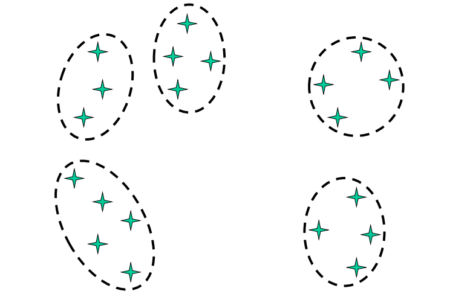

# Unsupervised Learning

[toc]

## Revisiting Unsupervised Methods

### Latent semantic analysis

- the idea is to compress the representation of a word using much less than $|D|$ dimensions for each vector 
  - compress for more efficient represent (small memory footprint)
  - compress for generalization
    - retain most important information and 
    - allow distinctions between similar words to be obscured
- how to do this automatically?
  - [Singular value decomposition SVD](6-Neural-Word-Embeddings.md#Singular value decomposition SVD)
  - [Continuous Bag of Words CBOW](6-Neural-Word-Embeddings.md#Continuous Bag of Words CBOW)

---

## Unsupervised Classification

### Clustering

 → 

### Clustering on Text

- input is features or vector representation of data, rather than the feature-label pair
- identify the **underlying structure of the observed data**, such that there are a few clusters of points
  - each of which is internally coherent

#### Non-Hierarchical Clustering

-  clusters do not overlap

> - iterative clustering:
>   - start with initial (random) set of clusters
>   - assign each object to a cluster 
>   - recompute cluster parameters
>   - stop when clustering is *good*

##### K-means Algorithm

- input:
  - set $X = \{x_1,...,x_n\}$ of objects
  - distance function that maps to $\mathbb R$
  - mean function $\mu$

> - select $k$ initial cluster centers $f_1,...,f_k$
> - *while* not finished *do*
>   - *for all* clusters $c_j$ *do*
>     - $c_j \leftarrow \{x_i| f_j  = \underset{f}{\text{argmin }} d(x_i,f)\}$
>   - *for all* means $f_j$ *do*
>     - $f_j \leftarrow \mu(c_j)$ 

I don't under stand the soft k-means crap

---

## Expectation Maximization EM

- combines **generative** modeling of Naive Bayes with **latent variable** modeling of soft K-means
  - ==generative model== models **joint probability** of class labels and observations
    - aims to understand *how* data is generated
  - ==discriminative model== models **conditional probability** of labels given observations
    - focusses on separating & classifying data 
- EM framework (not a single algorithm) is an **iterative** framework to find **maximum likelihood estimate** given a set of latent variables

### The EM Algorithm

- soft clustering method to solve
  - $\theta^* = \underset{\theta}{\text{argmax }}P_\text{model}(X|\theta)$
- *note* any occurrence of the data consists of
  - ==observable variables== the object we see
    - *bag of words*
    - *word sequences* in tagging tasks
  - ==hidden variables== which cluster generated which object
    - *document categories*
    - *underlying tag sequences*

### Two Principles: Expectation vs Maximization

- ==Expectation== if we knew $\theta$, we could compute the expected values of the hidden variables (i.e. probability of $x$ belonging to some cluster)
- ==maximization== if we knew the hidden structure, we could compute the maximum likelihood value of $\theta$

### Iterative Solution

- initialization: choose an initial $\theta$
- then iterate until convergence
  - ==E-step== compute $(X,Z_i) = E[X,Z|\theta_i]$
  - ==M-step== choose $\theta_{i+1}$ to maximize $P(X,Z_i, \theta_{i+1})$
- if M-step can't be computed, we can also move along its gradient

### EM for Naive Bayes Text Classification

- **E-Step**: compute $P(c_k|d_i)$ for each document $d_i$ and category $c_k$ given current model
- **M-step**: re-estimate the model parameters $P(w_j|c_k)$ and $P(c_k)$
- continue as long as log-likelihood of corpus increases

#### E-Step

- for each document $d_i$ and each category $c_k$, estimate the posterior probability $h_{ik} = P(c_k|d_i)$

$$
h_{ik} = \frac{P(d_i|c_k)P(c_k)}{\sum_{k'} P(d_i|c_{k'})P(c_{k'})}
$$

- to compute $P(d_i|c_k)$, use Naive Bayes

$$
P(d_i|c_k) = \prod_{w_k\in d_k}P(w_j|C_k)
$$

#### M-Step

- re-estimate parameters using maximum-likelihood estimation

$$
P(w_j|c_k) = \frac{\sum_{d_i:w_j\in d_i}h_Pik}{\sum_{d_i,\forall w_{j'}\in d_i}h_{jk}}\\
P(c_k) = \frac{\sum_i h_{ik}}{\sum_k\sum_i h_{ik}}
$$

#### Decision Procedure

- assign categories by

$$
\text{cat}(d_i) = \underset{c_k}{\text{argmax }}
\lfloor \log P(c_k) + \sum_{w_j\in d_i} \log P(w_j|c_k) \rfloor
$$

- can adjust number of categories $k$ to get finer or coarser distinctions
- if adding more categories doesn’t increase log-likelihood of data much, then stop

### Applications of EM

- clustering based on local context applicable to many NLP tasks
  - **word-sense induction**
    - overcome limitations of hand-annotation
  - **part-of-speech tagging**
    - for low-resource languages (limited annotated data)
  - and other crap