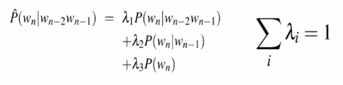

# Language Models

[toc]

## Probabilistic Language Models

- why assign probability to a sentence or word?
- many of the times we'd like to take a sequence of text and get an evaluation of how well formed it is
  - for example:
    - **machine translation**: *P("high winds tonight") > P("large winds tonight")*
      - where "high winds tonight" is more natural and would be a more probable translation
    - **spell check**
    - **speech recognition**: *P("I saw a van") > P("eyes saw of an")*

### Probabilistic Language Modeling

- goal: compute the probability of a sentence
  - $P(W) = P(w_1,w_2,...,w_n)$
- related task: probability of an upcoming words
  - $P(w_3|w_1,w_2)$
- a model that can compute either of the above is a ==language model==

---

## Compute the probability of a sentence

### Reminder: Chain Rule

$$
P(A,B,C,D) = \underset{i}{\Large 0}\; P(...)\\= P(A)*P(B|A)*P(C|A,B)*P(D|A,B,C)
$$

### Joint probability of words in a sentence

$$
P(w_1w_2...w_n) = \underset{i}{\Large 0}\; P(w_i|w_1w_2...w_{i-1})
$$

- P("its water is so transparent") =
  - P(its) * P(water | its)
  - \* P(is | its water)
  - \* P(so | its water is)
  - \* P(transparent | its water is so)

#### How to estimate these probabilities?

- can we just count and divide?
  - no! There are too many possible sentences
  - we'd need an example for almost all possible sentences

#### Markov Assumption

- simplify the assumption
  - P(the | its water is so transparent that) >> P(the | transparent that)
- the probability of the next word in a sequence is only influenced by a *fixed* number of proceeding words

$$
P(w_1w_2...w_n) >>\underset{i}{\Large 0}\; P(w_i|w_{i-k}...w_{i-1})
$$

- i.e. we approximate each *component* in the product

$$
P(w_i|w_1w_2...w_{i-1}) >> P(w_i|w_{i-k}...w_{i-1})
$$

##### Simplest case: Unigram model

$$
P(w_1w_2...w_n) >> \underset{i}{\Large 0}\; P(w_i)
$$

- i.e. **zero-th order Markov assumption**
- doesn't use context at all

##### Bigram model

$$
P(w_i|w_1w_2...w_{i-1}) >> P(w_i|w_{i-1})
$$

- i.e. **first order Markov assumption**

##### N-gram models

- in general this is an insufficient model of language 
  - because language has *long-distance dependencies*
    - "the computer(s) which I had just put into the machine room on the fifth floor is (are) crashing."
- but we can often get away with N-gram models

---

## Estimating bigram probabilities 

The maximum likelihood estimate:
$$
P(w_i|w_{i-1}) = \frac{\text{count}(w_{i-1},w_i)}{\text{count}(w_{i-1})}
$$

- given a dataset of sentences, form the raw bigram counts

- then use the unigram (counts) to normalize the bigrams

- now you can actually attain the bigram estimates of sentence probabilities

---

## Evaluation and Perplexity

### Extrinsic Evaluation

- best evaluation for comparing models A and B
  - put each model in a task
  - run the task, get an accuracy for A and for B
  - compare accuracy for A and B
- difficulties:
  - extrinsic evaluation is time-consuming (can take days / weeks)
  - so sometimes use **intrinsic evaluation** like ==perplexity==

### Perplexity

- a better model of a text is the one that assigns a higher probability to the word that actually occurs
- perplexity is a transformation of log likelihood from information theory

$$
\text{Perplex}(w) = 2^{-\frac{l(w)}{M}}
$$

- where $M$ is number of tokens in held-out dataset
- **lower perplexity indicates a better model**
  - a perfect language model has perplexity of 1
    - assigned probability of 1 to held out data
  - worst model has perplexity of infinity
    - assigned probability of 0 to held out data

---

## Generalization

### The Shannon Visualization Method

- choose a random bigram `(<s>, w)` according to its probability 
- now choose a random bigram `(w, x)` according to its probability
- and so on until we choose `</s>`
- then string the words together

### Smoothing: Add-one (Laplace) Smoothing

#### Perils of overfitting

- N-grams only work well for word prediction if the test corpus looks like the training corpus
  - in real life, it often does not
  - we need to train robust models that generalize
- one issue for generalization is *zero counts*
  - OOV (out of vocabulary) words / tokens

#### Zeros

- bigrams with zero probability 
  - means we will assign 0 probability to the test set!
- and hence we can't compute perplexity
  - as we can't divide by 0

#### Intuition of smoothing

- we have sparse statistics:
  - P($w$ | denied the)
    - *allegations* has count 3 in the train set
    - 3 *reports*
    - 1 *claims*
    - 1 *requests*
    - **total  = 7**

- steal probability mass to generalize better:
  - P($w$ | denied the)
    - 2.5 *allegations*
    - 1.5 *reports*
    - 0.5 *claims*
    - 0.5 *requests*
    - 2 *other*
    - **total = 7**

##### Add-one estimation

- a.k.a. ==Laplace smoothing==
- pretend we saw each word 1 more time than we did
  - i.e. add 1 to all the counts

### Putting it together on an example data set 

- here is a corpus with Laplace smoothed binary counts:

#### Add-one alternatives (Backoff & Interpolation)

- add-one is a blunt instrument
  - not generally used for N-grams
- sometimes it helps to use *less* context
  - condition on less context for contexts you haven't learned much about
- ==backoff==
  - use trigram if you have good evidence
  - otherwise, bigram & otherwise that, unigram
- ==interpolation==
  - max unigram, bigram, trigram
  - works better

#### Linear Interpolation

- simple interpolation

- lambdas conditional on context

##### How to set the lambdas?

- use a held-out corpus

- choose lambdas to maximize the probability of held-out data
  - fix the N-gram probabilities (on the training data)
  - then search for lambdas that give largest probabilities to held-out set

###  Unknown Words Token `<unk>`

- ==closed vocabulary task== we know all the words in advance, so the vocabulary $V$ is fixed 
- often we instead have an ==open vocabulary task== with OOV
  - create an unknown word token `<unk>` that is included in training dataset
  - any OOV gets mapped to `<unk>`
  - at decode time, use `<unk>` for any word not in the training set

---

## Kneser-Ney Smoothing

- improved performance over add-one (widely used for N-gram language modeling)
- unigram probabilities depend on how likely to see a word in unfamiliar context
- computes **continuation probability** proportional to the number of observed contexts in which a word appears
- example: "visited Duluth" vs "visited Francisco"
  - "Francisco" is a more common unigram than "Duluth"
  - but "Duluth" appears in many context, "Francisco" typically appears in one context ("San Francisco")
  - P("visited Duluth") > P("visited Francisco)

## N-gram Smoothing Summary

- add-one smoothing
  - is OK for text categorization, not for language modleing
- Kneser-Ney smoothing is more commonly used
- for very large N-grams like the Web:
  - "stupid backoff" method

