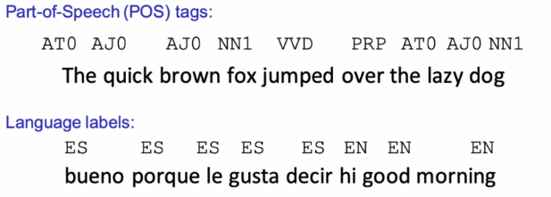
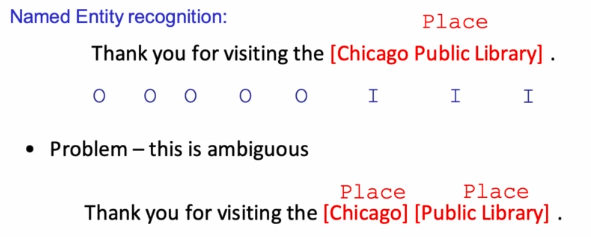
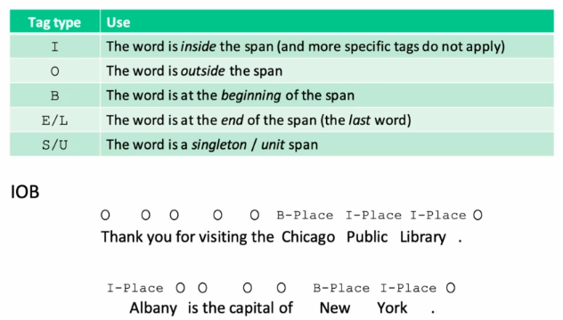
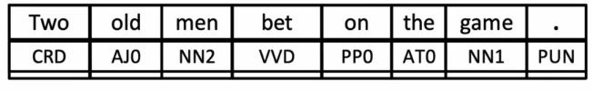
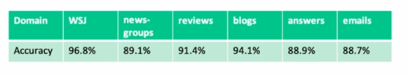
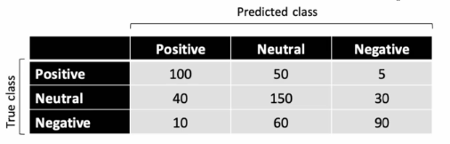

# Parts of Speech and Sequence Tagging

## Sequence Labeling

- we can treat text as a bunch of lexical units (i.e. bag of words)
- or we can also treat it as a *sequence*
  - typically for shorter texts
- similarly we can make predictions at the text level 
  - **or we can make predictions associated with each word in the text** incorporating information from the surrounding sequence
  - these are **sequence labeling tasks**

- sequence labeling involves associating a predicted label or tag with each word

### Spans

- sequence labeling methods can also be used to label *spans of text* by specifying word-level tags that encode whether the word is **inside** or **outside** the span 

#### IOB Representations

---

## Parts of Speech

- generally speaking the "grammatical type" of word:
  - verb, noun, adjective, adverb...
- we also include inflections:
  - verbs: tense, number...
  - nouns: number, proper / common...
  - adjectives: comparative, superlative...

### POS Tagging key for NLP

- ambiguity: "book" can be a noun or a verb
- useful input for parsing
  - "book a ticket" vs "book of the century"
- disambiguate meaning even without parsing
  - is text about literature or traveling?

### Tagsets

- **tagsets** are canonical definitions of parts of speech
  - maybe more or less granular
  - typically language-specific (although there are universal ones for nouns, verbs...)
  - an example is the **BNC parts of speech** for English

---

## Task: Part of Speech Tagging

- goal: assign the correct part-of-speech to each word (and punctuation) in a text

- **note** this is not *parsing* as we are not concerned with the topic of the sentence

### Modeling Considerations for POS tagging

- POS tagging is very similar to word-sense disambiguation, as it involves making predictions at the word level (not text level)
  - one difference is that that we need to assign a tag to *every* word
  - another difference is that the predictive information tends to be much more *local*
- **not** a bag-of-words problem!

---

## Evaluation

- part-of-speech tagging is "easy"
  - just guessing the most frequent tag for each word (and "noun" for unknown words) gets over 90% accuracy 
  - as always its important to evaluate accuracy measures relative to some baseline
- POS tagging accuracy can suffer when models are applied to different domain or genre than that used for training
  - this is an example of a model's performance that was training on Wall Street Journal text

### Accuracy

- *accuracy* is a high-level measure of a model performance for classification tasks, aligned with the loss function used for optimization (generally cross-entropy)
  - but it doesn't tell us how well the model is doing on specific categories
  - and as we have seen, it can be misleading in cases with very unbalanced class distributions or simple baselines
    - i.e. a mediocre model gives 90% accuracy where a great model gives 92%

### Confusion Matrix

- a tool to provide more insight into model performance 
- a table comparing the model's predictions to the true label class *grouped by class*

- for metric formulas use this [link](G:\My Drive\School\4-Senior-Fall\CS-584 Machine Learning\2+3-Model-Evaluation.md#Types of Classification Errors - Confusion Matrix)

#### Precision

The proportion of predictions for a given class that are correct

#### Recall

The proportion of true labels for a given class that are correctly predicted

#### F measure

A balanced weighting of precision & recall (harmonic mean)
