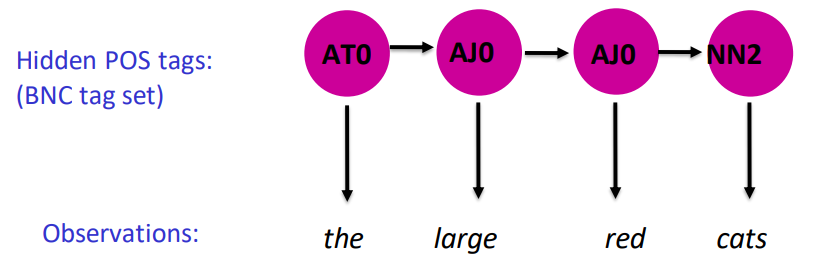
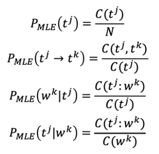

# Hidden Markov models and the Viterbi algorithm

## Hidden Markov Model (HMM)

- a generative framework for sequence labeling
  - expresses a joint probability distribution $P(t_{1..n},w_{1..n})$ over the observed word sequence and unobserved tag / label sequence
  - a "generative story" according to which each word is generated according to a distribution dependent on a fixed-length tag history 

### HMM - POS generation

- first-order (bigram) Markov assumptions:
  - ==limited horizon== tag depends only on previous tag
  - ==time invariance== no change over time

###  HMM - word generation

- output probabilities:
  - probability of getting word $w^k$ for tag $t^j$
    $$
    P(w^k|t^j)
    $$
- **assumption**: not dependent on other tags or words!

### Combining Probabilities

- probability of a tag sequence: $P(t_1,t_2,...,t_N) = P(t_1)P(t_1 \rightarrow t_2)...P(t_{N-1} \rightarrow t_N)$
- assume $t_0$ is universal start tag: $=P(t_0 \rightarrow t_1)P(t_1 \rightarrow t_2)...P(t_{N-1} \rightarrow t_B) = \prod_i P(t_{i-1}\rightarrow t_i)$
- probability of word sequence *and* tag sequence: $P(W,T) =  \prod_i P(t_{i-1}\rightarrow t_i)P(w_i|t_i)$

### Training from Labeled Data

- labeled training: each word in dataset has a POS tag
- thus

---

## 3 Basic POS Computations

- model *m* contains transitions and output probabilities
  1. compute the probability of a text: $P_m(W_{1,N})$
     - the probability of a sequence of words $W_{1,N}$ given model $m$
     - involves forward / backward algorithms to compute
  2. compute maximum probability tag sequence: $\underset{T_{1,N}}{\text{argmax }}P(T_{1,N}|W_{1,N})$
     - this step determines the most likely sequence of POS tags given the observed words
     - use the **Viterbi Algorithm**
  3. compute maximum likelihood model: $\underset{m}{\text{argmax }}P_m(W_{1,N})$
     - finding model parameters to maximize $P_m(W_{1,N})$

Too compliated for me :cry:

