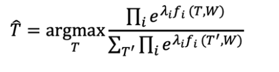

# Conditional Random Fields and structured prediction

> generative models maximize the joint probability rather than directly modeling the conditional probability or decision boundary (as with discriminative models)
>
> - Naive Bayes is generative (uses joint probability distribution)
> - Logistic Regression is discriminative (learns decision boundary)

## HMMs, MEMMs, and CRFs

- Hidden Markov Models (HMMS)
  - **generative** sequence labeling models
  - model $P(W,T)$
- Maximum Entropy Markov Models (MEMM)
  - like HMMs, but **discriminative**
  - logistic regression
  - model $P(T|W)$
- conditional random fields (CRF)
  - like MEMMs, but in structured prediction paradigm
  - i.e. also **discriminative**

---

## Maximum Entropy Markov Models (MEMM)

### Maximum Entropy

- in NLP, logistic regression models are often called **maximum entropy** (or maxent) models
  - when selecting a probability distribution to model observed data, we want the distribution to model the statistics of the data
  - model should be uncertain as possible while still capturing the data
    - i.e. minimize the bias
    - this is different than cross entropy (which we try to minimize as the loss function)
  - uncertainty → entropy, so select the model with max entropy subject to data-fitting constraints
- this is just logistic regression

### Maximum Entropy Markov Models (MEMMs)

- cousins of HMMs
  - still based on Markov assumption
  - but is discriminative
- because they are discriminative, MEMMs can't be trained in an unsupervised way like HMMs
- based on maximum entropy (logistic regression) models to predict tag for each word given local context
  - can be trained using gradient descent or other model-specific algorithms

#### MEMM Limitations

- locally normalized
  - MEMM assumes that the probability distribution over a tagging T can be **factored** into the product of conditional probabilities with limited history for each tag location in a sentence
  - this limits the flexibility of the model
    - only paths from the same prior state can "compete" against one another for probability mass

---

## Conditional Random Fields

### Structured prediction

- CRFs fall into a predictive modeling framework called **structured prediction**
  - when we have some complex structured object over which we want to make predictions...
    - examples: pixels in an image, tag sequences over syntactic trees
  - we try to estimate a probability distribution over the whole output space rather than distributions over subparts
- **structured prediction for sequence labeling**: predict optimal tagging $T^*$ using a scoring function over the output space

$$
\hat T = \underset{T}{\text{argmax }} \Psi(T,W)
$$

- in a probabilistic framework:

$$
\hat T = \underset{T}{\text{argmax }} P(T|W)
$$

- specially using logistic regression

---

## MEMMs & CRFs: Key Points

- MEMMs & CRFs incorporate complex features for sequence labeling in a probabilistic framework
- MEMMs & CRFs are based on logistic regression (a.k.a. maximum entropy)
- CRFs improve on MEMMs by using **globally** rather than locally normalized probabilities
- CRFs excel at incorporating global constraints on well-formedness of label sequences
- as with logistic regression, we can apply **L1 & L2 regularization**
