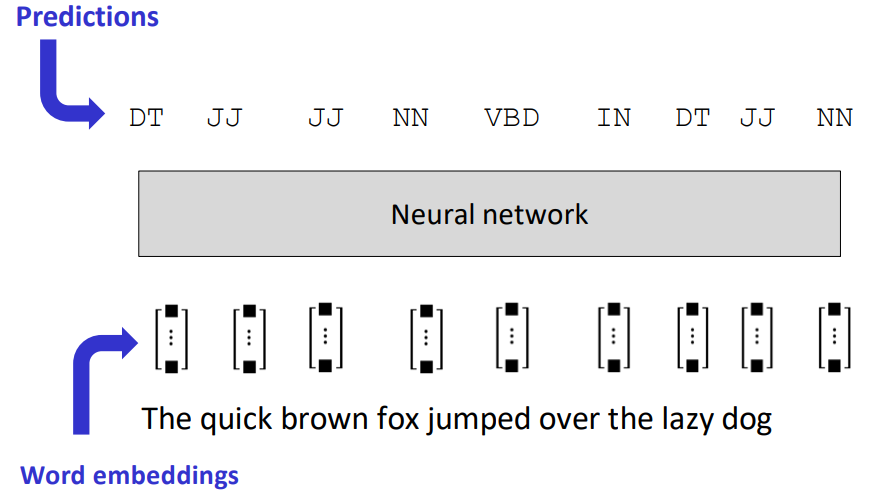
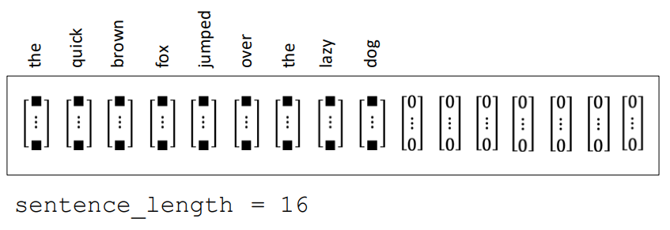
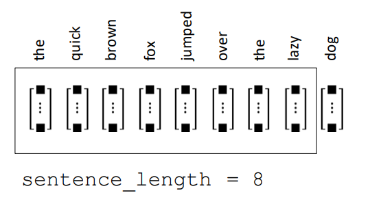
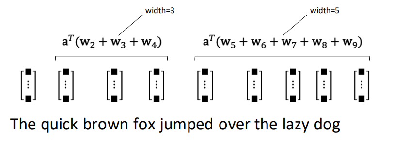
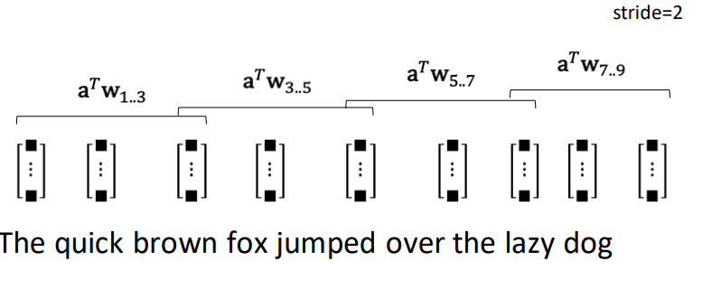
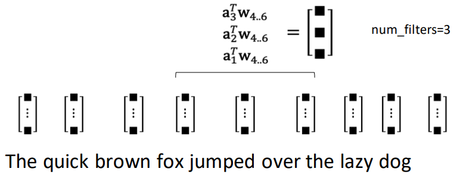
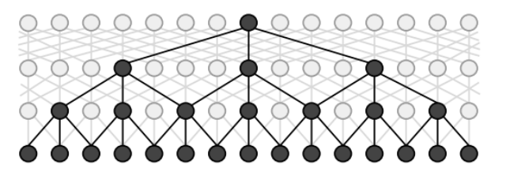

# Neural Networks for Sequence Tagging

## Word Embeddings Refresher

- encode semantic similarity between words 
- `word2vec`: Continuous Bag of Words

## Neural Networks for Sequence Labeling  

- **batch gradient descent**: accumulate updates across entire dataset before applying
  - slow
- **stochastic gradient descent**: update parameters after gradient calculated for each training exemplar
  - fast! But less stable
- **minibatch**: process updates for smaller samples of dataset
  - faster, more stable

### Preprocessing

- in order to process data efficiently for neural networks, we need to bundle representations of multiple texts into a **minibatch** (single matrix)
- problem: text length is not constant
  - some texts are longer than others
- solution: **zero-padding** & **truncation** of input sequence

#### Zero-Padding

- choose `sentence_length` for minibatches
- if a given sentence is too short, append zero vectors 

#### Truncation

- choose `sentence_length` for minibatches
- if a given sentence is too long, discard extra words

---

## Convolutional Networks for Text

- CNNs use convolution functions to collect information from a local receptive field for prediction
- properties:
  - CNN operations can be factored into operations that **run in parallel** because operations at different points in the sequence are independent of one another
  - CNNs can only use **limited contextual** information for prediction because each layer of the CNN aggregates information from a small local region (distance in words)
- for NLP: we use 1D convolutions (instead of 2D as with images)

### Convolutions as representation learning

- convolutions are local feature extractors
  - in computer vision: detection of edges, corners...
  - **in NLP**: detection of negative, tense...
- if word embeddings learn good representations for words
  - then convolutions learn good higher-level representations for making predictions

### Convolution Parameters

- **width**: size of the receptive field around the target location

- **stride**: offset between adjacent applications of the convolution

- **number of filters**: number of independent convolutions applied

### Dilated Convolutions

- adaption for NLP & sequence tagging
- structure grows with sequence length by adding layers

---

## Recurrent networks

- RNNs apply the same operation to the input at each time step, producing an output, but also updating an internal memory state that encodes relevant history to be used in prediction
- memory state can allow distant information to influence the prediction made for a given word/label
- because the memory state is transferred from time step to time step, the network is intrinsically sequential – it cannot be effectively parallelized

### Problems with RNNs

- information needs to travel a long way in an RNN to get from the error signal / loss function $y$ to some inputs $x_i$
- **vanishing gradients** & **exploding gradients**

---

## Long short-term memory (LSTM)

- a more sophisticated version of RNNs is the LSTM
- adds memory cell to hidden state
- uses gates to determine what information feeds forward from one time step of the network to the next
  - helps to address the vanishing / exploding gradients problems and make learning more stable
- gates are function of current input and previous hidden state

---

## CNNs and RNNs for text categorization

### CNNs for text categorization

- in a CNN model, we can use pooling operations to aggregate features across entire sentence / text
- then use this representation as an input to a standard feed-forward NN for text categorization

#### Pooling Layers

- if convolutional operations are feature detectors, then **pooling layers aggregate the outputs of the feature detectors** to indicate whether a given feature is activated in the neighborhood of a word
- output of the pooling layer is typically the maximum value

### RNNs for text categorization

- use an LSTM to aggregate information from the sequence, and then append a fully-connected layer (and SoftMax on the outputs) at the final time step to make predictions

---

## Regularization

- early stopping
- dropout
- L1 & L2 penalties

