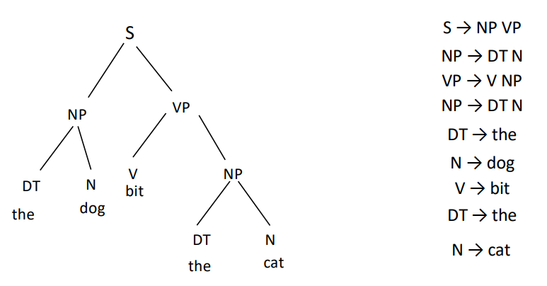
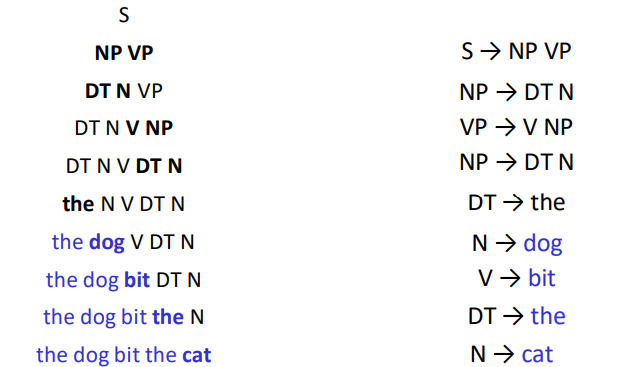
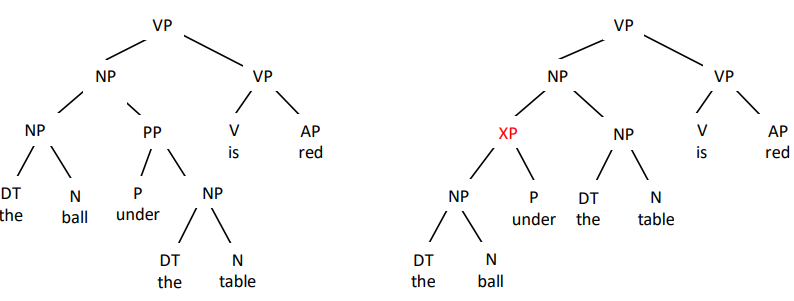
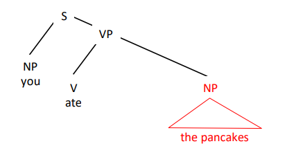
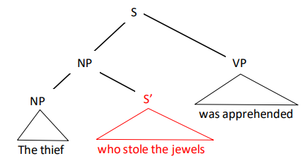
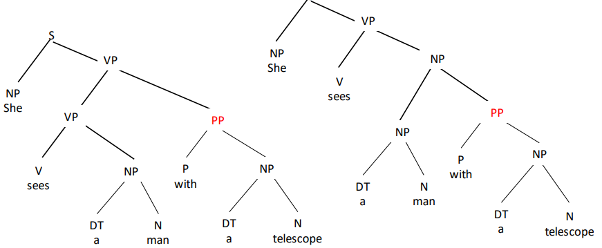
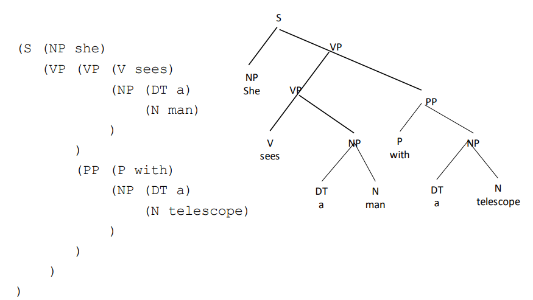

# Context-free Grammars and Syntax

## Grammatical Representations

- last couple of centuries people started representing linguistic structure using **trees** or other **hierarchical** representations

### Generative Grammar and Phrase Structure

- treat human languages lie formal languages such as predicate logic
- generative process that determines admissible sequences of symbols
- languages defined by production rules that indicate options for expressing sentence parts

## Grammar Types

### Regular (Finite-State) Grammars

- production rules of form `X -> y (Z)`
  - where `X` and `(Z)` are nonterminal symbols
  - `y` is a terminal symbol
- the root symbol is `S`
- has limited expressivity

### Context-free Grammars

- context-free means that the symbol is independent from what is from what is surrounding it, and its production or expansion is solely based on the defined rules within the grammar

- a sentence is generated by a series of rewrite operations

---

## Constituency and Phrases

### Constituents

- a **constituent** is a language unit that can be interrupted & stand on its own
- there are many ways we could potentially break down a sentence into grammatical units
- what is the "correct" way?

#### Constituency Tests

- more / betters tests [here](20-Context-Free-Parsing-CKY-and-Probabilistic-CFGs.md#Constituency Tests)
  
- **conjunction**: only constituents can be conjoined 
  
  - The ball [under the table] and [near the door] is red PASS
    - [under the table] and [near the door] are valid constituents 
  - [The ball under] and [the truck on] the table are red FAIL
    - [The ball under] and [the truck on] are invalid constituents 
  
- **fragments**: only constituents can stand alone as incomplete sentence utterances
  1. I saw the ball under the table. 
  2. Where?
  3. [Under the table] PASS
     - [Under the table] is a valid constituent (i.e. utterance that makes sense)
  
  1. I saw the ball under the table. 
  2. Where?
  3. [The ball under] FAIL

#### Phrase Types

- noun phrases NP
  - headed by a noun
  - may start with a determiner, include modifying adjectives, prepositional phrases, and postnominal related clauses
  - serves as arguments for prepositions or verbs, or as sentential subject
  - examples:
  - [NP The fellow I met last week]
    [NP The horse with the bit in its teeth]
    [NP Four quarters]
    [NP We]
- verb phrases VP
  - headed by a verb
  - auxiliary verbs head VPs with recursive structure
  - may include adverbial or PP modifiers
  - includes verb object arguments but not sentence subject
  - examples
    - [VP Finally took a week-long vacation ] 
    - [VP Saw the moon with a telescope ] 
    - [VP Will [VP have [VP been [VP winning ] ] ] ] 
    - [VP Left ]
- prepositional phrases PP
  - [PP On the moon ] 
  - [PP Between here and eternity ] 
  - [PP One week ago ]
- adjective phrases AP
  - [AP Red and gold ] 
  - [AP Certain to succeed ] 
  - [AP Bigger than a breadbox ] 
  - [AP Happy as a clam ]

#### Phrasal Heads

- the *head* of a phrase is the word that determines its attributes 
  - typically of the same category as the phrase (i.e. head of NP is a noun)
  - attributes of the head are shared by the phrase as a whole (i.e. tense, number)
  - relationships between heads of phrases are strongly predictive for parsing

---

## Syntactic Structure

### Complements and Adjuncts

- **complement**: syntactic elements that are **necessary to complete the meaning** of a sentence in a particular context

- **adjunct**: **optional** elements added to phrases of a particular category

### Compositionality

- **compositionality** is that semantic structure should mirror syntactic structure
- meaning of larger units is a function of the meaning of smaller units and the way in which they are combined

### Structural Ambiguity

- related to compositionality
- sometimes meaning differences can be traced to differences in syntactic structures

---

## Treebank Datasets

### Treebanks

- a **treebank** is a set of linguistic tree structures that humans have assigned to texts following a set of annotation guidelines
- used for **training** & **evaluation** of syntactic parsing models
- the best-known treebank is the **Penn Treebank**

### Treebank Bracketing

- typical convention is to
  - show constituent structure as nested brackets, with spaces inserted between adjacent constituents
  - label the opening bracket of a constituent with its category

