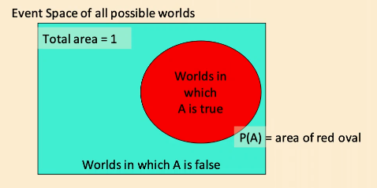
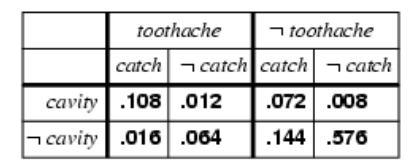

# Probability Theory Review

[toc]

## Probability

$P(A)$ denotes "fraction of possible worlds (given what I know) in which $A$ is true"

### Axioms

- $0 \le P(A) \le 1$
- $P(\text{true}) = 1$
- $P(\text{false}) = 0$
- $P(A \or B) = P(A) + P(B) - P(A\and B)$

### Random Variables

- call $A$ a ==random variable with arity $K$== if A can take on one of $K$ different values in some set $\{v_1,v_2,...,v_k\}$
- for example, $\text{Part of Speech}: \{\text{noun, verb, adjective, adverb}\}$ 

### Atomic Events

- an ==atomic event== is a complete specification of the state of the world which the agent is uncertain about
- i.e. if the world consists of 2 Boolean variables: $\text{Cavity}$ and $\text{Toothache}$ there are 4 atomic events:
  - $\text{Cavity} = \text{false}, \text{Toothache} = \text{false}$
  - $\text{Cavity} = \text{false}, \text{Toothache} = \text{true}$
  - $\text{Cavity} = \text{true}, \text{Toothache} = \text{false}$
  - $\text{Cavity} = \text{true}, \text{Toothache} = \text{true}$
- atomic events are mutually exclusive and exhaustive

## Conditional Probability

$$
P(A|B) = \frac{P(A\and B)}{P(B)} \\\rightarrow\\
P(A\and B)=P(A|B)P(B)
$$

## Chain Rule

From conditional probability $P(A\and B)=P(A|B)P(B)$, we can get
$$
P(A_1\and A_2,\and...\and A_n) = P(A_1|A_2\and...\and A_n)P(A_2|A_3\and...\and A_n)...P(A_n)
$$

## Prior (Unconditional) Probability

- i.e. $P(\text{Cavity}=\text{true})=0.1$ and $P(\text{Weather}=\text{sunny})=0.72$ correspond to belief prior to arrival of (new) evidence 
- a ==probability distribution== gives values for all possible assignments

$$
P(\text{Weather}) = \textlangle 0.72,0.1,0.08,0.1 \textrangle 
$$

- a ==joint probability distribution== for a set of random variables gives the probability of every atomic event on those random variables

| $\text{Weather} =$           | sunny | rainy | cloudy | snow |
| ---------------------------- | ----- | ----- | ------ | ---- |
| $\text{Cavity}=\text{true}$  | 0.114 | 0.02  | 0.016  | 0.02 |
| $\text{Cavity}=\text{false}$ | 0.576 | 0.08  | 0.064  | 0.08 |

## Independence

- 2 Boolean random variables $A,B$ are ==independent== if and only if $P(A|B)=P(A)$
  - if $A,B$ are independent then $P(A\and B) = P(A)P(B)$
- if $P(A|B)=P(A)$, can we show $P(B|A)=P(B)$?
  - $P(A|B)=P(A) $
  - $P(A\and B)/P(B) = P(A) $
  - $P(A\and B) = P(A)P(B) $
  - $P(A\and B)/P(A) = P(B) $
  - $P(B|A)=P(B)$
- if $P(A|B)=P(A)$, can we show $P(\neg A|\neg B)=P(\neg A)$?
  - notice, because $A,B$ are independent that $P(A\and B) = P(A)P(B)$
  - from our [axioms](#axioms), $P(A \or B) = P(A) + P(B) - P(A\and B)$
    - $= P(A) + P(B) - P(A)P(B)$
  - consider $P(\neg A \and \neg B) $ where $P(\neg A \and \neg B) = 1 - P(A\or B)$
    - $ = 1 - P(A) - P(B) + P(A)P(B)$
    - $ = (1-P(A))(1-P(B)) = P(\neg A)P(\neg B)$
  - thus, $P(\neg A \and \neg B) = P(\neg A)P(\neg B) $
    - $\implies P(\neg A \and \neg B)/P(\neg B) = P(\neg A) $
    - $\implies P(\neg A|\neg B)=P(\neg A)$

### Multivalued Independence

$$
\forall_{u,v}:P(A=u|B=v)=P(A=u)
$$

## Inference

Given some information about the probability distribution, determine the probability of some proposition $\phi$

### Inference by Enumeration

- for any proposition $\phi$, sum the atomic events where it's true

$$
P(\phi) = \sum_{\omega:\omega\vDash\phi}P(\omega)
$$

#### Inference by Enumeration Examples

- $P(\text{toothache}) = 0.108 + 0.012+0.016+0.064 = 0.2$
- $P(\text{toothache} \or \text{cavity}) = 0.108+0.012+0.016+0.064+0.072\\+0.0.008=0.28$
- $P(\neg\text{cavity} | \text{toothache}) = (0.016+0.064)/(0.108+0.012+0.016+0.064)=0.4$

#### Inference with Conditional Probabilities

$$
S: \text{stiff neck}, M:\text{meningitis}\\
P(S|M)=0.8, P(S)=0.2, P(M)=0.0001
$$

- Suppose you wake up with a stiff neck. What's the probability you have meningitis?

$$
P(M|S) = P(M\and S)/P(S)\\
=P(S|M)P(M) / P(S)\\
= 0.0004
$$

- the risk is pretty small!

## Bayes' Theorem

### Bayes' Rule

$$
P(A|B) = \frac{P(B|A)P(A)}{P(B)}
$$

#### Distribution Form

$$
P(Y|X)=P(X|Y)P(Y)/P(X) = \alpha P(X|Y)P(Y)
$$

### Bayes' Rule and Text Example

$$
U: \text{the word "urgent" is in the text}\\
S: \text{the email is spam}\\
P(S) = 0.6, P(U| S) = 0.1, P(U|\neg S) = 0.01
$$

What should we do if we receive an "urgent" email?
$$
P(S|U) = \alpha P(U|S) P(S) = \textlangle  \alpha 0.1 * 0.6,  \alpha 0.01 * 0.4 \textrangle \\
\alpha 0.1 * 0.6 +  \alpha 0.01 * 0.4 = 1 \\
\alpha (0.06 + 0.004) = 1\\
\alpha = 15.625\\
P(S|U) = \textlangle 0.9375, 0.0625 \textrangle
$$
We should label the email as "Spam" because $P(S = \text{true}|U=\text{true}) = 0.9375$ (this is a posterior probability)

> This is a [resource](notebooks/matrixcookbook.pdf) to help with matrices & linear algebra 