# Context-Free Parsing: CKY and Probabilistic CFGs

## Revisiting Grammar Concepts

### Constituents

- to study syntax, we break sentences into ==constituents==, or continuous sequences of words that function as a coherent unit

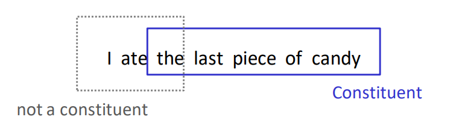

### Constituency Tests

- **movement**
  - "I ate <u>the last piece of candy</u>" 
  - "<u>The last piece of candy</u> was eaten"
- **substitution**
  - "I ate <u>the last piece of candy</u>" vs "I ate <u>it</u>"
- **conjunction**
  - "I ate <u>the last piece of candy</u> and <u>an apple</u>"
- **fragment test**
  1. "What did you eat?" 
  2. "<u>The last piece of candy</u>"

---

## Parsing with Context-Free Grammars CFGs

- goals of parsing:
  1. recognize if a sentence is valid
     - can it be derived from a given grammar?
  2. determine the syntactic structure of the sentence
     - useful for downstream NLP tasks
- problem: some sentences are ambiguous, can be described by multiple parse trees licensed by a given grammar
  - is it possible to parse a sentence deterministically as it is being read (e.g. from left-to-right)? 

### Context-Free Grammar

- start symbol `S`
- set of non terminal symbols `{NP, VP, ...}`
- set of terminal symbols (i.e. words)
- set of production rules in the form `NT -> a b c`
  - where `NT` is a non-terminal and `a b c` comprise a sequence of 1 or more terminals & non terminals

#### Example 

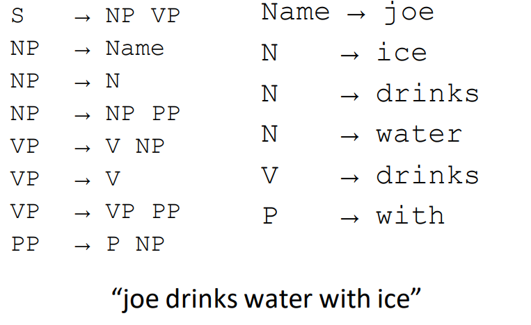

### Parser Properties

- ==soundness== a parser is sound if every parse returned is valid in the grammar
- ==completeness== a parser is complete if for every grammar & sentence it returns every valid parse for that sentence
- soundness is *key*
- but completeness may be difficult (or undesirable for highly ambiguous grammars)
  - instead of returning every valid parse, return the one(s) that make most sense

### Bottom-Up Parsing

- goal list initialized as list of terminals in the string to be parsed
- if sequence of goals matches RHS of a rule, replace it with the LHS
- parsing completes when producing `S`
- choices:
  1. RHS of multiple rules may match
  2. order of subgoals (depth-first, breadth-first)
- *inefficient when grammar has lexical ambiguity*

### Chart Parsing

- remember intermediate results
- explore all possible solutions in parallel
- example: "The~0~ man~1~ drinks~2~ water~3~ with~4~ ice~5~"

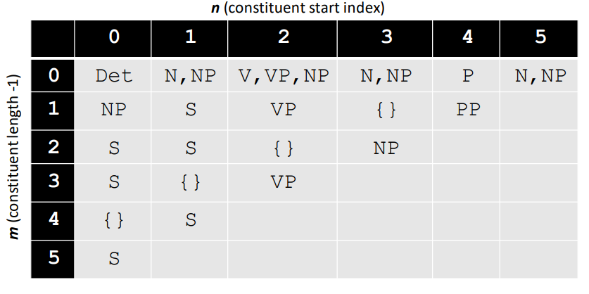

- where each cell stores the *set of partial solutions* for words $n$ to $n+m$
  - where $n$ is x-axis
  - $m$ is y-axis

### Chomsky Normal Form CNF

- ==Chomsky normal form== is a constraint on the grammar where
  - RHS is either 2 non-terminals or a terminal
- all CFGs can be written in CNF

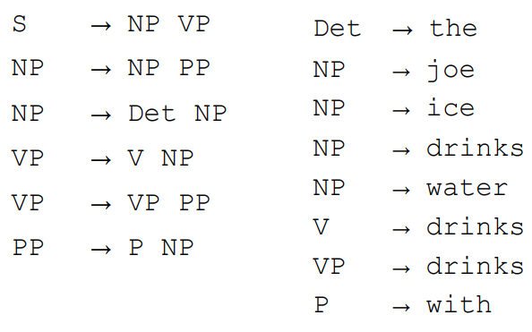

### Cocke-Kasami-Younger CKY

- ==Cocke-Kasami-Younger== is an algorithm for parsing context-free grammars

#### CKY Example (in CNF)

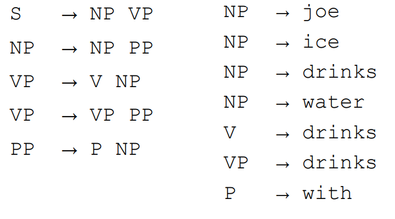

- sentence: "joe~0~ drinks~1~ water~2~ with~3~ ice~4~"
- steps:
  1. Initialize chart with terminal symbols
     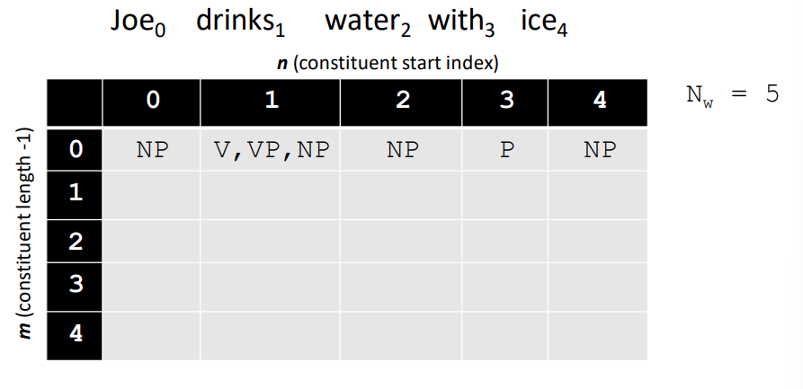
  2. the yellow cell below is the constituent from 0 to (0 + 1) or "joe drinks" which is a valid sentence `S -> NP VP`
     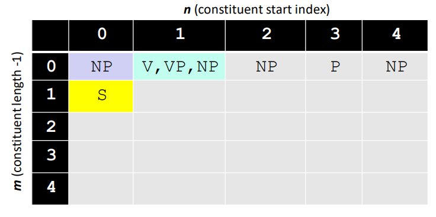
  3. the yellow cell is the constituent from 1 to (1 + 1) or "drinks water" which is a `VP -> V NP`
     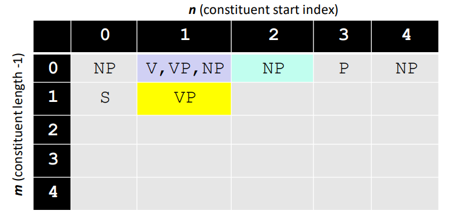
  4. the yellow cell is the constituent from 2 to (2 + 1) or "water with" which has no parse
     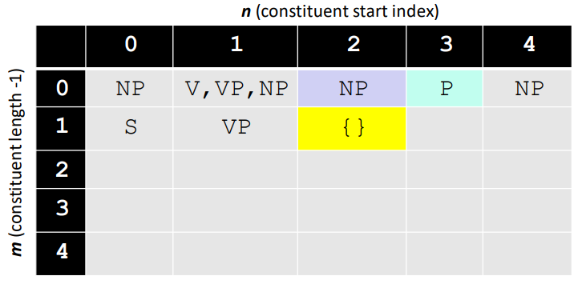
  5. the yellow cell below is the constituent from 3 to (3 + 1) or "with ice" which is a `PP -> P NP`
     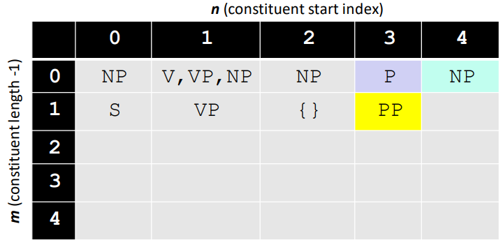
  6. the yellow cell below is the constituent from 0 to (0 + 2) or "joe drinks water" which is a `S -> NP VP`
     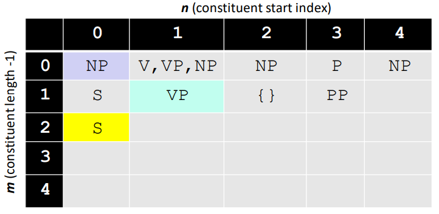
  7. continuing to termination
     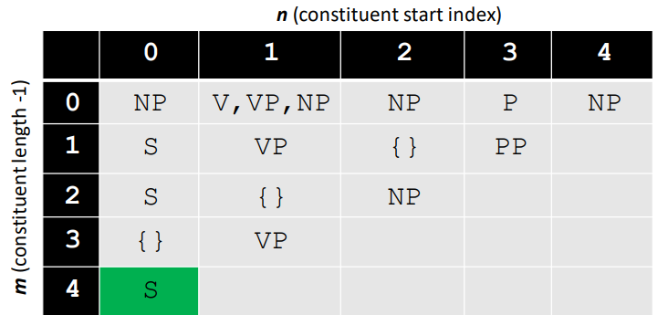

---

## Probabilistic Context-Free Grammars

### Parsing and ambiguity

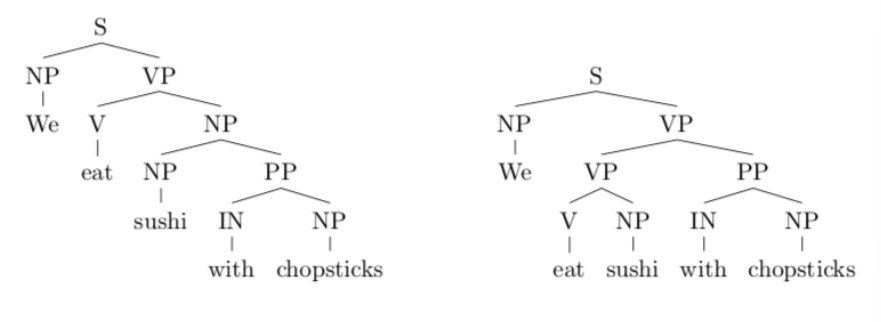

### Potential approach for dealing with ambiguity

- some rules / structures are less likely than others
- associate each rule with a weight / cost
  - rules with lower weights are preferred
  - cost for structure is sum of weights of all rules used
  - choose the structure with lowest weights
- how to select weights?
  - annotated treebank with supervised learning

#### CYK with weights Example

"time~0~ flies~1~ like~1~ an~3~ arrow~4~"

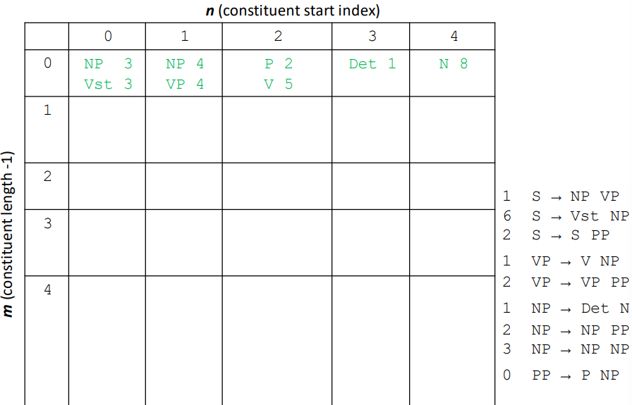

- do the same thing as before but now our rules and terminal symbols have weights
- when filling in the cells, include the sum of weights
- for example, in constituent 0 to (0 + 1) "time flies" we have parses `NP -> NP NP`, `S -> NP VP`, and `S -> Vst NP`
  - the weights for `NP 3` "time" and `NP 4` "flies" add to 7
    - plus the rule's weight `3 NP -> NP NP` we get 7 + 3 = 10
  - the weights for `NP 3` "time" and `VP 4` "flies" add to 7
    - plus the rule's weights `1 S -> NP VP` we get 7 + 1 = 8
  - the weights for `Vst 3` "time" and `NP 4` "flies" add to 7
    - plus the rule's weight `6 S -> Vst NP` we get 7 + 6 = 13
  - hence the cell is
    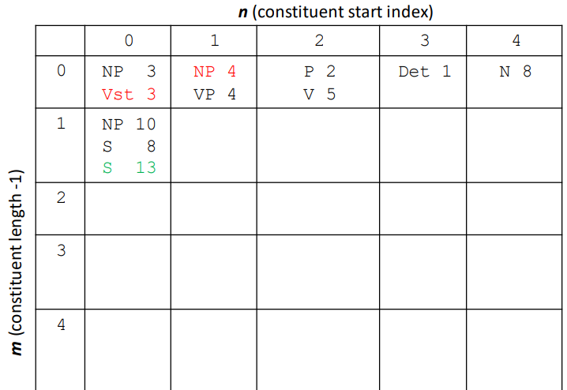

#### From weights to probabilities

- to move to a probabilistic framework, we can associate probabilities with rules instead of weights 
- the probability of a tree is just the product of the probabilities of all the independent rule choices made
- the probabilities can be assigned as $P(X \rightarrow Y\;Z) = 2^{\text{weight}(X \rightarrow Y\;Z)}$

---

## Parser Evaluation

### Comparing Parse Trees

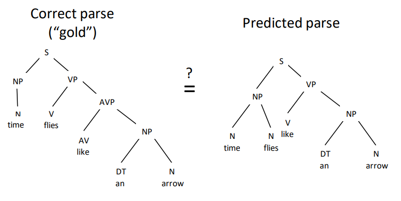

#### Absolute Accuracy

- the accuracy is 0% if the trees do not match exactly

#### Proportion of constituents correctly identified

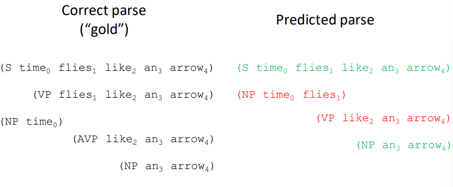

$\text{labeled precision} = \frac{TP}{TP+FP} = \frac{2}{2+2}=50\%$

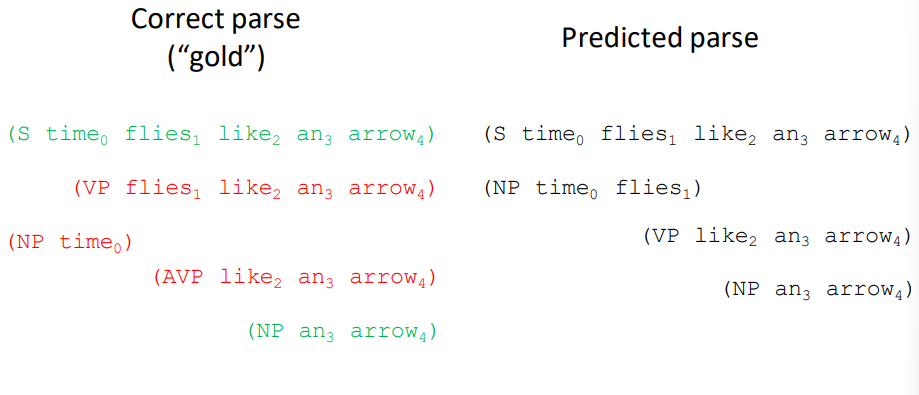

$\text{labeled recall} = \frac{TP}{TP + FN} = \frac{2}{2+3} = 40\%$

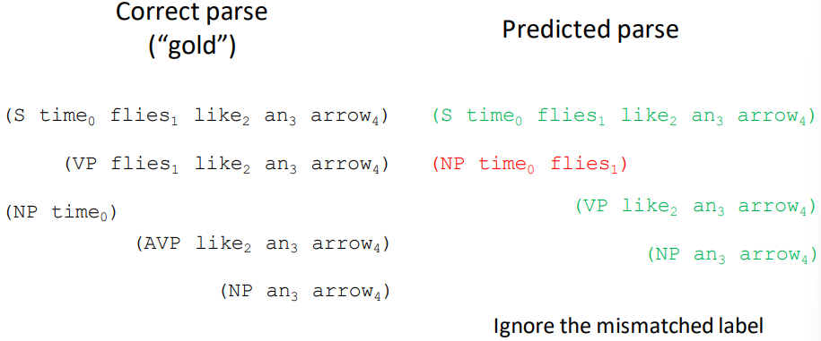

- ignore the mismatch label between `AVP` and `VP` for "like an arrow"

$\text{unlabeled precision} = \frac{TP}{TP+FP}=\frac{3}{3+1} = 75\%$

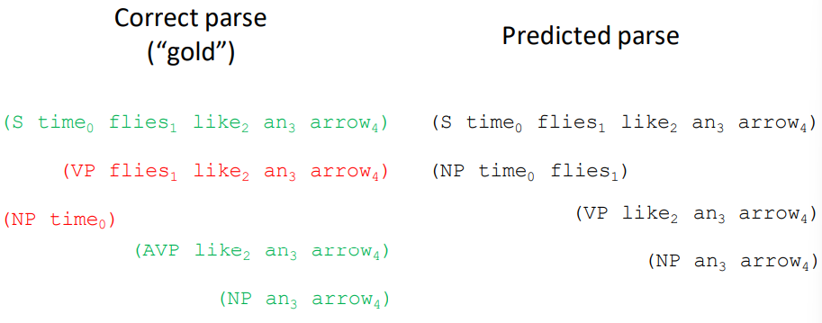

- again, ignore the mismatch label between `AVP` and `VP` for "like an arrow"

$\text{unlabeled recall} = \frac{TP}{TP+FN}= \frac{3}{3+2} =60\%$

### Learning Probabilistic Context-Free Grammars PCFGs

- learned from annotated treebanks datasets with supervised learning
- learning methods similar to other tasks