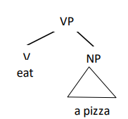
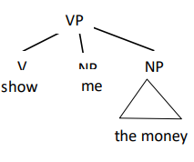
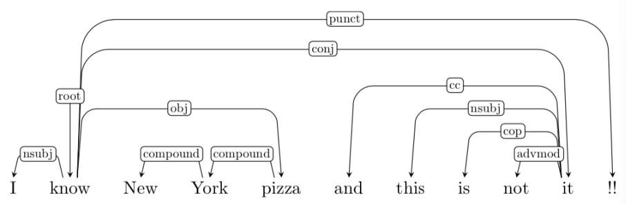
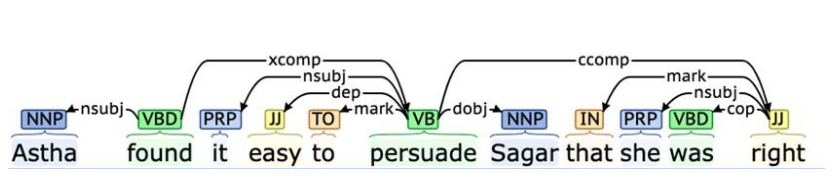
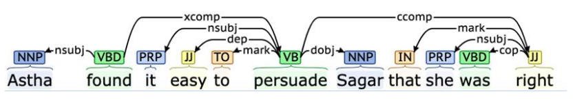
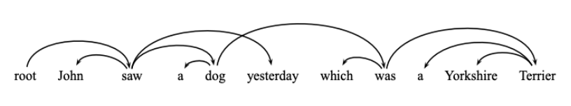

# Dependency Parsing

## Revisiting PCFPs: Lexicalization

- another approach to incorporating contextual information into PCFGs is **lexicalization** 
- not that the likelihood of specific rules applying often *depends on specific words*  (especially, subcategorization)
- the idea of lexicalization is to use properties of phrasal head words to get better estimates of rule probabilities 

### Phrasal Heads

- the *head* of a phrase is the word that determines its attributes 
  - refer to [this](19-Context-free-Grammars-and-Syntax.md#Phrasal Heads)

### Subcategorization

- subcategorization is the relationship between a **syntactic** word and the **dependents** its requires
  - transitive verb like "eat" *subcategorizes* a for single noun phrase
     
  - ditransitive verb like “show” subcategorizes for two noun phrases
    

---

## Dependency Structures

**Dependency** is a labeled, asymmetric relationship between two words

- no constituency or phrase structure
  - i.e. an alternative to context-free grammar from previous lectures
- binary **dependency relations** between words
  - head → modifier (dependent)
- some dependency relations
  - `main`: main verb
  - `subj`: syntactic subject
  - `obj`: direct object
  - `det`: determiner
  - `mod`: nominal postmodifier (e.g. PP)
  - `attr`: attributive (pre-modifying) nominal

### Syntactic Dependencies

- each word is **dependent of a single head**
- a head can have **multiple dependents**
- there are no clear "constituents" although there are some constraints on word ordering and contiguity
- links are of different types

### Robinson’s Axioms (1970)

- *only one* element is independent (**the root**)
- all other elements depend on some other element
- no element depends directly on more than one element
- **projectivity** if *A* depends **directly** on *B* and some element *C* is between them in the **string** then *C* must depend on *A, B*, or some other element between them
  - this may not always be suitable (may not always hold on all grammars) such as in this [example](#Discontinuous constituents)

#### Projectivity Property

- the head $h$ of any constituent that spans the nodes from $i$ to $j$ must have a path to every node in this span
  - does not allow "crossing branches"
- are there any crossing branches in this example? *No*
   

#### Discontinuous constituents

- in this example there is a "crossing branch" violating axiom of projectivity

---

## Dependency Structures and Phrase Structure

- for projective dependency parsing, we have the option of just doing regular CFG parsing and converting to dependencies later

