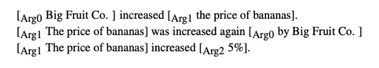

# Semantic Role Labeling

- can we figure out that these have the same meaning:
  - "XYZ corporation **bought** the stock."
  - "The stock was **purchased** by XYZ corporation."

## Predicate-Argument Structure and Semantic Roles

- **predicates** bear the central meaning of a situation expressed by a text
  - usually verbs or verbal nouns ("bought", "purchase")
- **arguments** phrases that fill meaning slots of a situation expressed by a predicate, define its essential details
  - answers questions like "who?", "did what?", "to whom?"
  - usually nouns or noun phrases ("stock", "XYZ corporation")
- **semantic roles** express the abstract role that *arguments* of a predicate can take in the event 
  - similar to a generalization of the arguments 
  - the semantic role of the "XYZ corporation" is the "Buyer"

---

## Semantic Roles

### Semantic roles: First order logic

### Thematic roles

- the semantic roles "Breaker" and "Opener" have something in common

  - volitional actor (they act by their will)
  - often animate
  - direct causal responsibility for their events

- **thematic roles** are a way to capture this semantic commonality 

  - they both have the role of `AGENT`

- "Broken thing" and "Opened thing" have role of `THEME`

- typical set of thematic roles:

  

  - but sets many exist
  - not universally agree-upon

### Beyond Thematic Roles

- problems with thematic roles for NLP:
  - hard to create & define a standard set of roles
  - often roles need to be fragmented to be defined\
- alternative for NLP
  1. **fewer roles**: generalized semantic roles, defined as prototypes
     - Proto-Agent
     - Proto-Patient
  2. **more roles**: define roles specific to a *group of predicates*

---

## The Propositional Bank (PropBank)

### PropBank

- system of role representation
- defines arguments for individual **verb senses** 
  - i.e. individual word sense for individual verbs
- corpus of sentences annotated by role
- English PropBank: annotated on **Penn Treebank**
- roles:
  - **Proto-Agent**
    - volitional (by one's will) involvement in event or state
    - sentience (and / or perception)
    - causes an event or change of state in another participant
    - movement (relative to position of another participant)
  - **Proto-Patient**
    - undergoes change of state
    - causally affected by another participant 
    - stationary relative to movement of another participant
- each verb sense gets numbered argument:
  
- an example frame is:
  
- this allows us to see the commonalities in these 3 sentences:
  

---

## FrameNet

- **goal**: capture descriptions of the same event by **different nouns & verbs** 
  

### FrameNet and Frames

- frame:
  - description of situations or events
  - evoked by lexical units
    - usually verbs but not always
  - include **frame elements** (similar concept to roles)
- **FrameNet**
  - lexicon of \~1000 frames
  - courpus of \~200K annotated sentences that use those frames
  - groups verbs into frames
  - links semanticalyl related roles across frames
- example frame: "change position on a scale"
  - this frame consists of words that
    - indicate the change of an `item`'s position on a scale (the `attribute`)
    - from a starting point (`inital value`)
    - to an end point (`final value`)

### Relationships between Frames

- FrameNet encodes relationships between frames to allow sharing of frame elements (i.e. frame roles)
- also supports inheritance
  - child Frames "Commerce-Sell" and "Lending" both inherit from parent frame "Giving"

### FrameNet vs ProbBank

- role in FrameNet are specific to a **frame**
  - multiple target words that can evoke some frame, usually but not always verbs
  - roles / elements are shared across frames
- roles in PropBank are specific to a **verb sense**
  - `arg0` and `arg1` are consistent across verbs
  - but `arg2, arg3...` are more verb-specific

---

## Semantic role labeling SRL

- **task**: recover the predicate-argument structure of a sentence
- find the semantic roles of each argument of each **predicate** in a sentence
- can apply FrameNet representation

### Shallow Semantics

- roles are filled with **tokens from the text**
  - identify **predicates**
  - specify **span** of text (tokens or sequences of tokens) that fills each role
- why "shallow"?
  - roles are **not** filed with symbolic expressions
  - **not** applying first-order logic concepts
  - intermediate between parse and full semantics

### How do we decide what is a predicate?

- if we’re just doing PropBank verbs
  - choose **all verbs**
  - possibly removing light verbs (from a list)
- if we're doing FrameNet (verbs, nouns, adjectives)
  - choose every word that was labeled as a target in training data

### SRL as Classification

- SRL can be modeled as classification of phrasal constituents
- steps:
  - parse sentence 
  - finding predicates in the sentence 
  - for each predicate, classify each parse tree constituent
