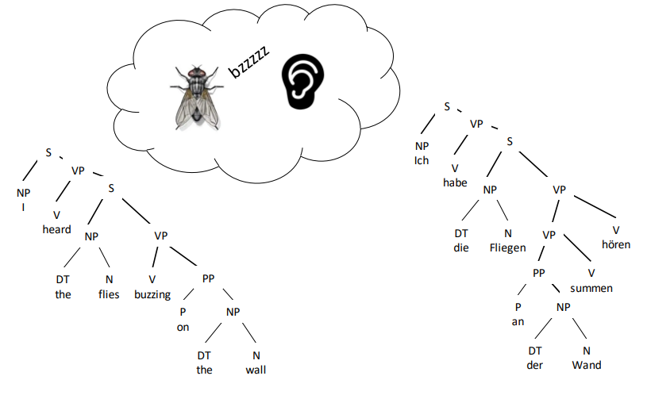
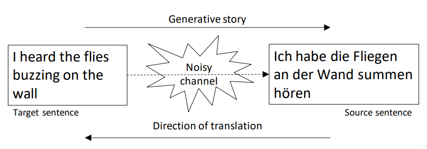
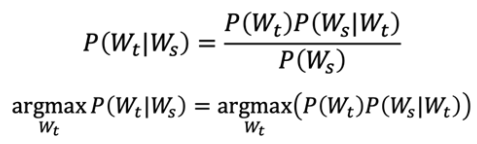

# Machine Translation MT

- for a given sentence in a source language, predict most likely sentence in target language
  - search space: all sequences of words in target language
  - hard to leverage locality assumptions

## Parallel Corpora

- **parallel corpora** data sets pairing source language sentences with their translations to the target language

## How Machine Translation does NOT work

- MT doesn't find the abstract meaning behind the sentence in the source language and convert that abstract meaning to the target language  

- semantic formalisms cannot capture the full meaning content of everyday language
- syntactic parsing can be brittle and introduce complexity when the MT system only needs local information to choose the right word

---

## Statistical MT

### The Noisy Channel Model

- statistical MT is based on the **noisy channel model**
  -  also used in data compression, speech recognition
- when we observe some sequence of symbols, we hypothesize that it actually comes from a noisy encoding process
  - we start with different symbol sequence
  - we passed it through a "noisy channel" that obscured the original message

- the noisy channel model for statistical MT is a generative model, similar to HMMs in which we hypothesize that words are generated from a sequence of latent states (tags)
- what we care about is $P(W_t|W_s)$ or the probability of the target sentence given the source sentence we observe
  - by Bayes' rule:
    

### Three Problems in Statistical MT

- language model $P(W_t)$
  - assign high probabilities to well-formed sequences (English sentences) & low probabilities to random sequences
- translation model $P(W_s|W_t)$
  - assign high probabilities to sentences that look like translations of one another, and low probabilities to random sentence pairs
- decoding algorithm
  - given a language model, a translation model, and a new sentence $W_s...$ find translation $W_t$ maximizing $P(W_t)P(W_s|W_t)$

#### Language model

- $P(W_t)$ can be estimated with language model tools such as
  - N-gram models
  - count smoothing
  - backoff and interpolation
  - ...

