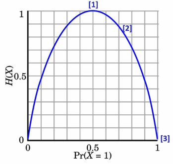
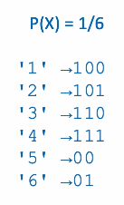

# Information Theory Review

[toc]

## Encoding Random Variables

- one coin → 1 bit
-  3 coins → 3 bits
- one 6-sided die → $\log_26 \approx 2.58$ bits (i.e. at least 3 bits)
- three 6-sided dice → $3\log_26$ bits
- five 20-sided dice → $5\log_220$ bits

## Information Content

- the **information content** or optimal code length of an event drawn from a uniform (equiprobable) distribution with $N$ outcomes is

$$
-\log_2 \frac{1}{N} = \log_2 N \text{ bits}  
$$

- what if it is nonuniform?
- the information content of an event $e$ drawn from a distribution $P(X)$ over a discrete random variable $X$ is

$$
- \log_2P(X=e) \text{ bits} 
$$

##  Bits and "Nats"

- in information theory, we generally use base-2 logs because it makes values interpretable as bits for computers
- you can also use a natural logarithm with the alternative unit *nats*
- to convert from bits → nats, divide by $log_2 e$

## Entropy of a Random Variable

- refer to [cross-entropy](#cross-entropy) for the definition in terms of NLP
- **entropy** (self-information) of a RV is

$$
H(X) = H(P(X)) = - E[\log_2P(X)] \\= -\sum_{x\in X}P(X=x)\log_2P(X=x)
$$

- where $\log_2P(X=x)$ is the optimal code length for $X=x$

### Entropy Example

Using a single coin then a single die
$$
H(\textlangle 0.5,0.5 \textrangle ) = -E[\log_2 \textlangle 0.5, 0.5\textrangle] \\
= -\frac 1 2 \log_2(.5)-\frac 1 2 \log_2(.5) = 1 \\\\

H( \textlangle \frac 1 6,\frac 1 6,\frac 1 6,\frac 1 6,\frac 1 6,\frac 1 6 \textrangle) = -\sum_1^6 \frac 1 6 \log_2(\frac 1 6) \\ = \log_26 \approx 2.58
$$

- for a Bernoulli distribution, the uncertainty (i.e. entropy) is maximized when outcomes are equiprobable (as it is hardest to predict)
- i.e. **the highest entropy you can get is from a uniform distribution**
- take this example of the entropies of different weighted coins

1. **Fair Coin** (not weighted): $H(X) = 1$
2. **A Weighted Coin**: $H(X) = -0.25\log_20.25 - \log_20.75 = 0.81$
3. **Two Heads** (not random): $H(X) = 0\log_2 0 + 1\log_21 = 0$
   - note that $\log_20 \rightarrow \infin$ but out of contention we say $0\log_20=0$ as the 0 multiplying takes over

## The Entropy of English

- we can think of language as an orthographic symbol generation process governed by some unknow probability distribution $P_ \text{lang}(X)$
- what is $H(P_ \text{lang}(X))$?

### Character-Level Entropy

- assume 27 equally likely symbols (a-z and space):
  - $X: \{a,b,c,...,z,\text{space}\}$
  - $H(X) = \log_227=4.76$ bits
- **but** characters in English are *not uniformly distributed*

## Optimal Coding

- we know that the optimal code length for a message drawn from distribution $X$ is $\log P(X = m)$, but how to construct code that approximates this bound?
  - [Huffman coding](#Huffman-coding)
  - Arithmetic coding
  - Hu-Tucker coding

## Entropy Rate of a Message

- we can compute the entropy rate of a message as the sum of the information content of its symbols
- for a message $X$ of length $n$

$$
H_{\text{rate}} = \frac 1 n H(X)
= - \frac 1 n \sum_{x} P(x)\log P(x)
$$

## Huffman coding

- based on binary tree
- builds **prefix-code**:
  - no code is a prefix of any other code
  - allows for variable-length code
- for example, our single die example that uses $2.58$ bits can be encoded as

> 1. create a leaf node for each symbol and add it to the priority queue
> 2. while there is more than 1 node in the queue:
>    - remove the 2 nodes of highest priority (lowest probability) from the queue
>    - create a new internal node with these 2 nodes as children and with with probability equal to the sum of the 2 nodes' probability
>    - add the new node to the queue
> 3. the remaining node is the root node, and the tree is complete
>
> [Jupyter Notebook](./notebooks/HuffmanCoding.ipynb) | [YouTube](https://www.youtube.com/watch?v=JsTptu56GM8&t=219s)

##  Cross-Entropy

- if **entropy** is the information in bits required to represent a message using an optimal encoding derived from the **true** distribution $P$
- then **cross-entropy** is the information in bits required to represent a message using an optimal encoding derived from an **different** distribution $Q$
- cross-entropy is always the **upper-bound** on the entropy
- the cross-entropy between 2 distributes $P,Q$ (where $Q$ is often a *model* of the true distribution $P$) is

$$
H(P(X),Q(X)) = -E_{P(X)}[\log_2P(X)]\\
= - \sum_{x\in X}P(X=x)\log_2Q(X=x)
$$

- this is the expected number of bits required to encode a message from $P$ using an encoding system from $Q$, and it is *not* symmetric where

$$
H(P,Q) \neq H(Q,P)\\H(P,Q) \ge H(P)
$$

## Cross-Entropy and Perplexity

- many speech recognition and language modeling tasks use *perplexity* rather than cross-entropy as an evaluation measure

$$
\text{Perplexity}(P(X),Q(X)) = 2^{H(P(X),Q(X))}
$$

- for a sequence of observations (i.e. words, characters) the perplexity is just

$$
\prod_{i=1..n}Q(X_i=x_i)^{-1}
$$

- where $n$ is the length of the sequence 
- **perplexity** is the inverse of the probability of the sequence under the model

## Conditional Entropy

- how related are 2 random variables $X,Y$?
- or how efficiently can you encode $X$ given the value of $Y$

$$
H(X|Y) = \sum_{y\in Y}P(Y=y)H(X|Y=y)
$$

## Mutual Information

- the difference between the entropy $H(X)$ and the conditional entropy $H(X|Y)$ is called the **mutual information** between the 2 random variables

$$
I(X;Y) = H(X) - H(X|Y)
$$

- when $Y$ provides no information about $X$ then $I(X;Y)=0$
- when $Y$ provides complete information about $X$ then $I(X;Y)=H(X)$
- mutual information is symmetric where

$$
I(X;Y) = I(Y;X)
$$

---

## Distributional Similarity Measures

- how different are 2 distributions $P(X), Q(X)$?
  - cross-entropy tells us how efficient a coding system designed for one distribution $P$ is for encoding different distribution $Q$
  - *but* cross-entropy depends on the entropy of the distribution to be encoded such that

$$
H(P,Q) \ge H(P)
$$

### KL Divergence

- the solution to the [above](#Distributional-Similarity-Measures) is to measure the incremental encoding length rather than the encoding length directly
- Kullback-Leibler or **KL divergence** is the cross-entropy minus the entropy of the distribution to be encoded

$$
D_{KL}(P(X)||Q(X))\\ = H(P(X),Q(X))-H(P(X)) \\
= -\sum_{x\in X}P(X=x)\log_2Q(X=x) + \sum_{x\in X}P(X=x)\log_2P(X=x) \\
= -\sum_{x\in X}P(X=x)(\log_2Q(X=x)-\log_2P(X=x))\\
= -\sum_{x\in X}P(X=x)(\log_2\frac{Q(X=x)}{P(X=x)})
$$

- KL Divergence is *not* symmetric

$$
D_{KL}(P||Q) \ne D_{KL}(Q||P)
$$

#### KL Divergence Example

$$
P(X) = \textlangle 0.1,0.5,0.4 \textrangle\\
Q(X) = \textlangle 0.2,0.2,0.6 \textrangle\\\\
D_{KL}(P||Q) = -\sum_{x\in X}P(X=x)(\log_2 \frac{Q(X=x)}{P(X=x)})\\
= -0.1\log_2(\frac{0.2}{0.1}) - 0.5 \log_2(\frac{0.2}{0.5})-0.4\log_2(\frac{0.6}{0.4})\\
= -0.1 + 0.66 - 0.23 = 0.33
$$

###  JS Divergence

- as mention KL divergence is not symmetric
- a commonly-used symmetric measure of distributional distance is the Jense-Shannon or **JS divergence**

$$
M(X) = \frac{(P(X)+Q(X))}2 \leftarrow \text{Mixture Distribution}\\
D_{JS}(P(X)||Q(X))= \frac{D_{KL}(P(X)||M(X)) + D_{KL}(Q(X)||M(X))}2
$$

- why can't we use $\frac{D_{KL}(P||Q)+D_{KL}(Q||P)}2$? Good question... 

#### JS Divergence Example

$$
P(X) = \textlangle 0.1,0.5,0.4 \textrangle\\
Q(X) = \textlangle 0.2,0.2,0.6 \textrangle\\\\
M(X) = \frac{P(X)+Q(X)}2= \textlangle 0.15,0.35,0.5 \textrangle \\\\
D_{KL}(P||M) = -\sum_{x\in X}P(X=x)(\log_2 \frac{M(X=x)}{P(X=x)})\\
= -0.1\log_2\frac{0.15}{0.1} - 0.5 \log_2{\frac{0.35}{0.5}}-0.5 \log_2\frac{0.5}{0.4}\\
= 0.070 \\ \\

D_{KL}(Q||M) = -\sum_{x\in X}Q(X=x)(\log_2 \frac{M(X=x)}{Q(X=x)})\\
= 0.079 \\\\

D_{JS} = \frac{D_{KL}(P||M)+D_{KL}(Q||M)}2 \\
= 0.75
$$

