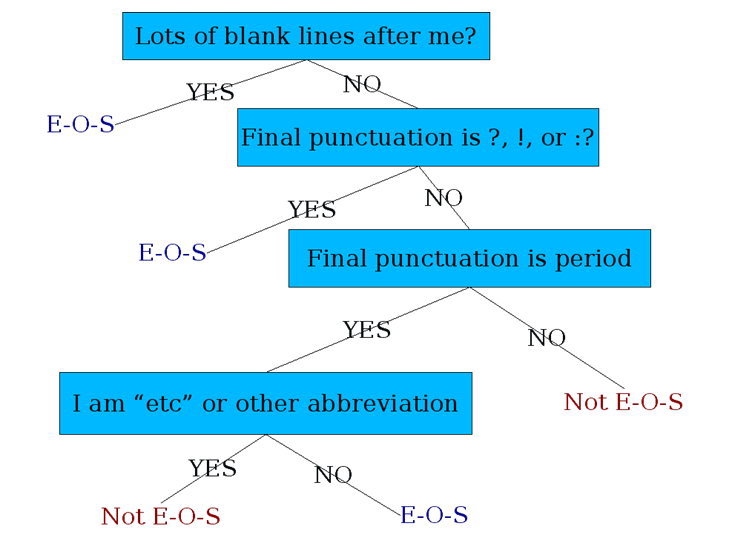

# Words and Pattern Matching

[toc]

## Regular Expressions :happy:

a formal language for specifying text strings

### Disjunctions

- letters inside square brackets `[]`
  - `[wW]oodchuck` matches on Woodchuck, woodchuck
  - `[0123456789]` matches on any single digit
- ranges `[A-Z]`
  - `[A-Z]` matches on any uppercase letter
  - `[a-z]` matches on any lowercase letter
  - `[A-Za-z]` matches on any letter
  - `[0-9]` matches on any single digit
- negations `[^Ss]`
  - `[^Ss]` matches on neither S or s
  - `[^A-z]` matches on any *not* uppercase letter

### Special Characters `? * + .`

| Pattern   | Description                     | Matches                                                      |
| --------- | ------------------------------- | ------------------------------------------------------------ |
| `colou?r` | optional previous character     | color, colour |
| `o*h!`    | 0 or more of previous character | h!, oooooh! |
| `o+h!`    | 1 or more of previous character | oh!, oooooh! |
| `beg.n`   | any character                   | began, beg3n |
| `\.`      | escape character                | period.                    |

### Anchors `^ $`

| Pattern  | Description     | Matches                                                      |
| -------- | --------------- | ------------------------------------------------------------ |
| `^[A-Z]` | start of string | Palo Alto                  |
| `.$`     | end of string   | the end?, the end |

### Character Classes

| Pattern     | Description                       |
| ----------- | --------------------------------- |
| `\s`        | a whitespace character            |
| `\S`        | a non-whitespace character        |
| `\d`        | a digit `[0-9]`                   |
| `\D`        | a non-digit                       |
| `\w`        | a "word" character `[0-9a-zA-Z_]` |
| `\W`        | a non-word character              |
| `[:upper:]` | an upper-case character `[A-Z]`   |
| `[:lower:]` | a lower-case character `[a-z]`    |

### Backreference `(...)...\n`

- sometimes we want to know which part of the text matched a part of a pattern
- we can even use it within the pattern itself, by "capturing it" in parenthesis
  - `(...)` captures some pattern
  - `\1` grabs the first captured pattern

| Pattern            | Matches                                          | Description                                                  |
| ------------------ | ------------------------------------------------ | ------------------------------------------------------------ |
| `(\d)[a-z]\1`      | fjsjga1a1fdsga | a letter bracketed by the  same number on each side     |
| `^(\d)(\d).*\2\1$` | 13woqietoiwq31 | A line starting with two digits,  and ending with those two digits  in reverse order |

## Text Normalization

1. segmenting / tokenizing words in running text
2. normalizing word formats
3. segmenting sentences in running text

### Tokenization

- **Type** is an element of the vocabulary (i.e. the unique words)
- **Token** is an instance of a that type in running text

> "they lay back on the San Francisco grass and looked at the stars and their"
>
> - 15 tokens and 13 types

#### Tokenization: Language Issues

- French: `L'ensemble` is one or two tokens?
- German: `Lebensversicherungsgesellschaftsangestellter` translates to – "life insurance company employee"
  - we need a compound splitter
- Chinese and Japanese: `莎拉波娃现在居住在美国东南部的佛罗里达。` no spaces between words 

##### Maximum Matching Word Segmentation Algorithm

This is greedy algorithm to segment strings with no delimiters

>1. Start a pointer at the beginning of the string
>2. Find the longest word in dictionary that matches the string starting at pointer
>3. Move the pointer over the word in string
>4. Go to 2

- this works well in Chinese 
- doesn't generally work in English!
  - `Thecatinthehat` → `the cat in the hat` :+1:
  - `Thetabledownthere` → `theta bled own there` :-1:

### Word Normalization & Stemming

#### Normalization

- we want to match `USA` and `U.S.A.`
- reducing all letters to lowercase has issues like:
  - `SAT` (the test) → `sat` (the verb)
  - `US` (united states) → `us`

#### Lemmatization

- reduce **inflections** or variant forms to base form
  - `am, are, is` → `be`
  - `car, cars, car's, cars'` → `car`
- this is based on *morphemes* from *morphology*
  - the small meaningful units that make up words
  - **stems** are the core meaning-baring units
  - **affixes** are bits and pieces that adhere to stems
    - usually grammatical functions

#### Stemming

- reduce terms to their stems
- *stemming* is crude chopping of affixes
  - `automate(s), automatic, automation` → `automat`
- this works well for English but not languages with complex morphology

### Sentence Segmentation

- some NLP process are unable to take very large strings
- because of this, we can break sentences

#### Where to break?

- `! ?` are relatively unambiguous
- `.` is *very* ambiguous
  - sentence boundary
  - abbreviations like "Dr."
  - numbers like "1.00%"
- build a classifier
  - looks at `.`
  - decides if its end of sentence or not

