# Lexical representations for NLP

[toc]

## Vector Space Model of Text

- here is an example corpus
  0. `"My dog sleeps"`
  1. `"Your cat sleeps"`
  2. `"That dog chases any cat"`
- given the `vocab = ["cat","chases","dog","eats","sleeps"]`
- we can represent it in vector space as
  0. `[0,0,1,0,1]`
  1. `[1,0,0,0,1]`
  2. `[1,1,1,0,0]`
- i.e. $3 \times 3$ matrix ($\text{Sentence} \times \text{Vocab}$)

### Vector Space for *Semantic* Representations

- words and documents are represented as vectors in **high-dimensional** space
- dimensions may *be as large* as the vocabulary size (which can be very large)
- meaning corresponds to *direction in space*
- in this example, we are grouping all words into 3 categories to visualize the vectors space in 3 dimensions

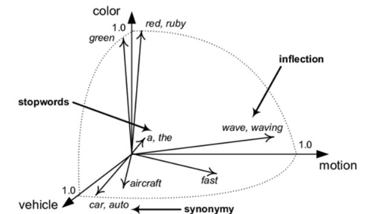

### One-Hot Encoding of Words

- a simple starting point for encoding words is to treat them as ==one-hot== vectors in space with one dimension for each word in the vocabulary

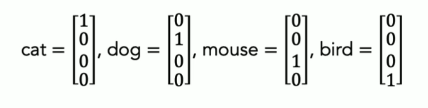

### Bag-of-Words Representation

- given a vector representation of words, we can create a representation for **documents** in the same space
- this is called a ==bag-of-words== representation because it treats meaning as a function of words counts
  - i.e. the sum of all the [one-hot encoding of words](#One-Hot Encoding of Words) used in the document
  - this is a very limited representation of meaning

### Measuring (Cosine) Similarity

- the typical way of assessing similarity between vector representations of documents is by looking the angle between them
- the cosine of that angle is a convenient measure as it is 0 when they are *orthogonal* (unrelated) and 1 when they are in same direction 
- recall that for vectors $a,b$, the cosine of the angle $\theta$ between them is given by

$$
\cos \theta = \frac{a \cdot b}{\sqrt{a \cdot a \times b \cdot b}}
$$

 

- there are other similarity measures like *Euclidean* or *Manhattan* similarity

---

## Vocabulary Selection

- keeping **all** tokens that occur in the data maybe inefficient (too many unique words)
- very **infrequent** tokens may not provide enough evidence to learn much from
- some tokens may not be **semantically important** or task-relevant

### Stop lists

- a ==stop list== is a list of words to be **ignored / excluded** for NLP tasks
- typically, these include *closed-class* words (==stop words==) like
  - determiners (a, an, the)
  - prepositions (of, with, by)
  - conjunctions (and, or)
- stop words are often the most frequent words in a corpus
- using stop words is better for tasks that are insensitive to order (such as with bag-of-words)
  - not as useful for tasks like sequence tagging

### Low Count Cutoffs

- we often use a count threshold to exclude infrequent terms from the vocabulary

### Zipf's Law

- word frequencies are highly skewed
- [VSauce video](https://www.youtube.com/watch?v=fCn8zs912OE) 

$$
\text{Count}(w_i) \propto \frac{1}{\text{Rank}(w_i)}
$$

- i.e. the 2nd most common word is used 1/2 as frequent as 1st
  - the 3rd is 1/3 as frequent as 1st
  - so on...

### Out of Vocabulary OOV Words

- how to deal with OOV words like names and places?
  - ignore them
  - map them to placeholder tokens like `PERSON` `PLACE` `NUMBER`
- its a good idea to track OOV rate for your task and break down model performance by OOV rate

---

## Document Representation

### Document Transformation Function

- function to produce a vector for a **word** is referred to as ==embedding==
- function to produce a vector for a **text** is referred to as a ==vectorizer==

#### Vectorization: how to represent multiple occurrences?

- if words are represented as one-hot vectors how do we represent a document?
  1. ==binary vectorizer== record 0/1 value indicating presence / absence of word in document
  2. ==count vectorizer== record number of occurrences per word in document 

#### Problems with binary & count vectorizers

- **Problem 1**
  - binary vectorization gives too little weight to words that occur multiple times
  - count vectorization gives too much weight
  - i.e. a single word that shows up many times can swamp the effect of the rest of the text in determining what other texts are most similar
- **Problem 2**
  - not all words should be equal
  - words with distinctive meaning should count more to document representation that general terms

#### TF-IDF  

- solution to above: define a "score" for each component of the document vector associated with a given word $w$, broken down into 2 parts
  1. ==term frequency TF== measure of the frequency of $w$ in the document
     - usually a sublinear transformation of the raw document count
     - example: $\log(1 + \text{Count}(w))$
  2. ==inverse document frequency IDF== measure of rarity of $w$ across documents 
     - an inverse measure of the frequency with which $w$ occurs across documents 
     - example: $-\log \frac{\text{DocumentCount}(w)}{\text{Number of Documents}}$
       - $\text{DocumentCount}(w)$ is the number of documents with $w$ present
- the total score for word $w$ is $\text{tf}_w \times \text{idf}_w$

---

## Lexical Representation

- the [vector space model for text](#Vector Space Model of Text) **does not** represent characters and local context
- ==lexical== generally, relating to words or to the vocabulary used for a task
  - ==lexical embeddings== word representations for neural networks
  - ==lexical semantics== meaning of words & word parts
  - ==lexical diversity== range of vocabulary in the text

### Levels of Lexical Representation

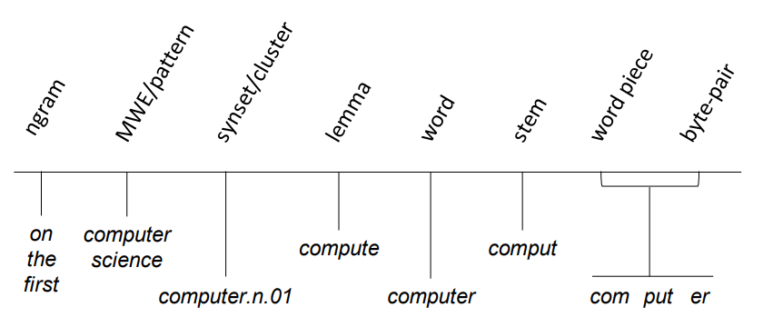

- different levels of **granularity** maybe relevant for different tasks

### Words

- English & most alphabetic languages are **delimited** by whitespace
- with some nuances related to tokenization such as contractions, abbreviations, case, emojis...

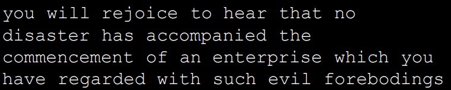

- example above: *un-normalized forms: fully inflected*
- fully inflected means the words retain all grammatical context in the language
  - refer to [this](4-Words-and-Pattern-Matching.md#Lemmatization); *inflections* are the variant forms of a word base


#### Word Stems

- [discussed previously](4-Words-and-Pattern-Matching.md#Stemming)
- crude chopping of suffixes to get **base form** that is shared with multiple un-normalized words
- loses information about inflection but reduces vocabulary size and captures some **meaning similarity** 

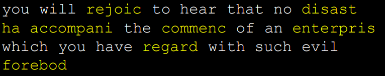

#### Lemmas (a.k.a. lemmeta)

- select **canonical form** to represent all differently-*inflected* forms of a word
- similar to stemming but results in "real" words

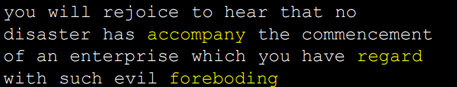

#### Multi-word expressions MWEs

- we may write patterns to capture & normalize specific types of token sequences

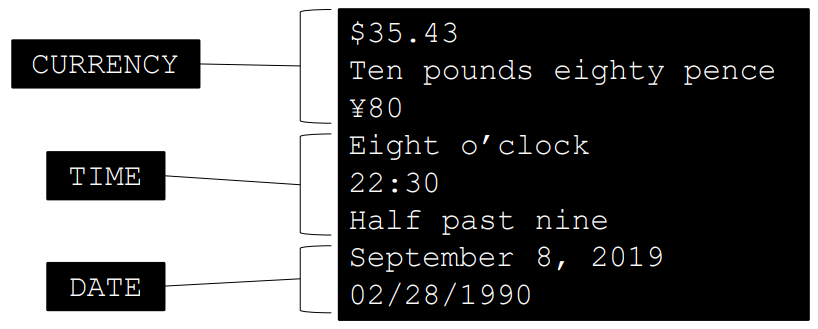

- other multi-word expressions may come from a dictionary or from statistical analyses of terms that occur together more *frequency than would be expected by chance*  

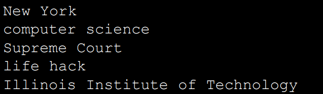

#### N-grams

- ==unigrams== single word
- ==bigrams== 2-word sequence
- ==trigrams== 3-word sequence
- ==n-grams== $n$-word sequence 

> example of trigrams in `"it was a dark and stormy night"`
>
> - `"it was a"`
> - `"was a dark"`
> - `"a dark and"`
> - `"dark and stormy"`
> - `"and stormy night"`

- uses
  - similar to features based on [MWEs](#Multi-word expressions MWEs) but less **curated**
  - local contextual features for language modeling / sequence labeling

### Semantic word clusters

- instead of (or in addition to) representing words directly, we could also represent the **concept** or **word class** 
- reduce the feature set (i.e. vocabulary) by using **higher-order** semantic units as the level of representation
  - instead of learning something specific about `"baseball"` or `"tennis"` independently, the model just learns about super-category `SPORTS`
- word clusters can come from a lexical resource like *Wordnet*, or from statistical clustering

#### Wordnet & Synsets 

- [Wordnet](https://wordnet.princeton.edu/) is a manually-compiled machine-readable dictionary for English
- it can be used programmatically to lookup word ==synsets== (senses related to a set of words)

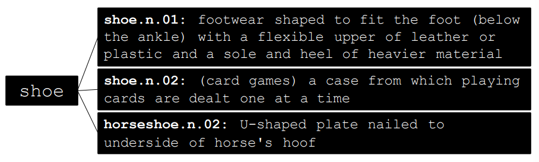

### Sub-word Representations

- ==sub-word== leverage character sequence representation of the word
- why is this needed?
  - [neologism](1-Introduction.md#Why is NLP Hard?) & [OOV](#Out of Vocabulary OOV Words) words
- generally developed in an **unsupervised manner**
  - uses statistical information about the data itself to identify the most useful units to include in the vocabulary
  - not informed by external human labeling

#### Byte-pair encoding & word pieces

- ==byte-pair encoding== & ==word pieces== are 2 *unsupervised* methods for generating a [sub-word](#Sub-word Representations) vocabulary of a given size
- based on *character* n-gram representation
  - example *bigram* for  `"natural"` is `[#n, na, at, ur, ra, al, l#]`
- more useful for **machine translation** & **natural language generation** than **text categorization**
- applied as tokenizers transformer models

##### Byte-pair encoding

- what makes a word part useful to include in our vocabulary?
  - it should show up in lots of words
    - <span style="color:SlateBlue">hav<u>ing</u>, lik<u>ing</u>, show<u>ing</u></span>
  - it should show up in frequent words
    - <span style="color:SlateBlue"><u>is</u>, <u>not</u>, <u>the</u>, <u>when</u>ever, <u>which</u>ever</span>
  - when we factor it out of a word, the remaining pieces should also be useful parts
  - <span style="color:SlateBlue">show+ing, when+ever, wait+er, blue+berry</span>
- ==byte-pair encoding== uses these principles to implement an algorithm for sub-word vocabulary induction

> 1. generate a word frequency list
>
> 2. append a word-end pseudo-letter `</w>` to every word
>
>    <details>     
>        <summary>example</summary>
>        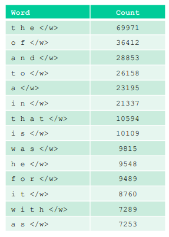
>    </details>
>
> 3. initialize vocabulary to set of distinct letters
>
>    <details>     
>        <summary>example</summary>
>        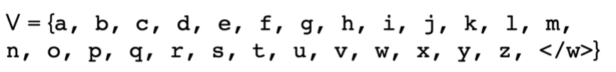
>    </details>
>
> 4. until the target vocabulary size is reached:
>
>    1. select the pair of vocabulary items **most frequently** occurring together in sequence
>    2. add it to the vocabulary as a new item
>		
>    <details>     
>        <summary>example</summary>
>        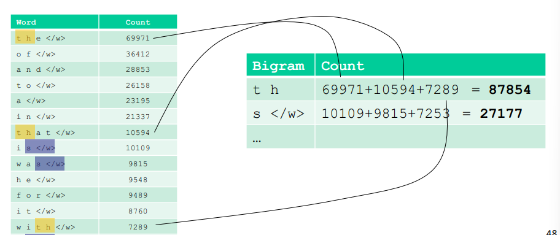
>    </details>
>
>    3. generate the word frequency list segmentations using the new vocabulary 
>
>    <details>     
>        <summary>example</summary>
>        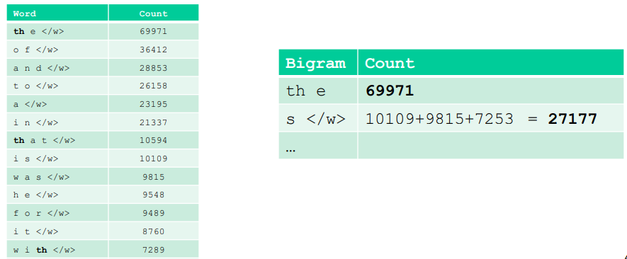

```python
vocab_tokenization.get("mountains</w>")
# ['m', 'oun', 'ta', 'in', 's</w>']
```

- byte-pair encoding will break if a symbol is introduced that is not in the vocabulary (like an emoji 😈)
- differences between byte-pair encoding & [Huffman encoding](3-Information-Theory-Review.md#Huffman coding)
  - Huffman encoding tries to compress a message (so its encoding will be binary 1s and 0s) whereas byte-pair will result in tokens that are actually readable
  - byte-pair also uses *context* as it considers character sequences alongside frequency of tokens

#### Word piece encoding

- the same as byte-pair encoding but for 1 step

> 1. generate a word frequency list 
>
> 2. append a word-end pseudo-letter  to every word 
>
> 3. Initialize vocabulary to set of distinct letters 
>
> 4. until the target vocabulary size is reached:
>
>    1. <span style="color:yellow">select the pair of vocabulary items that increase the likelihood estimate most</span> (this is the only difference from [byte-pair encoding](#byte-pair encoding))
>
>       $\text{Score} = (\text{freq. of pair}) / (\text{freq. of element 1} \times \text{freq. of element 2})$
>
>    2. add it to the vocabulary as a new item
>
>    3. gegenerate the word frequency list segmentations using the new vocabulary

---

## Summary of how to represent text

- choose a document representation
  - bag-of-words
    - binary
    - count
    - TF-IDF
  - other methods leverage word-order
- choose a word representation
  - word, lemma, MLE, n-gram
  - atomic words vs sub-word
- select a vocabulary 
  - dependent on corpus (text data)
  - remove stop words and infrequent words?
