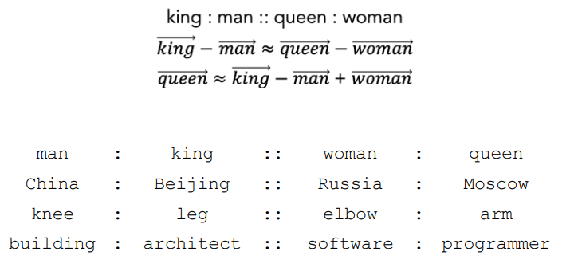

# Neural Word Embeddings

[toc]

## Problems with Word Vectors

- when building vectors to represent words using
  - one-hot encoding (binary, count, TF-IDF)
  - hashing trick as shown [here](5-Lexical-representations-for-NLP.md#Vector Space Model of Text) 
- we have the same problems
  - large dimensionality or word vectors
  - lack of meaningful relationships between words

## How to learn word meanings

1. look in dictionary 
   - dictionary-based learning
2. ask people 
   - word association & similarity judgement tasks
3. distributional hypothesis 
   - words that occur in the same contexts tend to be similar in meaning

---

## Using the Distributional Hypothesis to Learn Word Representations

### Latent Semantic Analysis LSA

- one way to use the distributional hypothesis to learn word vectors is called ==latent semantic analysis==
- the idea is to construct a **matrix** that represents words & their context
  - then create a reduced-dimensionality version of that matrix that preserves the most distinctive & important characteristics of words' contextual associations

#### Term-by-document matrix

- recall that given a sparse encoding of our words as vectors in $\mathbb R^{|V|}$, where $V$ is our vocabulary
- we can create a vector for each document by aggregating over the vectors for all words it contains
- so the $V=\{\text{the},\text{fox},\text{dog},\text{jumped},\text{over}\}$, using a count vectorizer, we have

- each word is represented as a vector of values related to that word's occurrence in a document 
  - instead of $\mathbb{R}^{|V|}$, each vector is now $\mathbb{R}^{|D|}$ (i.e. length of the number of documents)
  - this is still a pretty high dimension
  - latent semantic analysis tries to compress the representation 

#### Singular value decomposition SVD

- for a term-by-document matrix $M$, based on documents $D$ and vocabulary $V$, we can approximate that

- where $U$ is an orthogonal matrix with one row per document
- $W$ is an orthogonal matrix with one column per word
- $\sum$ is a diagonal matrix of *singular values*

> - any $n \times m$ matrix $A$ can be written as $A = UDV^\top$ where
>   - $U = \text{eigenvectors of }AA^\top$
>   - $D = \sqrt{\text{diga}(\text{eig}(AA^\top))}$
>   - $V = \text{eigenvectors of } A^\top A$

- [notebook](notebooks/SVD - LSA.ipynb)

---

## Natural Word Embeddings: `word2vec`

- efficient and widely-used method for getting word embeddings (vectors) using a neural network framework

### `word2vec` model

- ==representation learning== automatically learning useful features for a task rather than manually creating them
- to do this task accurately, the model is trained to learn a **vector (or embedding) of the most useful attributes of a words**
- *fake task*: build a model to **predict** the word that will show up in a given context (or, predict the context that is most appropriate for a given word) 
  - [CBOW](#Continuous Bag of Words CBOW)

#### Continuous Bag of Words CBOW

- given the words to the left and right of this one, predict what the word is

1. $N$-dimensional word vectors → 
2. compute weighted sum of word embeddings → $S$-dimensional context vector → 
3. multiply by $N \times V$ matrix to get activations for each word that could be predicted → $V$-dimensional word activations →
4. normalize activations to get probabilities for each word (SoftMax) →  $V$-dimensional word probabilities 

$$
P(w_0|w_{-2},w_{-1},w_1,w_2) = \text{softmax}((\sum_{i\in\{-2,-1,1,2\}} a_i E_{w_i})\times P)
$$

- where $E$ is the $V \times N$ matrix of word embeddings
- $P$ is the $N \times V$ matrix mapping contextual representations to word predictions
- $a_i$ is the weighting of a word location $i$ in the contextual representations (words closer to the target position are weighted more highly)

##### SoftMax

- a convenient way to get a proper probability distribution out of an unconstrained vector of values
- maps a vector with values in $[-\infin,\infin]$ to a vector with values in $[0,1]$ that sum to one
- also conveniently differentiable (for [backpropagation](#Backpropagation and Gradient Descent))

$$
\text{softmax}(\vec x) = [\frac{e^{\vec x_i}}{\sum_{\forall{j}}e^{x_j}}]_{\forall{i}}
$$

######  SoftMax example

$$
\text{softmax}(\begin{bmatrix}
-1\\0\\1.5
\end{bmatrix})
= \text{normalize}(\begin{bmatrix}
e^{-1}\\e^0\\e^{1.5}
\end{bmatrix})
= \text{normalize}(\begin{bmatrix}
0.37\\1\\4.48
\end{bmatrix})\\
= \begin{bmatrix}
\frac{0.37}{0.37+1+3.38}\\
\frac{1}{0.37+1+3.38}\\
\frac{3.38}{0.37+1+3.38}
\end{bmatrix}
= \begin{bmatrix}
0.06\\0.17\\0.77
\end{bmatrix}
$$

#### Backpropagation and Gradient Descent

> error backpropagation is a general framework for learning the parameters of a model (neural network)

1. define a ==loss function== $\mathcal L$ to be **minimized**
   - muse be differentiable
2. calculate the derivatives of the loss with respect to its inputs
   - vector derivatives of the loss with respect to its inputs or the ==gradient== $\nabla \mathcal L$
3. use the chain rule to get the derivatives of the loss for all parameters in the model
   - $\frac{\partial}{\partial x}(u(v(x)))=\frac{\partial}{\partial v}(u(v))\frac{\partial}{\partial x}(v(x))$
4. update all parameters in the direction of the negative gradient
   - ==gradient descent==

#### Gradient Descent for CBOW

1. loss function $\mathcal L$ is ==cross-entropy==
   - $\mathcal L = - \sum_{w\in V} y_w \log \hat p(w)$
   - where $y_w$ is an indicator variable with the value 1 when $w$ is the correct word $w^*$ and 0 otherwise
   - $\hat p(w)$ is the model's estimated probability for word $w$
   - so the loss function simplifies to $\mathcal L = -\log \hat p(w^*)$
2. calculate the derivatives of the loss
   - in terms of the pre-SoftMax activations, $\nabla a_w \mathcal L = \hat p(w) - y_w$
3. use chain rule
4. update all parameters
   - for all word embeddings, model weights $\theta$ update to $\theta \coloneqq \theta - n \nabla \mathcal L$
   - $n$ is learning rate

> these is computationally expensive (but there are ways to mitigate)

##### Revisiting [SoftMax Example](# SoftMax example)

$$
\text{softmax}(\begin{bmatrix}
-1\\0\\1.5
\end{bmatrix})
= ... \\
$$

- in our loss function

$$
y_w = \begin{bmatrix}
0\\0\\1
\end{bmatrix},
\hat p(w) =\begin{bmatrix}
-1\\0\\1.5
\end{bmatrix}
$$

- where we get $y_w$ from training data (i.e. our true label)

#### Skip-gram

- similar to CBOW but *given* a word, can we predict its context

- where the output is the predictions for $w_{-2},w_{-1},w_1,w_2$

---

### Analogies using `word2vec` 

- analogies represent consistent semantic relationships
- we can rephrase them in terms of vector translation operations

- there can statistical relationships in data that we prefer *not* to leverage (especially if you're a liberal 😜) 

## Advantages of Word Embeddings

- *transfer learning*: build representations using **large, general-purpose data set**
  - fine-tune model based on smaller task-specific data
- hand-annotation (supervision) is generally not required
- *deeper* language features related to meaning, rather than specific words
- in combination with sub-word tokenization, generate encodings of OOV words

