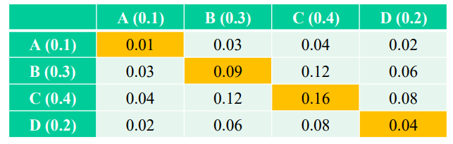

# Word Sense Disambiguation WSD

[toc]

- many words have multiple meanings
  - example: river bank, financial bank
- **problem**: assign proper sense to each ambiguous word in text
- **applications**:
  - machine translation
  - information retrieval
  - semantic interpretation of text

## Sense Tagging

- idea: treat sense disambiguation like **POS** (part of speech) tagging just with *semantic tags*
- the problems differ:
  - POS tags depend on specific structural queues (mostly neighbor tags)
  - senses depend on **semantic context** 
    - less structured
    - long distance dependency

### Wordnet

- this was also referenced in [Lexical representations for NLP](5-Lexical-representations-for-NLP.md#Wordnet & Synsets )
- [Wordnet](https://wordnet.princeton.edu/) is a manually-compiled machine-readable dictionary for English
- it can be used programmatically to lookup word ==synsets== (senses related to a set of words)

- it's basically a dictionary that explains the different context a word came be in

## Approaches

- dictionary-based learning
  - learn to distinguish senses from dictionary entries
- supervised learning
  - learn from pre-tagged corpus
- unsupervised learning
  - automatically cluster word occurrences into different senses
  - ==clustering== partitioning of datapoints into related groups

##  WSD Evaluation

- train & test on pre-tagged texts is difficult to obtain
- ==pseudoword== or artificial data: *merge* 2 words to form an *ambiguous* word with two *senses* 
- example: replace all occurrence of "door" & "banana" with "*doorbanana*" and see if the system figures out which is which
  - "the jasmine, almond, *doorbanana*, cork and coco-nut palm are among the trees"

### Performance Bounds

- how good is (say) 80%?
- evaluate performance relative to lower and upper bounds:
  - ⬇️ *baseline performance*: how well does the simplest (trivial) *reasonable* algorithm do?
    - i.e. *majority class* → what if we always assign most common label?
    - this serves as **lower bound**
  - ⬆️ *human performance*: what percentage of the time do people agree on classification?
    - a lower agreement amongst humans → *harder problem*
    - this serves as **upper bound**

---

## Annotation & Inter-Rater Reliability (Agreement)

- human annotation is expensive 
- crowd sources may lead to bad data (as annotators may not be motivated to do a good job)

### Inter-Rater Reliability (Agreement)

- ==inter-rate reliability== measures how often humans agree on annotations
  - if they don't agree, then the task is ill-defined
- ==agreement probability== $P(\text{agree}) = $
  - $\text{number of times raters agree} / \text{number of ratings}$
  - but if 90% of things are annotated all the same then agreement could just be high by change
- ==Cohen's Kappa==

$$
\kappa = \frac{P_\text{agree} - P_\text{chance}}{1 - P_\text{chance}}
$$

- where $P_\text{agree}$ is observed agreement rate between annotators
- $P_\text{chance}$ is expected agreement rate between 2 annotators assigning labels randomly, *but* using true class distribution 

#### Inter-Rater Reliability (Agreement) Example 1

- for a binary classification task with equiprobable outcomes, $P_\text{chance} = 0.5$
  - we'd expect raters (using 2 classes with equal frequency) to agree half the time
- so if $P_\text{agree}=0.7$

$$
\kappa = \frac{0.7-0.5}{1-0.5} = 0.4
$$

#### Inter-Rater Reliability (Agreement) Example 2

- for a distribution with $N$ classes

$$
P_\text{chance} = \sum_{i=1}^N P_i^2
$$

- for example, for labels distributed according to $\{0.1,0.3,0.4,0.2\}$

- $P_\text{chance} = 0.01+0.09+0.16+0.04=0.3$
- if $P_\text{agree} = 0.7$ then

$$
\kappa = \frac{0.7-0.3}{1-0.3} = 0.57
$$

> - usually $\kappa > 0.4$ is desirable
> - Cohen's Kappa can be negative if the annotators are agreeing less frequently than you would get from random chance

---

## Dictionary-Based Learning

- idea: choose between sense of a word given in a dictionary based on the *words in the definitions*

### Algorithm (Lesk 1986)

> - define $D_i(w)$ as a bag of words in the $i$^th^ definition for $w$
> - define $E(w)$ as $U_iD_i(w)$ ?
> - for all sense $s_k$ of $w$ do
>
> $$
> \text{score}(s_k) = \text{similarity}(D_k(w), \bigcup_{v\in c}E(v))
> $$
>
> - choose $s = \underset{s_k}{\text{argmax } \text{score}(s_k)}$

- Lesk algorithm tries to figure out the correct meaning of a word in a given context by comparing the words in its definition to the words in the context

#### Similarity Metric

$$
\text{similarity}(X,Y) = 
\begin{cases} 
	\text{matching coefficient } |X \cap Y|\\
    \text{dice coefficient } \frac{2|X\cap Y| }{|X|+|Y|}\\
    \text{jaccard coefficient } \frac{|X \cap Y|}{|X \cup Y|}\\
    \text{overlap coefficient } \frac{|X \cap Y| }{\min(|X|,|Y|)}
\end{cases}
$$

#### Some Improvements

- run iteratively, each time only using definitions of "appropriate" senses for context words ?
- expand each word (in the text) to a set of synonyms (so the target's true sense has a higher chance on matching)

---

## Supervised Learning

- each ambiguous word token $w_i$ in the training is tagged with a sense from $\text{sense}(w_i) = s_1,...,s_k$
- each work token occurs in a context $c_i$
  - usually this is a window around the word occurrence up to ~100 words long
- each context contains a set of words used as features $v_{ij}$

###  Bayesian Classification

- Bayes decision rule:
  - classify $s(w_i) = \underset{s}{\text{argmax }}P(s|c_i)$
- minimizes probability of error
- to compute, use Bayes' theorem:

$$
P(s_k|c) = \frac{P(c|s_k)P(s_k)}{P(c)}
$$

- *note* that $P(c)$ is constant for all sense such that the denominator can be ignored in the $\underset{s}{\text{argmax }}$

$$
s(w_i) = \underset{s}{\text{argmax }P(s|c)} = ... = \underset{s}{\text{argmax }}P(c|s)P(s)
$$

### Naïve Bayes

- assume
  - features are conditionally independent, given the example class
  - feature order doesn't matter

$$
P(c|s) = P(\{v_j:v_j \in c|s\}) \\
= \prod_{v_j\in c} P(v_j|s) \leftarrow \text{ Naïve Bayes assumption }\\
\log P(c|s) = \sum_{v_j\in c}\log P(v_j|s)
$$

#### Naïve Bayes Training

- for all senses of $s_k$ of $w$ do

  - for all words $v_j$ in the vocabulary do
    $$
    P(v_j|s_k) = \frac{\text{count}(v_j,s_k)}{\text{count}(s_k)}
    $$

- for all senses of $s_k$ of $w$ do
  $$
  P(s_k) = \frac{\text{count}(s_k)}{\text{count}(w)}
  $$

#### Naïve Bayes Classification

- for all senses $s_k$ of $w_i$ do
  - $\text{score}(s_k) = \log P(s_k)$
- for all words $v_j$ in the context window $c_i$ do
  - $\text{score}(s_k) \mathrel{+}= \log P(v_i|s_k)$
- choose $s(w_i) = \underset{s_k}{\text{argmax }}\text{score}(s_k)$ ($s$ with max score)

> - Naïve Bayes' assumption isn't true for natural language but can be useful for large amounts of data (bag of word models)
> - it also trains very quickly which is good if the model is continuously updated

---

## Unsupervised Learning

### Tuning for a Specific Corpus

- use Naïve Bayes formulation

$$
P(s|C) = \frac{P(s)\prod_{v\in c}P(v|s)}{\prod_{v\in c}P(v)}
$$

- initialized probabilities as uniform
- re-estimate $P(s)$ & $P(v_j|s)$ for each sense $s$ and each word $v_j$ by evaluating all contexts in the corpus assuming the context has sense $s$ if $P(s|c)>\theta$ 
  - where $\theta$ is a redefined threshold
- disambiguate by choosing the highest

### Leveraging Bilingual Data

- use correlations between phrases in 2 languages to disambiguate
- if we have 2 parallel corpuses (1 in English & 1 in German), we can check to see the translations of English words / phrases to get a better idea of what the true sense is

#### Scoring

- count the overlap

#### Challenges with Bilingual Data

- in related languages, senses may share a translation
- no occurrences found for some senses